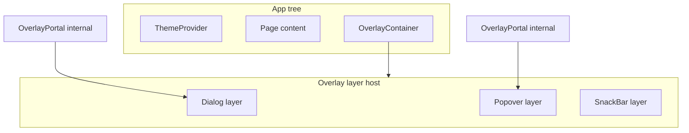
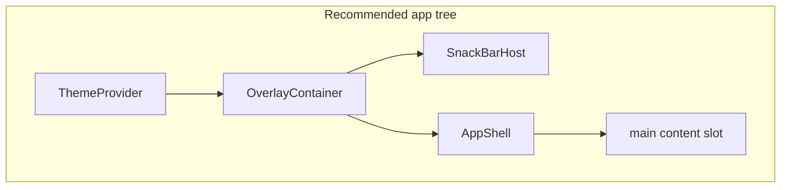

# qwik-flutter-ui — Public API Design

> **Status:** v1 layout + typography finalized. **v1.1** (§15–§21) specified — v1.1 open questions approved (§102). **v1.2** scrolling (§22–§24) specified — resolve open questions in §101 before implementation. **v1.25** `MediaQuery` specified (§25) — resolve open questions in §27 before implementation. **v1.3** forms **specified** (§28–§37). **v1.4** selection controls **specified** (§46–§56). **v1.5** theming **specified and implemented** (§57; decisions **T1–T6** in §105). **v1.6** form decoration **specified** (§58–§72; decisions **FD1–FD10** in §105). **v1.7** overlays **specified and implemented** (§73–§89; decisions **OV1–OV15** in §105). **v1.8** App Structure **specified and approved** (§90–§99; decisions **AB1–AB7**, **DR1–DR7**, **SS1–SS7**, **BN1–BN9** in §105). **Next:** **v1.9 Navigation** (§106, §88).
> **Goal:** A Flutter-inspired UI framework for Qwik. The API should feel as close to Flutter as possible while remaining idiomatic JSX.

---

## Design Principles

Every API decision in this document is justified against these ten principles. When two principles conflict, the higher-numbered one yields.

1. **Flutter-first developer experience.** Component names, prop names, enum names, and defaults match Flutter wherever it doesn't fight the web. A Flutter dev should be able to read this API and start writing code without docs.
2. **Semantic HTML output.** Layout widgets render meaningful tags (`<div>` for layout boxes, `<span>` or appropriate heading for `Text`, etc.) and never lean on `<div>` for everything. Where a single default isn't right, an `as` escape hatch is provided.
3. **Accessibility by default.** ARIA passthrough is built into `BaseProps`. `Text` is selectable by default. Focusable/interactive primitives (post-v1) will inherit keyboard handling. Nothing the library does silently breaks a screen reader.
4. **SSR friendly.** Every widget renders to static markup with no client JS needed for the initial paint. Hydration is opt-in and minimal.
5. **Qwik resumability first.** No widget runs eager client-side code. Hooks live behind `useTask$`/`useVisibleTask$` only where unavoidable. No global state, no module-level side effects.
6. **Strong TypeScript support.** Every prop is typed. Enums are exported with companion types. No `any`. No `string` where an enum exists. No `unknown` leaking into public surface.
7. **Minimal runtime overhead.** Widgets compile to plain CSS classes and inline styles. No CSS-in-JS runtime. Theming (§57) uses read-only Qwik context plus CSS custom properties on `<ThemeProvider>` — no reactive global theme store. Const-object enums tree-shake cleanly.
8. **Production-ready API design.** Public surface is intentional — what we ship in v1 is what we'll maintain. Breaking changes after v1 follow semver.
9. **Responsive design support.** Length values accept strings (`"50%"`, `"clamp(...)"`, `var(--w)`), enabling fluid layouts via CSS. v1 ships no breakpoint system; users compose with their own CSS. A breakpoint-aware prop shape is reserved for v2.
10. **Consistent widget behavior.** Same prop name = same meaning across widgets. Same defaults across analogous widgets. Same overflow, sizing, and naming conventions everywhere unless Flutter explicitly differs.

---

## Table of contents

- §0 — Cross-cutting conventions
- §1 — Shared enums
- §2 — Shared types
- §3 — `Row`
- §4 — `Column`
- §5 — `Container`
- §6 — `SizedBox`
- §7 — `Spacer`
- §8 — `Expanded`
- §9 — `Flexible`
- §10 — `Center`
- §11 — `Wrap`
- §12 — `Stack`
- §13 — `Positioned`
- §14 — `Text`
- §15 — `Card`
- §16 — `Divider`
- §17 — `Button`
- §18 — `Image`
- §19 — `Visibility`
- §20 — `Align`
- §21 — `AspectRatio`
- §22 — `SingleChildScrollView`
- §23 — `ListView`
- §24 — `GridView`
- §25 — `MediaQuery`
- §26 — v1.25 — shared enums review
- §27 — v1.25 MediaQuery open questions
- §28 — `InputDecoration` (type)
- §29 — `TextField`
- §30 — `TextFormField`
- §31 — `Form`
- §32 — v1.3 forms — shared types review
- §33 — v1.3 forms — shared enums review
- §34 — v1.3 forms — validation strategy
- §35 — v1.3 forms — accessibility review
- §36 — v1.3 forms — SSR and resumability review
- §37 — v1.3 Forms open questions
- §46 — `Checkbox`
- §47 — `Radio`
- §48 — `RadioGroup`
- §49 — `Switch`
- §50 — `Dropdown`
- §51 — v1.4 selection — shared types review
- §52 — v1.4 selection — shared enums review
- §53 — v1.4 selection — form integration review
- §54 — v1.4 selection — accessibility review
- §55 — v1.4 selection — SSR and resumability review
- §56 — v1.4 Selection Controls open questions
- §57 — v1.5 Theming
- §58 — v1.6 Form Decoration — overview
- §59 — Shared field infrastructure (internal)
- §60 — `FormField<T>` deferral
- §61 — `TextFormField` review
- §62 — `CheckboxFormField`
- §63 — `DropdownFormField`
- §64 — `RadioGroupFormField`
- §65 — Label ownership (FD10)
- §66 — v1.6 shared types review
- §67 — v1.6 accessibility review
- §68 — v1.6 SSR and resumability
- §69 — v1.6 open questions (FD1–FD10)
- §70 — v1.6 Flutter parity
- §71 — v1.6 future roadmap
- §72 — v1.6 final review
- §73 — v1.7 Overlays — overview
- §74 — `OverlayContainer` (public)
- §75 — `OverlayPortal` (internal)
- §76 — v1.7 shared types review
- §77 — `Dialog`
- §78 — `AlertDialog`
- §79 — `ModalBottomSheet`
- §80 — `SnackBar`
- §81 — `Tooltip`
- §82 — `Popover`
- §83 — `Menu` / `MenuItem` / `MenuDivider`
- §84 — v1.7 accessibility review
- §85 — v1.7 SSR and resumability
- §86 — v1.7 open questions (OV1–OV15)
- §87 — v1.7 Flutter parity
- §88 — Post-v1.7 roadmap (v1.8 App Structure, v1.9 Navigation)
- §89 — v1.7 final review
- §90 — v1.8 App Structure — overview
- §91 — `AppShell`
- §92 — AppBar — overview
- §93 — `AppBar`
- §94 — Drawer — overview
- §95 — `Drawer`
- §96 — SideSheet — overview
- §97 — `SideSheet`
- §98 — BottomNavigationBar — overview
- §99 — `BottomNavigationBar` / `BottomNavigationItem`
- §100 — v1.2 scrolling — shared enums review
- §101 — v1.2 Scrolling open questions
- §102 — Open questions (v1.1, approval required)
- §103 — API consistency review
- §104 — Summary table
- §105 — Decisions log
- §106 — Roadmap (incl. version summary, scrolling, forms, theming)
- §107 — Final implementation checklist

---

## 0. Cross-cutting conventions

These apply to **every** widget. Defining them once keeps each widget API small.

### 0.1 Children

We use **JSX nesting (slots)**, not a `child` / `children` prop.

```tsx
<Center>
  <Text>hello</Text>
</Center>
```

For "single-child" widgets (`Center`, `Expanded`, `Flexible`, `Container`, `Positioned`, `SizedBox`), we accept any number of slotted children and let the user wrap. Flutter's "one child" rule is documented as a convention, not enforced.

### 0.2 Length values

```ts
export type Length = number | string;
// number  -> treated as `px`
// string  -> passed through ("1rem", "50%", "100vh", "auto", "clamp(...)")
```

Numbers are interpreted as px.
Strings are passed directly to CSS.

Used by: `width`, `height`, `padding`, `margin`, `gap`, `top`, `left`, `borderRadius`, etc. String values enable responsive sizing without a separate breakpoint API (Principle #9).

### 0.3 EdgeInsets

Union type — no helper class, no imports needed.

```ts
export type EdgeInsets =
  | Length                                          // all sides
  | [Length, Length]                                // [vertical, horizontal]
  | [Length, Length, Length, Length]                // [top, right, bottom, left]
  | { top?: Length; right?: Length; bottom?: Length; left?: Length;
      x?: Length; y?: Length };                     // x = left+right, y = top+bottom
```

Examples:

```tsx
<Container padding={16} />
<Container padding={[8, 16]} />
<Container padding={{ x: 16, top: 8 }} />
```

### 0.4 Colors

CSS color strings (`"#fff"`, `"rgb(...)"`, `"var(--accent)"`). No `Color` class.

### 0.5 Alignment

See `Alignment` enum in §1.9, including the full CSS mapping table.

### 0.6 Shared base props

Every widget extends `BaseProps` (§2). It includes:

- `class` / `style` — merged with internal classes/styles (user wins).
- `id` — passthrough.
- `role` — accessibility role (Principle #3).
- Open `aria-*` index — any ARIA attribute (`aria-label`, `aria-hidden`, etc.).
- Open `data-*` index — any data attribute (including `data-testid`).

We do **not** spread `...rest` onto the DOM beyond the above; arbitrary unknown props are rejected by TypeScript. This keeps the API tight while still allowing accessibility and test instrumentation.

### 0.7 Interactive widgets (v1.1+)

Layout widgets (§3–§14) stay **non-interactive** — no `onClick$` (see §103.6). **`Button`** (§17) is the first widget that accepts Qwik event handlers.

Conventions for all interactive widgets:

- Handlers use Qwik's `on*Event$` naming (`onClick$`, `onKeyDown$`, …).
- Prefer native elements (`<button>`, `<a>`) over `<div onClick$>`.
- `disabled` maps to the native `disabled` attribute (buttons) or `aria-disabled` + `pointer-events: none` where native disable doesn't exist.
- Focus ring styles live in the widget's CSS module (`:focus-visible`), not removed by default.

### 0.8 Naming

- Components: `PascalCase` (matches Flutter).
- Props: `camelCase` (matches Flutter + JS).
- Enums: `PascalCase` type name + `PascalCase` import; member keys are `camelCase` (e.g. `MainAxisAlignment.spaceBetween`) to match Flutter style.
- We keep Flutter prop names (`mainAxisAlignment`) rather than CSS names (`justifyContent`) so Flutter docs translate 1:1.

### 0.9 Overflow

Default `overflow: visible` everywhere except `Stack`, which defaults to `Clip.hardEdge` for Flutter parity. Users opt in to clipping via `Container({ style: { overflow: "hidden" } })` (v1) or future `Container.clip` (v1.1).

### 0.10 Folder structure

**One widget per folder.** Each widget owns its component, prop types, and barrel:

```
src/
├── index.ts                       // package barrel — re-exports everything below
└── lib/
    ├── _shared/
    │   ├── enums.ts               // all const-object enums (§1)
    │   ├── types.ts               // Length, EdgeInsets, BaseProps, FlexProps (§2)
    │   └── index.ts
    │
    ├── row/
    │   ├── row.tsx
    │   ├── types.ts               // RowProps
    │   └── index.ts
    ├── column/
    │   ├── column.tsx
    │   ├── types.ts
    │   └── index.ts
    ├── container/
    │   ├── container.tsx
    │   ├── types.ts
    │   └── index.ts
    ├── sized-box/
    │   ├── sized-box.tsx
    │   ├── types.ts
    │   └── index.ts
    ├── spacer/
    │   ├── spacer.tsx
    │   ├── types.ts
    │   └── index.ts
    ├── expanded/
    │   ├── expanded.tsx
    │   ├── types.ts
    │   └── index.ts
    ├── flexible/
    │   ├── flexible.tsx
    │   ├── types.ts
    │   └── index.ts
    ├── center/
    │   ├── center.tsx
    │   ├── types.ts
    │   └── index.ts
    ├── wrap/
    │   ├── wrap.tsx
    │   ├── types.ts
    │   └── index.ts
    ├── stack/
    │   ├── stack.tsx
    │   ├── types.ts
    │   └── index.ts
    ├── positioned/
    │   ├── positioned.tsx
    │   ├── types.ts
    │   └── index.ts
    ├── text/
    │   ├── text.tsx
    │   ├── types.ts
    │   └── index.ts
    ├── card/
    ├── divider/
    ├── button/
    ├── image/
    ├── visibility/
    ├── align/
    ├── aspect-ratio/
    ├── single-child-scroll-view/
    ├── list-view/
    ├── grid-view/
    ├── media-query/
    │   ├── media-query.tsx
    │   ├── types.ts
    │   └── index.ts
    ├── text-field/
    │   ├── text-field.tsx
    │   ├── types.ts
    │   └── index.ts
    ├── text-form-field/
    │   ├── text-form-field.tsx
    │   ├── types.ts
    │   └── index.ts
    └── form/
        ├── form.tsx
        ├── types.ts
        └── index.ts
    ├── checkbox/
    │   ├── checkbox.tsx
    │   ├── types.ts
    │   └── index.ts
    ├── radio/
    │   ├── radio.tsx
    │   ├── types.ts
    │   └── index.ts
    ├── radio-group/
    │   ├── radio-group.tsx
    │   ├── context.ts
    │   ├── types.ts
    │   └── index.ts
    ├── switch/
    │   ├── switch.tsx
    │   ├── types.ts
    │   └── index.ts
    └── dropdown/
        ├── dropdown.tsx
        ├── types.ts
        └── index.ts
    │
    └── theme/                         // v1.5 — §57 (not a “widget”; provider + hooks)
        ├── theme-provider.tsx
        ├── use-theme.ts
        ├── create-theme-data.ts
        ├── css-vars.ts
        ├── context.ts
        ├── types.ts
        └── index.ts
    │
    ├── field-decoration/              // v1.6 — §59 (internal; not exported)
    │   └── …
    ├── use-form-field/                // v1.6 — §59 (internal; not exported)
    │   └── …
    ├── checkbox-form-field/           // v1.6 — §62
    ├── dropdown-form-field/           // v1.6 — §63
    ├── radio-group-form-field/        // v1.6 — §64
    │
    ├── overlay/                       // v1.7 — §74–§75 (portal internal)
    │   ├── overlay-container.tsx
    │   ├── overlay-portal.tsx         // NOT exported
    │   ├── use-overlay-layer.ts       // NOT exported
    │   ├── focus-trap.ts              // NOT exported
    │   ├── types.ts
    │   └── index.ts
    ├── dialog/                        // v1.7 — §77
    ├── alert-dialog/                  // v1.7 — §78
    ├── modal-bottom-sheet/            // v1.7 — §79
    ├── snack-bar/                     // v1.7 — §80
    ├── tooltip/                       // v1.7 — §81
    ├── popover/                       // v1.7 — §82
    ├── menu/                          // v1.7 — §83
    ├── app-shell/                     // v1.8 — App Structure (foundational)
    ├── app-bar/                       // v1.8 — App Structure
    ├── drawer/                        // v1.8 — App Structure
    ├── side-sheet/                    // v1.8 — App Structure
    ├── bottom-navigation-bar/         // v1.8 — App Structure
    ├── link/                          // v1.9 — Navigation
    ├── tabs/                          // v1.9 — Navigation
    ├── tab-bar/                       // v1.9 — Navigation
    ├── tab-panel/                     // v1.9 — Navigation
    ├── breadcrumb/                    // v1.9 — Navigation
    └── navigation-rail/               // v1.9 — Navigation
```

No `input-decoration/` widget folder — `InputDecoration` / `FieldDecoration` are types (§28, §58; Decision #78).

Package entry (`src/index.ts`) re-exports:

```ts
// Components
export { Row } from "./lib/row";
export { Column } from "./lib/column";
export { Container } from "./lib/container";
export { SizedBox } from "./lib/sized-box";
export { Spacer } from "./lib/spacer";
export { Expanded } from "./lib/expanded";
export { Flexible } from "./lib/flexible";
export { Center } from "./lib/center";
export { Wrap } from "./lib/wrap";
export { Stack } from "./lib/stack";
export { Positioned } from "./lib/positioned";
export { Text } from "./lib/text";
export { Card } from "./lib/card";
export { Divider } from "./lib/divider";
export { Button } from "./lib/button";
export { Image } from "./lib/image";
export { Visibility } from "./lib/visibility";
export { Align } from "./lib/align";
export { AspectRatio } from "./lib/aspect-ratio";
export { SingleChildScrollView } from "./lib/single-child-scroll-view";
export { ListView } from "./lib/list-view";
export { GridView } from "./lib/grid-view";
export { MediaQuery, useMediaQuery } from "./lib/media-query";
export { TextField } from "./lib/text-field";
export { TextFormField } from "./lib/text-form-field";
export { CheckboxFormField } from "./lib/checkbox-form-field";
export { DropdownFormField } from "./lib/dropdown-form-field";
export { RadioGroupFormField } from "./lib/radio-group-form-field";
export { Form } from "./lib/form";
export { Checkbox } from "./lib/checkbox";
export { Radio } from "./lib/radio";
export { RadioGroup } from "./lib/radio-group";
export { Switch } from "./lib/switch";
export { Dropdown } from "./lib/dropdown";
export {
  ThemeProvider,
  useTheme,
  createThemeData,
} from "./lib/theme";
export { OverlayContainer } from "./lib/overlay";
export { Dialog } from "./lib/dialog";
export { AlertDialog, AlertDialogTitle, AlertDialogContent, AlertDialogActions } from "./lib/alert-dialog";
export { ModalBottomSheet } from "./lib/modal-bottom-sheet";
export { SnackBar, SnackBarHost, enqueueSnackBar$ } from "./lib/snack-bar";
export { Tooltip } from "./lib/tooltip";
export { Popover } from "./lib/popover";
export { Menu, MenuItem, MenuDivider } from "./lib/menu";
// AppShell — §91 (v1.8); export when implemented
// AppBar — §93 (v1.8)
// Drawer — §95 (v1.8)
// SideSheet — §97 (v1.8)
// BottomNavigationBar — §99 (v1.8)

// Prop types
export type { RowProps } from "./lib/row";
export type { ColumnProps } from "./lib/column";
// ...etc

// Shared enums + types
export * from "./lib/_shared";
```

#### Public exports planning

Roadmap placeholders for `src/index.ts` — no API design in this table.

| Symbol | Export from `src/index.ts` |
| ------ | -------------------------- |
| `AppShell` | Future export (v1.8) |
| `AppBar` | Future export (v1.8) — §93 |
| `Drawer` | Future export (v1.8) — §95 |
| `SideSheet` | Future export (v1.8) — §97 |
| `BottomNavigationBar` | Future export (v1.8) — §99 |

### 0.11 Enums vs string literals

Flutter uses real enums. Strings are not allowed. We mirror this for parity and IDE autocomplete.

**Pattern: `const` object + companion type.** Not TypeScript `enum`.

```ts
// src/lib/_shared/enums.ts
export const MainAxisAlignment = {
  start: "start",
  end: "end",
  center: "center",
  spaceBetween: "space-between",
  spaceAround: "space-around",
  spaceEvenly: "space-evenly",
} as const;
export type MainAxisAlignment =
  (typeof MainAxisAlignment)[keyof typeof MainAxisAlignment];
```

Why not `enum`?

| Concern                              | `enum`         | `const` object        |
| ------------------------------------ | -------------- | --------------------- |
| Tree-shakeable                       | partial        | yes                   |
| Works with `isolatedModules: true`   | const enum no  | yes                   |
| Underlying values are inspectable    | numbers (ugly) | strings (debuggable)  |
| Identical at the call site           | yes            | yes                   |
| Flutter-style usage                  | yes            | yes                   |

Call site is identical for the user:

```tsx
<Row mainAxisAlignment={MainAxisAlignment.spaceBetween} />
```

**String literal values are not exposed publicly.** Always type a prop as the type, never as `string`. If a user really wants to bypass the enum they can `as MainAxisAlignment` cast.

---

## 1. Shared enums

All enums live in `src/lib/_shared/enums.ts` and are re-exported from the package root. Member values shown for implementation reference; consumers only ever use the named keys.

### 1.1 `MainAxisAlignment` — `Row` / `Column`

```ts
export const MainAxisAlignment = {
  start:        "start",
  end:          "end",
  center:       "center",
  spaceBetween: "space-between",
  spaceAround:  "space-around",
  spaceEvenly:  "space-evenly",
} as const;
```

### 1.2 `CrossAxisAlignment` — `Row` / `Column`

```ts
export const CrossAxisAlignment = {
  start:    "start",
  end:      "end",
  center:   "center",
  stretch:  "stretch",
  baseline: "baseline",
} as const;
```

### 1.3 `MainAxisSize` — `Row` / `Column`

Controls how much space the flex container takes along its main axis.

```ts
export const MainAxisSize = {
  min: "min",   // shrink to fit children
  max: "max",   // fill parent along the main axis
} as const;
```

**Behavior & CSS mapping**

| Value             | `Row` (main = horizontal)     | `Column` (main = vertical)    | Behavior                                                              |
| ----------------- | ----------------------------- | ----------------------------- | --------------------------------------------------------------------- |
| `MainAxisSize.max` | `width: 100%`                | `height: 100%`                | **Default.** Flex container fills the available space on the main axis. `mainAxisAlignment` is meaningful (there is extra space to distribute). |
| `MainAxisSize.min` | `width: fit-content`         | `height: fit-content`         | Container shrinks to wrap its children. `mainAxisAlignment` has no visible effect (no extra space). Useful for chips, badges, inline groups. |

**Note:** if the flex container's parent imposes its own width/height (e.g. via `Container({ width })`), that wins. `mainAxisSize` only governs the container's intrinsic preference.

### 1.4 `Axis` — `Wrap`

```ts
export const Axis = {
  horizontal: "horizontal",
  vertical:   "vertical",
} as const;
```

### 1.5 `WrapAlignment` — `Wrap`

```ts
export const WrapAlignment = {
  start:        "start",
  end:          "end",
  center:       "center",
  spaceBetween: "space-between",
  spaceAround:  "space-around",
  spaceEvenly:  "space-evenly",
} as const;
```

### 1.6 `WrapCrossAlignment` — `Wrap`

```ts
export const WrapCrossAlignment = {
  start:  "start",
  end:    "end",
  center: "center",
} as const;
```

### 1.7 `TextDirection` — `Row` / `Column` / `Wrap` / `Stack`

```ts
export const TextDirection = {
  ltr: "ltr",
  rtl: "rtl",
} as const;
```

### 1.8 `VerticalDirection` — `Row` / `Column` / `Wrap`

```ts
export const VerticalDirection = {
  down: "down",
  up:   "up",
} as const;
```

### 1.9 `Alignment` — `Container` / `Stack` / `Center` / `Align`

Full 9-point alignment grid, mirroring Flutter's `Alignment` constants.

```ts
export const Alignment = {
  topLeft:      "top-left",
  topCenter:    "top-center",
  topRight:     "top-right",
  centerLeft:   "center-left",
  center:       "center",
  centerRight:  "center-right",
  bottomLeft:   "bottom-left",
  bottomCenter: "bottom-center",
  bottomRight:  "bottom-right",
} as const;
```

**Mapping to CSS** — `Alignment` is used in two distinct contexts. The implementation picks the right CSS based on the consuming widget:

| `Alignment` value | Flex context (`Container`, `Center`, `Align`) | Stack context (`Stack`) |
| ----------------- | ------------------------------------ | ----------------------- |
|                   | `justify-content` / `align-items` on a flex parent | Absolute positioning of non-positioned children |
| `topLeft`         | `justify-content: flex-start; align-items: flex-start` | `top: 0; left: 0` |
| `topCenter`       | `justify-content: center; align-items: flex-start` | `top: 0; left: 50%; transform: translateX(-50%)` |
| `topRight`        | `justify-content: flex-end; align-items: flex-start` | `top: 0; right: 0` |
| `centerLeft`      | `justify-content: flex-start; align-items: center` | `top: 50%; left: 0; transform: translateY(-50%)` |
| `center`          | `justify-content: center; align-items: center` | `top: 50%; left: 50%; transform: translate(-50%, -50%)` |
| `centerRight`     | `justify-content: flex-end; align-items: center` | `top: 50%; right: 0; transform: translateY(-50%)` |
| `bottomLeft`      | `justify-content: flex-start; align-items: flex-end` | `bottom: 0; left: 0` |
| `bottomCenter`    | `justify-content: center; align-items: flex-end` | `bottom: 0; left: 50%; transform: translateX(-50%)` |
| `bottomRight`     | `justify-content: flex-end; align-items: flex-end` | `bottom: 0; right: 0` |

> When `textDirection={TextDirection.rtl}` is in effect on a `Stack`, `left` and `right` swap to follow the writing direction.

### 1.10 `StackFit` — `Stack`

```ts
export const StackFit = {
  loose:       "loose",       // children sized to their content
  expand:      "expand",      // non-positioned children fill the stack
  passthrough: "passthrough", // stack sized by non-positioned children
} as const;
```

### 1.11 `Clip` — `Container` (v1.1) / `Stack` / `Wrap`

```ts
export const Clip = {
  none:      "none",       // overflow: visible
  hardEdge:  "hard-edge",  // overflow: hidden
  antiAlias: "anti-alias", // overflow: hidden (no separate CSS equivalent; treated as hardEdge in browsers, kept for parity)
} as const;
```

> Note: in the browser, `hardEdge` and `antiAlias` behave identically. We keep both for Flutter parity and to allow future divergence.

### 1.12 `FlexFit` — `Flexible`

```ts
export const FlexFit = {
  loose: "loose",   // child may be smaller than its allocated main-axis space
  tight: "tight",   // child must fill its allocated main-axis space (same as Expanded)
} as const;
```

> `Flexible({ fit: FlexFit.tight })` is **semantically equivalent to `Expanded`**. We ship both for Flutter parity.

### 1.13 `TextAlign` — `Text`

```ts
export const TextAlign = {
  left:    "left",
  right:   "right",
  center:  "center",
  justify: "justify",
  start:   "start",
  end:     "end",
} as const;
```

### 1.14 `TextOverflow` — `Text`

```ts
export const TextOverflow = {
  clip:     "clip",
  ellipsis: "ellipsis",
  fade:     "fade",       // approximation via mask-image
  visible:  "visible",
} as const;
```

### 1.15 `FontWeight` — `Text`

```ts
export const FontWeight = {
  w100:   "100",
  w200:   "200",
  w300:   "300",
  w400:   "400",
  w500:   "500",
  w600:   "600",
  w700:   "700",
  w800:   "800",
  w900:   "900",
  normal: "400",
  bold:   "700",
} as const;
```

### 1.16 `FontStyle` — `Text`

```ts
export const FontStyle = {
  normal: "normal",
  italic: "italic",
} as const;
```

### 1.17 `TextDecoration` — `Text`

```ts
export const TextDecoration = {
  none:        "none",
  underline:   "underline",
  overline:    "overline",
  lineThrough: "line-through",
} as const;
```

### 1.18 `TextDecorationStyle` — `Text`

```ts
export const TextDecorationStyle = {
  solid:  "solid",
  double: "double",
  dotted: "dotted",
  dashed: "dashed",
  wavy:   "wavy",
} as const;
```

### 1.19 `TextTransform` — `Text`

```ts
export const TextTransform = {
  none:       "none",
  uppercase:  "uppercase",
  lowercase:  "lowercase",
  capitalize: "capitalize",
} as const;
```

> Not a Flutter concept (Flutter handles case at the string level). Included for parity with CSS, which web users expect.

### 1.20 `BorderStyle` — `Container`

```ts
export const BorderStyle = {
  none:   "none",
  solid:  "solid",
  dashed: "dashed",
  dotted: "dotted",
} as const;
```

> Flutter only has `none` and `solid`. We expose `dashed` / `dotted` since CSS supports them for free; users from Flutter ignore them.

### 1.21 `BoxFit` — `Image`

Maps to CSS `object-fit`. Mirrors Flutter's [`BoxFit`](https://api.flutter.dev/flutter/painting/BoxFit.html).

```ts
export const BoxFit = {
  fill:      "fill",
  contain:   "contain",
  cover:     "cover",
  fitWidth:  "fit-width",   // CSS: object-fit: none + width constraint (see §18)
  fitHeight: "fit-height",
  none:      "none",
  scaleDown: "scale-down",
} as const;
```

| `BoxFit`      | CSS `object-fit` | Notes                                                                 |
| ------------- | ---------------- | --------------------------------------------------------------------- |
| `fill`        | `fill`           | Stretch to fill; may distort aspect ratio.                            |
| `contain`     | `contain`        | Letterbox inside bounds.                                              |
| `cover`       | `cover`          | Crop to fill bounds.                                                  |
| `fitWidth`    | `none` + sizing  | Scale down so width fits; height may clip. **Deferred in v1.1 impl (§102.5).** |
| `fitHeight`   | `none` + sizing  | Scale down so height fits; width may clip. **Deferred in v1.1 impl (§102.5).** |
| `none`        | `none`           | Intrinsic size; may overflow.                                         |
| `scaleDown`   | `scale-down`     | Like `contain` but never upscale. **Default for `Image`.**            |

> `fitWidth` / `fitHeight` have no single `object-fit` keyword; implementation uses `object-fit: none` plus `width`/`height`/`max-*` rules documented in §18.

### 1.22 `ButtonVariant` — `Button`

Material-style button appearances. Mirrors Flutter 3's [`FilledButton`](https://api.flutter.dev/flutter/material/FilledButton-class.html), [`OutlinedButton`](https://api.flutter.dev/flutter/material/OutlinedButton-class.html), and [`TextButton`](https://api.flutter.dev/flutter/material/TextButton-class.html).

```ts
export const ButtonVariant = {
  filled:    "filled",     // solid background (M3 FilledButton / legacy ElevatedButton body)
  outlined:  "outlined",   // border, transparent fill
  text:      "text",       // no border, transparent fill
  elevated:  "elevated",   // filled + shadow (legacy ElevatedButton; extension for parity)
} as const;
```

| Variant    | Typical surface                                      | Flutter analogue        |
| ---------- | ---------------------------------------------------- | ----------------------- |
| `filled`   | Solid `backgroundColor`, no shadow                     | `FilledButton`          |
| `outlined` | Transparent fill + `border`                          | `OutlinedButton`        |
| `text`     | Transparent fill, no border                            | `TextButton`            |
| `elevated` | Solid fill + `box-shadow` (uses Card-like elevation) | `ElevatedButton` (M2) |

**Default:** `ButtonVariant.filled`.

### 1.23 `ImageLoading` — `Image` (v1.1)

Native lazy-loading hint. Not a Flutter concept; web-standard.

```ts
export const ImageLoading = {
  eager: "eager",
  lazy:  "lazy",
} as const;
```

**Default:** `ImageLoading.lazy`.

### 1.24 `ImagePlaceholder` — `Image`

Built-in placeholder surface shown until the `` fires `load`. Not a Flutter concept; web/SSR pattern.

```ts
export const ImagePlaceholder = {
  none:     "none",
  skeleton: "skeleton",
  shimmer:  "shimmer",
} as const;
```

| Value      | Behavior                                              |
| ---------- | ----------------------------------------------------- |
| `none`     | No placeholder layer (plain `` only).            |
| `skeleton` | Neutral solid fill in the image box.                  |
| `shimmer`  | Animated gradient placeholder (loading affordance).   |

**Default:** `ImagePlaceholder.none`.

### 1.25 `ImageError` — `Image`

Built-in UI when the `` fires `error`. Mirrors Flutter's `errorBuilder` as enum presets (not a custom slot).

```ts
export const ImageError = {
  none: "none",
  icon: "icon",
  text: "text",
} as const;
```

| Value  | Behavior                                                                 |
| ------ | ------------------------------------------------------------------------ |
| `none` | Browser default broken-image affordance; `` stays visible.          |
| `icon` | Built-in icon glyph + `role="alert"` (decorative icon, announced label). |
| `text` | Short visible message + `role="alert"`. **Default.**                     |

**Default:** `ImageError.text`.

### 1.26 `ButtonSize` — `Button` (planned, not v1.1)

Density presets for `Button`. **Specified for roadmap consistency; not exported until v1.2+** (see §17 future extensibility).

```ts
export const ButtonSize = {
  small:  "small",
  medium: "medium",
  large:  "large",
} as const;
```

| Size     | Intended use                                      |
| -------- | ------------------------------------------------- |
| `small`  | Dense toolbars, tables, inline actions.           |
| `medium` | Default app density (matches v1.1 hard-coded pad). |
| `large`  | Primary CTAs, touch-first layouts.                |

### 1.27 `Orientation` — `MediaQuery` (v1.25)

Viewport aspect classification. Flutter [`Orientation`](https://api.flutter.dev/flutter/widgets/Orientation.html).

```ts
export const Orientation = {
  portrait:  "portrait",
  landscape: "landscape",
} as const;
```

**Used by:** `MediaQueryData.orientation` (§25).

**Not** layout scroll direction — use `Axis` (§1.4) for `Row`, `Column`, `ListView`, `GridView`, `Divider`, `Wrap`.

**Derivation:** `width >= height` → `Orientation.landscape`; else `Orientation.portrait`. Square viewport → `portrait` (§27 M8).

### 1.28 `Breakpoint` — shared responsive tier (v1.25)

Framework-wide viewport tier enum. **Not** scoped to `MediaQuery` — lives in `src/lib/_shared/enums.ts` (§0.10) alongside `Axis`, `Alignment`, `Orientation`.

```ts
export const Breakpoint = {
  mobile:  "mobile",
  tablet:  "tablet",
  desktop: "desktop",
} as const;
```

| Consumer | Usage |
| -------- | ----- |
| `MediaQuery` / `useMediaQuery()` | `MediaQueryData.breakpoint`; derived `isMobile` / `isTablet` / `isDesktop` |
| `Responsive<T>` (v2+, §103.7) | `Partial<Record<Breakpoint, T>>` or alias map |
| `ThemeData` (v1.5, §57) | `ThemeProvider` + `createThemeData()`; per-tier tokens deferred |
| Responsive widget props (v2+) | e.g. `padding?: Responsive<EdgeInsets>` |

**Not in v1.25:** `xs`–`xl` enum members — reserved for `Responsive<T>` string keys (§103.7). Additive enum members (e.g. `largeDesktop`) may ship in a future semver minor.

### 1.29 `InputType` — `TextField` (v1.3)

Maps to HTML `<input type="">`. Flutter text-field keyboard types where applicable.

```ts
export const InputType = {
  text:            "text",
  password:        "password",
  email:           "email",
  url:             "url",
  tel:             "tel",
  search:          "search",
  number:          "number",
  date:            "date",
  time:            "time",
  datetimeLocal:   "datetime-local",
  month:           "month",
  week:            "week",
  color:           "color",
} as const;
```

**Used by:** `TextField` / `TextFormField` `type` prop (§29).

**Excluded from `InputType` (v1.3):**

| Excluded | Reason |
| -------- | ------ |
| `file` | Separate upload widget — not text entry |
| `hidden` | Not a visible field |
| `image` | Submit chrome, not text entry |
| `range` | Separate slider widget |
| `reset` / `submit` | Use `<Button type="reset">` / `type="submit">` (§17) |
| `multiline` | **Not an `InputType`** — use `maxLines > 1` on `TextField` (§29) |

There is no HTML `type="multiline"`. Multiline text uses `<textarea>` when `maxLines > 1`.

### 1.30 `AutovalidateMode` — `Form` (v1.3)

Flutter [`AutovalidateMode`](https://api.flutter.dev/flutter/widgets/AutovalidateMode.html).

```ts
export const AutovalidateMode = {
  disabled:            "disabled",
  onUserInteraction:   "onUserInteraction",
  always:              "always",
} as const;
```

**Used by:** `Form.autovalidateMode` (§31). Validation timing in §34.

**`onUserInteraction`:** run `validator$` on **`input`** after the field is touched (Decision #74, F6).

### 1.31 `InputMode` — `TextField` (v1.3)

Maps to HTML `inputmode=""` — keyboard hint only; does not replace `type` or `validator$`.

```ts
export const InputMode = {
  text:     "text",
  search:   "search",
  email:    "email",
  tel:      "tel",
  url:      "url",
  numeric:  "numeric",
  decimal:  "decimal",
} as const;
```

**Used by:** `TextField.inputMode` (§29). Default: derive from `type` where sensible (e.g. `InputType.email` → `InputMode.email`).

### 1.32 `OverlayPlacement` — `Popover` / `Tooltip` (v1.7)

```ts
export const OverlayPlacement = {
  top:    "top",
  bottom: "bottom",
  start:  "start",
  end:    "end",
  center: "center",
} as const;
```

**Used by:** `Popover.placement`, `Tooltip.placement` (§82, §81). Manual flip in v1.7 (OV10).

### 1.33 `OverlayTrigger` — declarative triggers (v1.7)

```ts
export const OverlayTrigger = {
  manual: "manual",
  click:  "click",
  hover:  "hover",
  focus:  "focus",
} as const;
```

**Used by:** `Popover`, `Tooltip` when trigger mode is exposed (§81–§82).

### 1.34 `OverlayDismissReason` — `onOpenChange$` (v1.7)

```ts
export const OverlayDismissReason = {
  escape:          "escape",
  backdrop:        "backdrop",
  outsidePointer:  "outsidePointer",
  programmatic:    "programmatic",
} as const;
```

**Used by:** `Dialog`, `ModalBottomSheet`, `Popover`, `Menu` `onOpenChange$` callbacks (§77–§83).

---

## 2. Shared types

```ts
// src/lib/_shared/types.ts
import type { CSSProperties } from "@builder.io/qwik";

export type Length = number | string;

export type EdgeInsets =
  | Length
  | [Length, Length]
  | [Length, Length, Length, Length]
  | { top?: Length; right?: Length; bottom?: Length; left?: Length;
      x?: Length; y?: Length };

// Open-ended passthrough for accessibility and instrumentation.
// Principle #3: ARIA passthrough is built in.
type AriaAttributes = { [K in `aria-${string}`]?: string | number | boolean };
type DataAttributes = { [K in `data-${string}`]?: string | number | boolean };

export interface BaseProps extends AriaAttributes, DataAttributes {
  class?: string;          // merged with internal classes
  style?: CSSProperties;   // merged with internal styles (user wins)
  id?: string;
  role?: string;           // ARIA role
}

export interface BoxShadow {
  offsetX?: Length;
  offsetY?: Length;
  blur?: Length;
  spread?: Length;
  color?: string;
  inset?: boolean;
}

export interface Gradient {
  type: "linear" | "radial";
  angle?: number;          // linear only, degrees
  stops: Array<{ color: string; at?: Length }>;
}

export interface BorderSide {
  width?: Length;
  color?: string;
  style?: BorderStyle;
}

// Per-corner border radius. Single Length applies to all corners.
// Object form matches Flutter's BorderRadius.only(...).
export type BorderRadius =
  | Length
  | {
      topLeft?: Length;
      topRight?: Length;
      bottomRight?: Length;
      bottomLeft?: Length;
    };

// Shared by Row & Column. Each widget re-exports as RowProps / ColumnProps.
export interface FlexProps extends BaseProps {
  mainAxisAlignment?: MainAxisAlignment;
  crossAxisAlignment?: CrossAxisAlignment;
  mainAxisSize?: MainAxisSize;
  gap?: Length;
  textDirection?: TextDirection;
  verticalDirection?: VerticalDirection;
}

// §5 Container, §15 Card — semantic layout/surface tags.
export type ContainerTag =
  | "div" | "section" | "article" | "header" | "footer"
  | "nav" | "aside" | "main";

// §17 Button — native interactive element.
export type ButtonTag = "button" | "a";

// §17 — optional base for interactive widgets (not used by layout widgets).
import type { QRL } from "@builder.io/qwik";

export interface InteractiveProps {
  onClick$?: QRL<(event: MouseEvent, element: HTMLElement) => void>;
  disabled?: boolean;
}

// §28 InputDecoration — configuration object, not a widget.
export interface InputDecoration {
  label?: string;
  placeholder?: string;
  helperText?: string;
  errorText?: string;
  required?: boolean;
  prefix?: string;
  suffix?: string;
}

// §31 Form
export type FormValues = Record<string, unknown>;
export type FormFieldValidator = (value: unknown) => string | undefined;

// §50 Dropdown / §51 (v1.4 selection)
export interface DropdownOption {
  value: string;
  label: string;
  disabled?: boolean;
}

// §57 Theming (v1.5)
export interface ColorScheme {
  primary: string;
  onPrimary: string;
  surface: string;
  onSurface: string;
  error: string;
  onError: string;
  outline: string;
}
export interface TextStyle { /* fontFamily, fontSize, fontWeight, … */ }
export interface TextTheme { body?: TextStyle; title?: TextStyle; label?: TextStyle; caption?: TextStyle; }
export interface ButtonTheme { foregroundColor?: string; backgroundColor?: string; borderColor?: string; borderRadius?: BorderRadius; padding?: EdgeInsets; }
export interface InputDecorationTheme { labelColor?: string; helperColor?: string; errorColor?: string; placeholderColor?: string; outlineColor?: string; focusOutlineColor?: string; borderRadius?: BorderRadius; padding?: EdgeInsets; requiredIndicatorColor?: string; }
export interface ThemeData {
  colorScheme: ColorScheme;
  textTheme?: TextTheme;
  buttonTheme?: ButtonTheme;
  inputDecorationTheme?: InputDecorationTheme;
}
```

**Notes:**

- `CSSProperties` is imported from `@builder.io/qwik`, not React (Qwik's type is structurally compatible but uses kebab-case-aware keys).
- `AriaAttributes` / `DataAttributes` use template-literal-key index signatures so any `aria-*` or `data-*` attribute typechecks without us having to enumerate them. `data-testid` is no longer a special-cased prop — it's covered by the `data-*` index.
- All widget prop interfaces (`RowProps`, `ColumnProps`, `ContainerProps`, …) extend `BaseProps` either directly or via `FlexProps`, so every widget gets accessibility passthrough for free.
- `ContainerTag` is shared by `Container` and `Card`. `InteractiveProps` is extended only by `Button` in v1.1.
- `InputDecoration` is a **type only** — no `<InputDecoration>` component (Decision #78).
- `DropdownOption` (§51) — option shape for native `<select>`; no `Option<T>` generic in v1.4.
- Theming types (§57) — `ThemeData`, `ColorScheme`, `TextStyle`, `TextTheme`, `ButtonTheme`, `InputDecorationTheme`; factory `createThemeData()` in `src/lib/theme/`.

---

## 3. `Row`

Horizontal flex layout. Flutter's [`Row`](https://api.flutter.dev/flutter/widgets/Row-class.html).

### Props

```ts
export interface RowProps extends FlexProps {}
// Distinct alias of FlexProps for nicer editor hovers and future divergence.
```

| Prop                 | Type                  | Default                       | Notes                                                                              |
| -------------------- | --------------------- | ----------------------------- | ---------------------------------------------------------------------------------- |
| `mainAxisAlignment`  | `MainAxisAlignment`   | `MainAxisAlignment.start`     | Horizontal alignment of children. Maps to `justify-content`.                       |
| `crossAxisAlignment` | `CrossAxisAlignment`  | `CrossAxisAlignment.center`   | Vertical alignment of children. Maps to `align-items`. Flutter default.            |
| `mainAxisSize`       | `MainAxisSize`        | `MainAxisSize.max`            | `max` → `width: 100%`; `min` → `width: fit-content`. See §1.3.                     |
| `gap`                | `Length`              | `0`                           | **Extension over Flutter.** Avoids manual `SizedBox`. Maps to CSS `gap`.           |
| `textDirection`      | `TextDirection`       | inherit                       | Reverses main axis when `rtl`.                                                     |
| `verticalDirection`  | `VerticalDirection`   | `VerticalDirection.down`      | `up` reverses children top-to-bottom (affects baseline alignment).                 |
| _base props_         | `BaseProps`           | —                             | See §0.6.                                                                          |

### Usage

```tsx
<Row
  mainAxisAlignment={MainAxisAlignment.spaceBetween}
  crossAxisAlignment={CrossAxisAlignment.center}
  gap={8}
>
  <Icon name="back" />
  <Text>Title</Text>
  <Icon name="more" />
</Row>

{/* Shrink-to-fit row (e.g. chip) */}
<Row mainAxisSize={MainAxisSize.min} gap={4}>
  <Icon name="check" />
  <Text>Done</Text>
</Row>
```

### Flutter equivalent

```dart
Row(
  mainAxisAlignment: MainAxisAlignment.spaceBetween,
  crossAxisAlignment: CrossAxisAlignment.center,
  children: [
    Icon(Icons.back),
    SizedBox(width: 8),
    Text('Title'),
    SizedBox(width: 8),
    Icon(Icons.more),
  ],
)
```

### Notes

- **Default `crossAxisAlignment` is `center`** for Flutter parity (CSS flex defaults to `stretch`).
- **`gap` is a deliberate extension** — Flutter has no `gap`; idiomatic Flutter uses `SizedBox`.
- **No `wrap` prop.** Wrapping behavior lives in §11 `Wrap`.
- **`mainAxisSize`** controls the row's own width — see §1.3 for the behavior table.
- **Overflow defaults to `visible`** (see §0.9).

---

## 4. `Column`

Vertical flex layout. Flutter's [`Column`](https://api.flutter.dev/flutter/widgets/Column-class.html).

API is **identical to `Row`** with axis semantics swapped.

### Props

```ts
export interface ColumnProps extends FlexProps {}
```

Same table as `Row`. Differences:

- `mainAxisAlignment` maps to vertical alignment.
- `crossAxisAlignment` maps to horizontal alignment.
- `mainAxisSize` `max` → `height: 100%`, `min` → `height: fit-content` (see §1.3).

### Usage

```tsx
<Column crossAxisAlignment={CrossAxisAlignment.start} gap={12}>
  <Text fontSize={20}>Settings</Text>
  <Text>Manage your account</Text>
</Column>

{/* Full-height column that fills the parent */}
<Column mainAxisSize={MainAxisSize.max} mainAxisAlignment={MainAxisAlignment.spaceBetween}>
  <Header />
  <Footer />
</Column>
```

### Flutter equivalent

```dart
Column(
  crossAxisAlignment: CrossAxisAlignment.start,
  children: [
    Text('Settings', style: TextStyle(fontSize: 20)),
    SizedBox(height: 12),
    Text('Manage your account'),
  ],
)
```

### Notes

- `Row` and `Column` are **structurally identical** — same props, different component. Same internal `FlexProps` (§2).

---

## 5. `Container`

A box with sizing, padding, margin, alignment, and flat decoration. Flutter's [`Container`](https://api.flutter.dev/flutter/widgets/Container-class.html).

**Decoration is flat-only.** No nested `decoration={{...}}` prop.

### Props

```ts
export type ContainerTag =
  | "div" | "section" | "article" | "header" | "footer"
  | "nav" | "aside" | "main";

export interface ContainerProps extends BaseProps {
  // semantic tag (Principle #2)
  as?: ContainerTag;        // default "div"

  // sizing
  width?: Length;
  height?: Length;
  minWidth?: Length;
  maxWidth?: Length;
  minHeight?: Length;
  maxHeight?: Length;

  // spacing
  padding?: EdgeInsets;
  margin?: EdgeInsets;

  // alignment of the child inside the container
  alignment?: Alignment;

  // decoration (flat, no nested object)
  backgroundColor?: string;
  borderRadius?: BorderRadius;
  border?: string | BorderSide;
  boxShadow?: string | BoxShadow | BoxShadow[];
  gradient?: string | Gradient;
  opacity?: number;
  transform?: string;
}
```

| Prop              | Notes                                                                                          |
| ----------------- | ---------------------------------------------------------------------------------------------- |
| `as`              | HTML tag the container renders. Default `"div"`. Use `"section"`, `"article"`, `"header"`, `"footer"`, `"nav"`, `"aside"`, `"main"` for semantic markup (Principle #2). |
| `width` / `height`| `Length`. Numbers are `px`.                                                                    |
| `minWidth`, …     | Flat replacements for Flutter's `BoxConstraints`.                                              |
| `padding`         | `EdgeInsets` (see §0.3).                                                                       |
| `margin`          | `EdgeInsets`.                                                                                  |
| `alignment`       | Aligns the **child** inside the container (§1.9).                                              |
| `backgroundColor` | CSS color string. If `gradient` is also set, `gradient` wins.                                  |
| `borderRadius`    | Single `Length` → all corners; object → per-corner (matches Flutter `BorderRadius.only(...)`). |
| `border`          | Raw CSS string (`"1px solid #ccc"`) or structured `BorderSide`.                                |
| `boxShadow`       | CSS string, single `BoxShadow`, or array of `BoxShadow`s.                                      |
| `gradient`        | CSS gradient string or structured `Gradient`.                                                  |
| `opacity`         | `0..1`.                                                                                        |
| `transform`       | Raw CSS transform.                                                                             |

### Usage

```tsx
<Container
  width={240}
  padding={16}
  margin={{ y: 8 }}
  borderRadius={12}
  backgroundColor="#fff"
  boxShadow={{ offsetY: 2, blur: 8, color: "rgba(0,0,0,0.1)" }}
>
  <Text>Card</Text>
</Container>

<Container
  width="100%"
  height={200}
  alignment={Alignment.center}
  backgroundColor="#111"
>
  <Text color="#fff">Centered</Text>
</Container>

<Container
  padding={[12, 16]}
  borderRadius={{ topLeft: 8, topRight: 8, bottomRight: 16, bottomLeft: 16 }}
  border={{ width: 1, color: "#ddd", style: BorderStyle.solid }}
  gradient={{
    type: "linear",
    angle: 135,
    stops: [{ color: "#7c3aed" }, { color: "#3b82f6" }],
  }}
>
  <Text color="#fff">Per-corner radius + structured border + gradient</Text>
</Container>

{/* Semantic HTML: renders <header> instead of <div> */}
<Container as="header" padding={16} backgroundColor="#fafafa">
  <Text as="h1" fontSize={24} fontWeight={FontWeight.bold}>Dashboard</Text>
</Container>
```

### Flutter equivalent

```dart
Container(
  width: 240,
  padding: EdgeInsets.all(16),
  margin: EdgeInsets.symmetric(vertical: 8),
  decoration: BoxDecoration(
    color: Colors.white,
    borderRadius: BorderRadius.circular(12),
    boxShadow: [BoxShadow(offset: Offset(0, 2), blurRadius: 8, color: Colors.black12)],
  ),
  child: Text('Card'),
)
```

### Notes

- For Material-style elevated panels, prefer **`Card`** (§15) over `Container` + manual `boxShadow`.
- **`as` prop** keeps `Container` as a layout primitive while still emitting semantic HTML. The internal styling/classes are identical regardless of tag.
- `backgroundColor` + `gradient`: Flutter forbids both. We let CSS resolve and document that `gradient` wins (it paints on top).
- **Deferred to v1.1:**
  - `clip` — kept Container minimal in v1; use `style={{ overflow: "hidden" }}` as an escape hatch.
  - `transformOrigin`.
  - Structured per-side `border` (`borderTop`, `borderRight`, `borderBottom`, `borderLeft`).

---

## 6. `SizedBox`

A box with a fixed width and/or height. Flutter's [`SizedBox`](https://api.flutter.dev/flutter/widgets/SizedBox-class.html).

### Props

```ts
export interface SizedBoxProps extends BaseProps {
  width?: Length;
  height?: Length;
}
```

| Prop     | Default | Notes                                            |
| -------- | ------- | ------------------------------------------------ |
| `width`  | omit    | If omitted, child's intrinsic width is used.     |
| `height` | omit    | If omitted, child's intrinsic height is used.    |

> Optional child (slotted). Most uses are childless (as a spacer).

### Usage

```tsx
<Column>
  <Header />
  <SizedBox height={16} />
  <Body />
</Column>

<SizedBox width={48} height={48}>
  <Avatar src="/me.png" />
</SizedBox>
```

### Flutter equivalent

```dart
Column(children: [Header(), SizedBox(height: 16), Body()])

SizedBox(width: 48, height: 48, child: Avatar(src: '/me.png'))
```

### Notes

- For inter-child spacing in `Row` / `Column`, **prefer `gap`**. Use `SizedBox` outside flex containers or as a fixed-size wrapper.
- **`SizedBox.expand` / `SizedBox.shrink`** (Flutter named constructors) are not part of v1. Equivalents: `width="100%" height="100%"` and `width={0} height={0}`.

---

## 7. `Spacer`

Empty flexible spacer inside `Row` / `Column`. Flutter's [`Spacer`](https://api.flutter.dev/flutter/widgets/Spacer-class.html).

### Props

```ts
export interface SpacerProps extends BaseProps {
  flex?: number;   // default 1
}
```

> No children.

### Usage

```tsx
<Row>
  <Text>Left</Text>
  <Spacer />
  <Text>Right</Text>
</Row>

<Row>
  <Text>A</Text>
  <Spacer flex={2} />
  <Text>B</Text>
  <Spacer flex={1} />
  <Text>C</Text>
</Row>
```

### Flutter equivalent

```dart
Row(children: [Text('Left'), Spacer(), Text('Right')])
```

### Notes

- Internally: `flex-grow: <flex>; flex-shrink: 1; flex-basis: 0`.
- **Outside a flex parent:** silent no-op. No dev-time warning in v1.

---

## 8. `Expanded`

Forces a child to fill remaining space along the main axis of a `Row` / `Column`. Flutter's [`Expanded`](https://api.flutter.dev/flutter/widgets/Expanded-class.html).

### Props

```ts
export interface ExpandedProps extends BaseProps {
  flex?: number;   // default 1
}
```

> Single child (slotted).

### Usage

```tsx
<Row gap={8}>
  <Icon name="search" />
  <Expanded>
    <Input placeholder="Search..." />
  </Expanded>
  <Button>Go</Button>
</Row>

<Column>
  <Header />
  <Expanded flex={1}>
    <Content />
  </Expanded>
  <Footer />
</Column>
```

### Flutter equivalent

```dart
Row(children: [
  Icon(Icons.search),
  Expanded(child: TextField(decoration: InputDecoration(hintText: 'Search...'))),
  ElevatedButton(onPressed: () {}, child: Text('Go')),
])
```

### Notes

- Internally: `flex: <flex> 1 0; min-width: 0; min-height: 0`. The `min-*: 0` bit prevents the classic CSS flex overflow surprise.
- **Outside a flex parent:** silent no-op.
- **Relationship to `Flexible`:** `Expanded` is sugar for `Flexible({ fit: FlexFit.tight })`. See §9.

---

## 9. `Flexible`

A flex child with configurable fit. Flutter's [`Flexible`](https://api.flutter.dev/flutter/widgets/Flexible-class.html).

**Included in v1.** Implementation complexity is trivial (one extra prop over `Expanded`), and it completes the Flutter flex model: `Spacer` (empty filler) + `Expanded` (tight fit) + `Flexible` (loose or tight fit, user choice).

### Props

```ts
export interface FlexibleProps extends BaseProps {
  flex?: number;     // default 1
  fit?: FlexFit;     // default FlexFit.loose
}
```

> Single child (slotted).

| Prop  | Default          | Notes                                                                                              |
| ----- | ---------------- | -------------------------------------------------------------------------------------------------- |
| `flex`| `1`              | Flex grow factor along the main axis.                                                              |
| `fit` | `FlexFit.loose`  | `loose` → child may be smaller than allocated space. `tight` → child must fill allocated space.    |

**CSS mapping**

| `fit`           | Internal style                                            | Equivalent to                |
| --------------- | --------------------------------------------------------- | ---------------------------- |
| `FlexFit.loose` | `flex: <flex> 1 auto; min-width: 0; min-height: 0`        | Flutter `Flexible` (default) |
| `FlexFit.tight` | `flex: <flex> 1 0;    min-width: 0; min-height: 0`        | `<Expanded flex={flex}>`     |

### Usage

```tsx
{/* Image takes up to its natural width; button takes the rest */}
<Row gap={8}>
  <Flexible flex={1}>
    <Avatar src="/me.png" />
  </Flexible>
  <Expanded>
    <Button>Save</Button>
  </Expanded>
</Row>

{/* Equivalent to <Expanded flex={2}> */}
<Row>
  <Flexible flex={2} fit={FlexFit.tight}>
    <Card />
  </Flexible>
  <Flexible flex={1}>
    <Sidebar />
  </Flexible>
</Row>
```

### Flutter equivalent

```dart
Row(children: [
  Flexible(flex: 1, child: Avatar(src: '/me.png')),
  Expanded(child: ElevatedButton(onPressed: () {}, child: Text('Save'))),
])
```

### Notes

- **`Flexible` vs `Expanded`:**
  - `Expanded` always forces the child to fill (tight fit). It's the common case and gets its own widget for readability and Flutter parity.
  - `Flexible` is the more general form. With `fit: FlexFit.tight` it's identical to `Expanded`; with `fit: FlexFit.loose` it allows the child to be smaller than its allocated space.
- **When to reach for `Flexible` over `Expanded`:** when you want a child to *participate* in flex distribution (so it shrinks if needed) but **not** be forced to grow to fill remaining space.
- **Outside a flex parent:** silent no-op (same as `Expanded` and `Spacer`).

---

## 10. `Center`

Centers its child both horizontally and vertically. Flutter's [`Center`](https://api.flutter.dev/flutter/widgets/Center-class.html).

### Props

```ts
export interface CenterProps extends BaseProps {
  widthFactor?: number;   // optional, v1.1 candidate
  heightFactor?: number;  // optional, v1.1 candidate
}
```

> Single child (slotted).

### Usage

```tsx
<Center>
  <Text>Centered</Text>
</Center>

<Container width="100%" height={400}>
  <Center>
    <Spinner />
  </Center>
</Container>
```

### Flutter equivalent

```dart
Center(child: Text('Centered'))
```

### Notes

- Equivalent to `Align({ alignment: Alignment.center })` inside a parent that gives it bounded constraints, or `Container` with full-size + `alignment: Alignment.center`.
- **`widthFactor` / `heightFactor`** live on **`Align`** (§20), not `Center` — keeps `Center` a zero-config convenience widget.
- For arbitrary alignment (not dead-center), use **`Align`** (§20).

---

## 11. `Wrap`

Like `Row` but wraps overflowing children onto new lines. Flutter's [`Wrap`](https://api.flutter.dev/flutter/widgets/Wrap-class.html).

### Props

```ts
export interface WrapProps extends BaseProps {
  direction?: Axis;                         // default Axis.horizontal
  alignment?: WrapAlignment;                // main-axis, default WrapAlignment.start
  runAlignment?: WrapAlignment;             // cross-axis alignment of runs, default start
  crossAxisAlignment?: WrapCrossAlignment;  // alignment within a run, default start
  spacing?: Length;                         // main-axis gap, default 0
  runSpacing?: Length;                      // cross-axis gap, default 0
  textDirection?: TextDirection;
  verticalDirection?: VerticalDirection;
  clipBehavior?: Clip;                      // default Clip.none
}
```

| Prop                 | Maps to (CSS)                                               |
| -------------------- | ----------------------------------------------------------- |
| `direction`          | `flex-direction` (row / column).                            |
| `alignment`          | `justify-content` along the main axis.                      |
| `runAlignment`       | `align-content` (between wrap runs).                        |
| `crossAxisAlignment` | `align-items` (within a single run).                        |
| `spacing`            | `column-gap` (horizontal) / `row-gap` (vertical).           |
| `runSpacing`         | `row-gap` (horizontal) / `column-gap` (vertical).           |
| `clipBehavior`       | `overflow`.                                                 |

### Usage

```tsx
<Wrap spacing={8} runSpacing={8}>
  {tags.map((t) => (
    <Chip key={t}>{t}</Chip>
  ))}
</Wrap>

<Wrap
  direction={Axis.horizontal}
  alignment={WrapAlignment.center}
  runAlignment={WrapAlignment.center}
  crossAxisAlignment={WrapCrossAlignment.center}
  spacing={12}
  runSpacing={12}
>
  <Card />
  <Card />
  <Card />
</Wrap>
```

### Flutter equivalent

```dart
Wrap(
  spacing: 8,
  runSpacing: 8,
  children: tags.map((t) => Chip(label: Text(t))).toList(),
)
```

### Notes

- We intentionally do **not** merge this into `Row` as a `wrap` boolean — Flutter splits them and the prop sets diverge (`spacing` + `runSpacing` vs. `gap`).
- `alignment` uses the **`WrapAlignment`** enum (not `MainAxisAlignment`) because Flutter does — the set is the same today but kept distinct for parity and future divergence.
- `crossAxisAlignment` uses **`WrapCrossAlignment`** (no `stretch` or `baseline`).

---

## 12. `Stack`

Positions children on top of each other. Flutter's [`Stack`](https://api.flutter.dev/flutter/widgets/Stack-class.html).

### Props

```ts
export interface StackProps extends BaseProps {
  alignment?: Alignment;       // default Alignment.topLeft  (Flutter default)
  fit?: StackFit;              // default StackFit.loose
  clipBehavior?: Clip;         // default Clip.hardEdge      (Flutter default)
  textDirection?: TextDirection;
}
```

| Prop           | Default              | Notes                                                                   |
| -------------- | -------------------- | ----------------------------------------------------------------------- |
| `alignment`    | `Alignment.topLeft`  | Aligns **non-positioned** children inside the stack (see §1.9).         |
| `fit`          | `StackFit.loose`     | How non-positioned children are sized (see §1.10).                      |
| `clipBehavior` | `Clip.hardEdge`      | This is the **only** widget where the default is not `Clip.none`.       |
| `textDirection`| inherit              |                                                                         |

### Usage

```tsx
<Stack alignment={Alignment.bottomCenter}>
  
  <Container padding={[4, 12]} backgroundColor="rgba(0,0,0,0.5)">
    <Text color="#fff">Caption</Text>
  </Container>
</Stack>

<Stack>
  <Container width={300} height={200} backgroundColor="#eee" />
  <Positioned top={8} right={8}>
    <Button>Close</Button>
  </Positioned>
</Stack>
```

### Flutter equivalent

```dart
Stack(
  alignment: Alignment.bottomCenter,
  children: [
    Image.asset('hero.jpg'),
    Container(
      padding: EdgeInsets.symmetric(vertical: 4, horizontal: 12),
      color: Colors.black54,
      child: Text('Caption', style: TextStyle(color: Colors.white)),
    ),
  ],
)
```

### Notes

- Internally: `position: relative` on stack; non-positioned children laid out per `fit`; positioned children (`<Positioned>`) use `position: absolute`.
- **Non-positioned children** are aligned by `alignment`.
- **Stack sizing rules:**
  - `loose` → stack sized to its largest non-positioned child; children keep their intrinsic size.
  - `expand` → non-positioned children stretched to fill the stack.
  - `passthrough` → stack reports child sizes upward without enforcing.
- **Stack clips by default** to match Flutter. Override with `clipBehavior={Clip.none}`.

---

## 13. `Positioned`

Positions a child inside a `Stack`. Flutter's [`Positioned`](https://api.flutter.dev/flutter/widgets/Positioned-class.html).

### Props

```ts
export interface PositionedProps extends BaseProps {
  top?: Length;
  right?: Length;
  bottom?: Length;
  left?: Length;
  width?: Length;
  height?: Length;
}
```

> Single child (slotted). Only meaningful inside a `Stack`.

| Constraint                       | Behavior                                                            |
| -------------------------------- | ------------------------------------------------------------------- |
| Provide `top` + `bottom`         | Height stretches between them.                                      |
| Provide `left` + `right`         | Width stretches between them.                                       |
| Provide `width` AND `left/right` | Same warning as Flutter: ambiguous — we let CSS resolve (no error). |

### Usage

```tsx
<Stack>
  <Container width={400} height={300} backgroundColor="#eef" />

  <Positioned top={8} left={8}>
    <Badge>NEW</Badge>
  </Positioned>

  <Positioned bottom={0} left={0} right={0}>
    <Container padding={12} backgroundColor="rgba(0,0,0,0.6)">
      <Text color="#fff">Footer banner</Text>
    </Container>
  </Positioned>
</Stack>
```

### Flutter equivalent

```dart
Stack(
  children: [
    Container(width: 400, height: 300, color: Color(0xFFEEF)),
    Positioned(top: 8, left: 8, child: Badge(child: Text('NEW'))),
    Positioned(
      bottom: 0, left: 0, right: 0,
      child: Container(
        padding: EdgeInsets.all(12),
        color: Colors.black54,
        child: Text('Footer banner', style: TextStyle(color: Colors.white)),
      ),
    ),
  ],
)
```

### Notes

- **Outside a `Stack`:** behaves as an absolutely positioned element relative to nearest positioned ancestor. Silent — no warning in v1.
- **Flutter named constructors** (`Positioned.fill`, `Positioned.directional`, `Positioned.fromRect`) are **deferred to v1.1**. `Positioned.fill` can be approximated with `<Positioned top={0} right={0} bottom={0} left={0}>`.

---

## 14. `Text`

Displays a run of styled text. Flutter's [`Text`](https://api.flutter.dev/flutter/widgets/Text-class.html).

**Text content is passed as a child** (not via a `text` prop). **Style props are flat** (no nested `TextStyle`).

### Props

```ts
export type TextTag =
  | "span" | "p" | "div" | "label"
  | "h1" | "h2" | "h3" | "h4" | "h5" | "h6"
  | "strong" | "em" | "small";

export interface TextProps extends BaseProps {
  // semantic tag (Principle #2)
  as?: TextTag;              // default "span"

  // typography (flat — Flutter's TextStyle flattened in)
  color?: string;
  fontSize?: Length;
  fontFamily?: string;
  fontWeight?: FontWeight;
  fontStyle?: FontStyle;
  letterSpacing?: Length;
  wordSpacing?: Length;
  lineHeight?: number | Length;          // unitless multiplier preferred
  decoration?: TextDecoration;
  decorationColor?: string;
  decorationStyle?: TextDecorationStyle;
  textTransform?: TextTransform;

  // layout / behavior (Flutter Text's top-level props)
  textAlign?: TextAlign;
  maxLines?: number;
  overflow?: TextOverflow;
  softWrap?: boolean;        // default true
  selectable?: boolean;      // default true (extension over Flutter)
}
```

| Prop | Notes                                                                                                                          |
| ---- | ------------------------------------------------------------------------------------------------------------------------------ |
| `as` | HTML tag the text renders. Default `"span"`. Use `"h1"`–`"h6"` for headings, `"p"` for paragraphs, `"label"` for form labels (Principle #2). |

> Single string child, or nested `<Text>` children for inline spans (rich text). See notes.

### Usage

```tsx
<Text>Hello</Text>

<Text
  fontSize={20}
  fontWeight={FontWeight.bold}
  color="#222"
  textAlign={TextAlign.center}
>
  Settings
</Text>

<Text maxLines={2} overflow={TextOverflow.ellipsis}>
  A long paragraph that should be truncated after two lines with an ellipsis…
</Text>

{/* Semantic headings + paragraph */}
<Text as="h1" fontSize={32} fontWeight={FontWeight.bold}>
  Welcome
</Text>

<Text as="p" lineHeight={1.5}>
  A paragraph of body copy that renders as a real <p> element.
</Text>
```

### Flutter equivalent

```dart
Text('Hello')

Text(
  'Settings',
  style: TextStyle(fontSize: 20, fontWeight: FontWeight.bold, color: Color(0xFF222222)),
  textAlign: TextAlign.center,
)

Text(
  'A long paragraph…',
  maxLines: 2,
  overflow: TextOverflow.ellipsis,
)
```

### Notes

- **`as` prop** keeps `Text` as a styling primitive while still emitting semantic HTML. Browser styling defaults of the chosen tag (e.g. `<h1>`'s default `font-size`) are reset; our typography props are the source of truth.
- **Style props are flat**, consistent with `Container`. Trade-off: more props on `Text`, but no `style` collision with `BaseProps.style` (CSSProperties).
- **`children` is intended as a single string** in v1. Nested `<Text>` (Flutter's `Text.rich` / `TextSpan`) is **deferred to v1.1**.
- **`selectable={true}` is the default** — Flutter defaults to non-selectable on mobile, but on web users expect text to be selectable. Deliberate divergence (Principle #3).
- **`fade` overflow** is approximated via `mask-image`. Document the visual limitations.

---

## 15. `Card`

A Material-style **surface** for grouped content — elevation, rounded corners, and padding without the full sizing/alignment surface of `Container`. Flutter's [`Card`](https://api.flutter.dev/flutter/material/Card-class.html).

`Card` is intentionally **narrower than `Container`**: no `width`/`height`/`margin`/`alignment`/`gradient` in v1.1. Use `Container` when you need a generic box; use `Card` when you want a raised panel.

### Props

```ts
export interface CardProps extends BaseProps {
  /** Semantic tag. Default `"div"`. Prefer `"article"` for standalone content cards. */
  as?: ContainerTag;

  /** Shadow depth 0–24 (Material-style presets). Default `1`. Rounded to nearest integer. */
  elevation?: number;

  /** Outer spacing around the card surface (Flutter `margin`). */
  margin?: EdgeInsets;

  /** Inner spacing (Flutter often uses `Padding` child; we expose directly). */
  padding?: EdgeInsets;

  backgroundColor?: string;
  borderRadius?: BorderRadius;
  border?: string | BorderSide;
  /** When set, overrides `elevation` shadow. */
  boxShadow?: string | BoxShadow | BoxShadow[];
}
```

| Prop              | Default   | Notes                                                                                    |
| ----------------- | --------- | ---------------------------------------------------------------------------------------- |
| `as`              | `"div"`   | Reuses `ContainerTag` (§2). Use `"article"` for feed/list cards.                          |
| `elevation`       | `1`       | Maps to layered `box-shadow` presets (0 = flat). Ignored when `boxShadow` is set.        |
| `margin`          | —         | `EdgeInsets` (§0.3). Flutter default margin is `4` — **not** applied by default (§102.1). |
| `padding`         | —         | `EdgeInsets`.                                                                            |
| `backgroundColor` | —         | CSS color string.                                                                        |
| `borderRadius`    | —         | Same shape as `Container` (§5).                                                          |
| `border`          | —         | Raw CSS or `BorderSide`.                                                                 |
| `boxShadow`       | —         | Custom shadow; wins over `elevation`.                                                    |
| _base props_      | —         | See §0.6.                                                                                |

> Single child (slotted). Convention, not enforced.

### Usage

```tsx
<Card as="article" padding={16} borderRadius={12} elevation={2}>
  <Column gap={8}>
    <Text as="h2" fontSize={20} fontWeight={FontWeight.bold}>
      Account
    </Text>
    <Text>Manage your profile and preferences.</Text>
  </Column>
</Card>

<Card elevation={0} border="1px solid var(--border)" padding={12}>
  <Text>Outlined flat card</Text>
</Card>

<Row gap={16}>
  <Card margin={{ y: 8 }} backgroundColor="#fff" elevation={1} padding={16} style={{ flex: 1 }}>
    <Text>Left panel</Text>
  </Card>
  <Card margin={{ y: 8 }} backgroundColor="#fff" elevation={1} padding={16} style={{ flex: 1 }}>
    <Text>Right panel</Text>
  </Card>
</Row>
```

### Flutter equivalent

```dart
Card(
  elevation: 2,
  margin: EdgeInsets.symmetric(vertical: 8),
  shape: RoundedRectangleBorder(borderRadius: BorderRadius.circular(12)),
  child: Padding(
    padding: EdgeInsets.all(16),
    child: Column(
      crossAxisAlignment: CrossAxisAlignment.start,
      children: [
        Text('Account', style: TextStyle(fontSize: 20, fontWeight: FontWeight.bold)),
        SizedBox(height: 8),
        Text('Manage your profile and preferences.'),
      ],
    ),
  ),
)
```

### Accessibility considerations

- Prefer `as="article"` when the card is a self-contained piece of content; use `role` + `aria-labelledby` / `aria-describedby` via `BaseProps` when the card is a landmark region.
- **Do not** put click handlers on `Card` — use `Button` or wrap with a focusable control (§0.7, §17).
- Elevation is visual only; do not rely on shadow alone to convey state (pair with `Text`, `border`, or `aria-*`).

### Notes

- Decoration converters are shared with `Container` via `_shared/internal` (implementation detail).
- **`clipBehavior`** deferred to v1.1 alongside `Container.clip` (Decision #14).
- **`shadowColor`** (Flutter) not exposed — use `boxShadow` with explicit color.
- **`semanticContainer`** (Flutter) — use native semantics via `as` + ARIA on `BaseProps`.

### Future extensibility

| Version | Addition                                                                 |
| ------- | ------------------------------------------------------------------------ |
| v1.1    | `clipBehavior?: Clip`                                                    |
| v1.2    | `surfaceTintColor` / theme tokens when a `ThemeProvider` lands (v2)      |
| v2      | `InkWell` / ripple child wrapper; theme-driven default `borderRadius`    |

---

## 16. `Divider`

A thin line separator. Flutter's [`Divider`](https://api.flutter.dev/flutter/material/Divider-class.html) and [`VerticalDivider`](https://api.flutter.dev/flutter/material/VerticalDivider-class.html) unified via `axis`.

### Props

```ts
export interface DividerProps extends BaseProps {
  /** Line orientation. Default `Axis.horizontal`. */
  axis?: Axis;

  /** Thickness of the line itself. Default `1` (px). */
  thickness?: Length;

  /**
   * Total cross-axis size of the widget (Flutter `height` on horizontal
   * divider / `width` on vertical). Default: horizontal `16`, vertical `16`.
   */
  size?: Length;

  /** Inset before the line along the main axis. Default `0`. */
  indent?: Length;

  /** Inset after the line along the main axis. Default `0`. */
  endIndent?: Length;

  color?: string;
}
```

| Prop        | Default (horizontal) | Default (vertical) | Notes                                      |
| ----------- | -------------------- | ------------------ | ------------------------------------------ |
| `axis`      | `Axis.horizontal`    | —                  | Reuses §1.4 `Axis`.                        |
| `thickness` | `1`                  | `1`                | Line width in px.                            |
| `size`      | `16`                 | `16`               | Cross-axis space (Flutter `height` / `width`). |
| `indent`    | `0`                  | `0`                | Main-axis start inset.                       |
| `endIndent` | `0`                  | `0`                | Main-axis end inset.                         |
| `color`     | theme / `#e0e0e0`    | same               | CSS color. Implementation picks a neutral default. |
| _base props_| —                    | —                  | See §0.6.                                  |

> No children (zero-slot widget). Renders a single decorative separator element.

### Usage

```tsx
<Column gap={0}>
  <Text>Section A</Text>
  <Divider />
  <Text>Section B</Text>
</Column>

<Divider indent={16} endIndent={16} color="#ccc" thickness={2} />

<Row style={{ height: 120 }}>
  <Text>Left</Text>
  <Divider axis={Axis.vertical} size="100%" />
  <Text>Right</Text>
</Row>
```

### Flutter equivalent

```dart
Column(
  children: [
    Text('Section A'),
    Divider(),
    Text('Section B'),
  ],
)

Divider(indent: 16, endIndent: 16, color: Colors.grey, thickness: 2)

Row(
  children: [
    Text('Left'),
    VerticalDivider(),
    Text('Right'),
  ],
)
```

### Accessibility considerations

- Renders `<hr>` when `axis={Axis.horizontal}` (implicit `role="separator"`).
- Renders `<div role="separator" aria-orientation="vertical">` when vertical (`<hr>` is only valid horizontally).
- Set `aria-hidden={true}` via `BaseProps` when the divider is purely decorative and section headings already provide structure.
- Do not use `Divider` as the only visual label between controls — pair with visible `Text`.

### Notes

- **No `height` prop** — use `size` for cross-axis dimension (unified API across axes).
- Flutter's default divider color comes from `DividerTheme` — we use a fixed neutral until theming (v2).
- **`vertical` as separate widget** not shipped; `axis` covers both (extension with Flutter parity).

### Future extensibility

| Version | Addition                                      |
| ------- | --------------------------------------------- |
| v1.2    | `variant?: "full" \| "inset"` shorthand        |
| v2      | Theme token `DividerThemeData` equivalent       |

---

## 17. `Button`

A labeled pressable control. Flutter's [`FilledButton`](https://api.flutter.dev/flutter/material/FilledButton-class.html) / [`OutlinedButton`](https://api.flutter.dev/flutter/material/OutlinedButton-class.html) / [`TextButton`](https://api.flutter.dev/flutter/material/TextButton-class.html).

First **interactive** widget (§0.7). Accepts `onClick$`.

### Props

```ts
export interface ButtonProps extends BaseProps, InteractiveProps {
  /** Native element. Default `"button"`. Use `"a"` with `href` for link-styled buttons. */
  as?: ButtonTag;

  variant?: ButtonVariant;

  /** Foreground (label) color. Named `color` to match `Text`, not `foregroundColor`. */
  color?: string;
  backgroundColor?: string;
  padding?: EdgeInsets;
  borderRadius?: BorderRadius;
  border?: string | BorderSide;

  /** Only when `as="button"`. Default `"button"` (prevents accidental form submit). */
  type?: "button" | "submit" | "reset";

  /** When set, renders navigation (see §102.2). */
  href?: string;
  target?: string;
  rel?: string;

  /** Elevation shadow for `ButtonVariant.elevated` only. Default `1`. */
  elevation?: number;
}
```

| Prop              | Default                 | Notes                                                         |
| ----------------- | ----------------------- | ------------------------------------------------------------- |
| `variant`         | `ButtonVariant.filled`  | See §1.22. Preset styles in CSS module per variant.           |
| `type`            | `"button"`              | Ignored when rendering `<a>`.                                 |
| `disabled`        | `false`                 | Native `disabled` on `<button>`; `aria-disabled` + no pointer on `<a>`. |
| `onClick$`        | —                       | Suppressed when `disabled`.                                   |
| `color`           | variant default         | Label color.                                                  |
| `backgroundColor` | variant default         | Override surface color.                                       |
| `padding`         | variant default         | `EdgeInsets`.                                                 |
| `borderRadius`    | variant default         |                                                               |
| `border`          | variant default         | Most relevant for `outlined`.                                 |
| `elevation`       | `1`                     | Only for `elevated` variant.                                  |
| `href`            | —                       | Link navigation; see open questions §102.2.                    |
| _base props_      | —                       | `aria-label` required for icon-only buttons (documented).     |

> Label content is **slotted** (`<Button>Save</Button>`). Icon-only buttons are v1.1 without a dedicated `Icon` widget — use slotted markup + `aria-label`.

### Usage

```tsx
<Button variant={ButtonVariant.filled} onClick$={() => console.log("saved")}>
  Save
</Button>

<Button variant={ButtonVariant.outlined} disabled>
  Unavailable
</Button>

<Button
  variant={ButtonVariant.text}
  href="/docs"
  target="_blank"
  rel="noopener noreferrer"
>
  Read docs
</Button>

<Row gap={8}>
  <Button type="submit">Submit</Button>
  <Button variant={ButtonVariant.text} type="button" onClick$={() => {}}>
    Cancel
  </Button>
</Row>
```

### Flutter equivalent

```dart
FilledButton(
  onPressed: () => print('saved'),
  child: Text('Save'),
)

OutlinedButton(onPressed: null, child: Text('Unavailable'))

TextButton(
  onPressed: () {},
  child: Text('Read docs'),
)
```

### Accessibility considerations

- Default element is **`<button type="button">`** — keyboard activatable, in tab order, announced as button.
- **Visible focus ring** via `:focus-visible` in CSS module (never `outline: none` without replacement).
- **Icon-only:** caller must set `aria-label` (or `aria-labelledby`); document in examples/README.
- **`disabled`:** use native `disabled` on buttons; for links, `aria-disabled="true"` and prevent `onClick$` / navigation.
- **Contrast:** variant presets should meet WCAG AA for default theme; custom `color`/`backgroundColor` are caller's responsibility.
- Do not nest interactive elements inside `Button`.

### Notes

- **`onPressed` → `onClick$`** — Qwik idiom, not Flutter name (Principle #5: Qwik resumability first).
- **`styleFrom` / `ButtonStyle`** not exposed — flat decoration props only (same philosophy as `Container`).
- **`autofocus`**, **`clipBehavior`**, **`isSemanticButton`** — deferred.
- Layout widgets remain non-interactive (§103.6); `Button` is the pattern for future `Link`, `IconButton`.

### Future extensibility

#### `ButtonSize` (v1.2+)

v1.1 ships a single density per `ButtonVariant` (padding, font size, min-height baked into CSS module presets). **`ButtonSize` is intentionally omitted from v1.1** because:

1. **Surface area** — three sizes × four variants = twelve combinations to design, test, and keep accessible (touch targets, contrast).
2. **No theme system yet** — sizes are really design tokens; without `ThemeData` (§57 theming), every size would be hard-coded duplication.
3. **Escape hatch exists** — callers can override `padding`, `fontSize` on slotted `Text`, or `class` / `style` until `size` lands.
4. **Flutter parity timing** — Material 3 uses `ButtonStyle` + theme; we ship variants first, then density.

**Planned API (v1.2):**

```ts
// enum §1.26 — not shipped in v1.1
size?: ButtonSize;   // default ButtonSize.medium
```

| `ButtonSize` | Typical min-height | Typical horizontal padding |
| ------------ | ------------------ | -------------------------- |
| `small`      | ~32px              | 12px                       |
| `medium`     | ~40px              | 16px                       |
| `large`      | ~48px              | 24px                       |

Exact values will align with `ThemeData` once theming lands (§57).

#### Other planned additions

| Version | Addition                                                                 |
| ------- | ------------------------------------------------------------------------ |
| v1.2    | `size?: ButtonSize` (§1.26); `onKeyDown$`, `autofocus`, `fullWidth?: boolean` |
| v1.2    | `IconButton` widget; slotted `leading` / `trailing` icon slots           |
| v2      | `Button.icon`, `Button.styleFrom` helper, theme-driven defaults, loading state |

---

## 18. `Image`

Displays an image from a URL via a semantic ``. Flutter's [`Image.network`](https://api.flutter.dev/flutter/widgets/Image/Image.network.html) / [`Image.asset`](https://api.flutter.dev/flutter/widgets/Image/Image.asset.html). v1.1 is **URL-only** (`src`) — no asset pipeline.

Wraps the `` in a **positioned container** so **placeholder** and **error** UI (enum presets or optional **QRL builders**) can occupy the same box without named slots or separate widgets.

> **Implementation status:** Core `` props ship in v1.1; **`placeholder`**, **`error`**, **`minWidth`**, and **`minHeight`** ship per this spec (§1.24–§1.25).

### Props

```ts
export interface ImageProps extends BaseProps {
  /** Image URL (required). */
  src: string;

  /**
   * Accessible name. Required unless `decorative={true}`.
   * Maps to the native `alt` attribute.
   */
  alt?: string;

  /** When true, sets `alt=""` and `role="presentation"`. */
  decorative?: boolean;

  width?: Length;
  height?: Length;
  minWidth?: Length;
  minHeight?: Length;
  fit?: BoxFit;

  /** CSS `object-position`. Default `"center"`. */
  alignment?: string;

  /** `0..1` opacity on the `` element. */
  opacity?: number;

  /** Native lazy-loading hint. Default `ImageLoading.lazy` (decision #40). */
  loading?: ImageLoading;

  /** Built-in placeholder until `load`. Default `ImagePlaceholder.none` (§1.24). Ignored when `placeholderBuilder$` is set. */
  placeholder?: ImagePlaceholder;

  /** Custom placeholder until `load`. Takes precedence over `placeholder`. */
  placeholderBuilder$?: ImagePlaceholderBuilder;

  /** Built-in UI on `error`. Default `ImageError.text` (§1.25). Ignored when `errorBuilder$` is set. */
  error?: ImageError;

  /** Custom UI on `error`. Takes precedence over `error`. */
  errorBuilder$?: ImageErrorBuilder;
}

/** QRL returning JSX for the loading state. */
export type ImagePlaceholderBuilder = QRL<() => unknown>;

/** QRL receiving the native `error` event. */
export type ImageErrorBuilder = QRL<(event: Event) => unknown>;
```

| Prop          | Default                   | Notes                                                |
| ------------- | ------------------------- | ---------------------------------------------------- |
| `src`         | (required)                | Passed to ``.                               |
| `alt`         | —                         | Required if `decorative` is not `true`.              |
| `decorative`  | `false`                   | Decorative images must not duplicate nearby text.    |
| `width` / `height` | —                    | `Length`. Numbers → `px`.                            |
| `minWidth`    | —                         | CSS `min-width`. Prevents layout collapse when loading. |
| `minHeight`   | —                         | CSS `min-height`.                                    |
| `fit`         | `BoxFit.scaleDown`        | Maps to `object-fit` (§1.21).                        |
| `alignment`   | `"center"`                | `object-position`.                                   |
| `opacity`     | —                         | `0..1` on the `` element.                       |
| `loading`     | `ImageLoading.lazy`       | Native `loading` attribute (§1.23).                  |
| `placeholder` | `ImagePlaceholder.none`   | Enum preset (§1.24). Ignored if `placeholderBuilder$` is set. |
| `placeholderBuilder$` | —                   | Custom JSX until `load`; overrides `placeholder`. |
| `error`       | `ImageError.text`         | Enum preset (§1.25). Ignored if `errorBuilder$` is set. |
| `errorBuilder$` | —                       | Custom JSX on `error`; overrides `error`. |
| _base props_  | —                         | See §0.6.                                            |

> Zero children (zero-slot). Self-closing: `<Image src="…" alt="…" />`. Custom UI uses **builder QRLs**, not named slots.

### Placeholder & error (enums + builders)

| Prop | Flutter analogue | When visible |
| ---- | ---------------- | ------------ |
| `placeholder` | `frameBuilder` (preset) | SSR + until `` `load`; hidden after load or on error. |
| `placeholderBuilder$` | `frameBuilder` (custom) | Same as `placeholder`; **overrides** enum when set. |
| `error` | `errorBuilder` (preset) | On `` `error`; hides `` unless `ImageError.none`. |
| `errorBuilder$` | `errorBuilder` (custom) | Same as `error`; **overrides** enum when set. |
| `loading` | (browser `loading` attr) | Native lazy/eager fetch — separate from placeholder UI. |

**Precedence:** `placeholderBuilder$` > `placeholder`; `errorBuilder$` > `error`. Use `error={ImageError.none}` with **no** `errorBuilder$` to keep the browser broken-image affordance.

**Builders** must be Qwik QRLs (`$((…) => …)`). The implementation wraps builder output in a positioned layer; custom error content is inside a `role="alert"` container (provide visible text or `aria-label` for icon-only UIs).

### Usage

```tsx
{/* Minimal — self-closing */}
<Image src="/hero.jpg" alt="Team working together" width={400} height={240} fit={BoxFit.cover} />

<Image src="/logo.svg" decorative width={48} height={48} fit={BoxFit.contain} />

{/* Eager hero (above the fold) */}
<Image
  src="/banner.png"
  alt="Conference hall"
  width="100%"
  height={200}
  minHeight={200}
  fit={BoxFit.cover}
  loading={ImageLoading.eager}
/>

{/* Placeholder + error enums */}
<Image
  src="/avatar.jpg"
  alt="User avatar"
  width={64}
  height={64}
  minWidth={64}
  minHeight={64}
  fit={BoxFit.cover}
  placeholder={ImagePlaceholder.shimmer}
  error={ImageError.text}
/>

{/* Custom builders (Flutter errorBuilder / frameBuilder parity) */}
<Image
  src="/avatar.jpg"
  alt="User avatar"
  width={64}
  height={64}
  fit={BoxFit.cover}
  placeholderBuilder$={$(() => (
    <Center><Text>Loading…</Text></Center>
  ))}
  errorBuilder$={$(() => (
    <Center><Text color="#b00020">Could not load image</Text></Center>
  ))}
/>

<Stack>
  <Image src="/banner.png" alt="" decorative width="100%" height={200} fit={BoxFit.cover} />
  <Positioned bottom={8} left={8}>
    <Text color="#fff">Caption elsewhere</Text>
  </Positioned>
</Stack>
```

### Flutter equivalent

```dart
Image.network(
  'https://example.com/hero.jpg',
  width: 400,
  height: 240,
  fit: BoxFit.cover,
)

// errorBuilder ≈ errorBuilder$={$(() => <Text>…</Text>)} or error={ImageError.text}
Image.network(
  'https://example.com/avatar.jpg',
  width: 64,
  height: 64,
  fit: BoxFit.cover,
  errorBuilder: (context, error, stackTrace) {
    return Center(child: Text('Could not load image'));
  },
)
// TS/JSX: errorBuilder$={$(() => <Center><Text>Could not load image</Text></Center>)}
```

### Accessibility considerations

- **Meaningful images:** `alt` must describe content or function, not the filename.
- **Decorative images:** `decorative={true}` → `alt=""` + `role="presentation"`.
- **`ImageError.text` / `ImageError.icon`:** implementation sets `role="alert"` on the error layer. Do not rely on color alone.
- **`placeholder` enum / `placeholderBuilder$`:** preset and custom layers use `aria-hidden="true"` on the placeholder layer; wrapper uses `aria-busy="true"` until load.
- **`errorBuilder$`:** wrapper layer uses `role="alert"`; ensure custom content is perceivable (text or `aria-label`).
- **Do not** use `Image` for text — use real text or `Text`.
- If the image is the sole control (e.g. icon button), use `Button` with slotted `` instead.

### Notes

- **`Image.asset` / bundled assets** — caller resolves paths (`/assets/…`); no build-time asset pipeline in v1.1.
- **`loading` vs `placeholder`:** `loading` is the native `loading` attribute (`ImageLoading`); `placeholder` is the enum preset layer until `load`.
- **`BoxFit.fitWidth` / `fitHeight`** — enum members exist; full CSS mapping deferred in implementation (§102.5). Use `contain` / `cover` until then.
- **`semanticLabel`** → `alt`; **`excludeFromSemantics`** → `decorative`.
- **`color` / `colorBlendMode`** (Flutter tint) — deferred; use `filter` via `style` until v2.
- **`gaplessPlayback`**, **`filterQuality`**, **`repeat`** — not applicable or deferred.
- **Enums + QRL builders, not slots** — presets stay typed; custom content via `placeholderBuilder$` / `errorBuilder$` (Principle #7–#8).

### Future extensibility

| Version | Addition                                                          |
| ------- | ----------------------------------------------------------------- |
| v1.2    | `srcset`, `sizes`; `decoding?: "async" \| "sync" \| "auto"`       |
| v2      | `Image.asset`; LQIP; richer builder context (e.g. `src`, dimensions) |

---

## 19. `Visibility`

Shows or hides a child without removing it from the tree (optionally preserving layout space). Flutter's [`Visibility`](https://api.flutter.dev/flutter/widgets/Visibility-class.html).

### Props

```ts
export interface VisibilityProps extends BaseProps {
  /** When false, child is hidden. Default `true`. */
  visible?: boolean;

  /**
   * When false and `visible` is false, remove from layout (`display: none`).
   * When true, keep box but hide visually (`visibility: hidden` + no pointer events).
   * Default `false`.
   */
  maintainSize?: boolean;

  /**
   * When false and `visible` is false, set `aria-hidden` on the wrapper.
   * Default `true`.
   */
  maintainSemantics?: boolean;
}
```

| Prop                 | Default | Behavior when `visible={false}`                                      |
| -------------------- | ------- | -------------------------------------------------------------------- |
| `visible`            | `true`  | —                                                                    |
| `maintainSize`       | `false` | `false` → `display: none`; `true` → `visibility: hidden`, keeps box |
| `maintainSemantics`  | `true`  | `false` → `aria-hidden="true"` on wrapper                            |
| _base props_         | —       | See §0.6.                                                          |

> Single child (slotted).

### Usage

```tsx
<Visibility visible={isOpen}>
  <Text>Details panel</Text>
</Visibility>

{/* Hidden but still occupies space (skeleton layout) */}
<Visibility visible={false} maintainSize>
  <Container height={200} backgroundColor="#f5f5f5" />
</Visibility>

<Column>
  <Text>Always visible</Text>
  <Visibility visible={showBonus} maintainSemantics={false}>
    <Text>Bonus content (excluded from a11y tree when hidden)</Text>
  </Visibility>
</Column>
```

### Flutter equivalent

```dart
Visibility(
  visible: isOpen,
  child: Text('Details panel'),
)

Visibility(
  visible: false,
  maintainSize: true,
  child: Container(height: 200, color: Color(0xFFF5F5F5)),
)
```

### Accessibility considerations

- When `visible={false}` and `maintainSemantics={true}` (default), wrapper gets **`aria-hidden="true"`** so assistive tech skips hidden content.
- When `maintainSize={true}`, content is invisible but still in the tab order **unless** implementation also sets `inert` or `pointer-events: none` — **v1.1 applies `pointer-events: none` and `inert` when hidden** (extension for safety).
- Prefer conditional rendering (`{show && <Panel />}`) when the hidden subtree is expensive or should not mount — `Visibility` is for cheap toggle / layout preservation.

### Notes

- **`replacement` widget** (Flutter) — deferred; use JSX conditional for alternate UI in v1.1.
- **`maintainState`**, **`maintainAnimation`**, **`maintainInteractivity`** — largely N/A on web/Qwik SSR; see §57.
- **`Offstage`** analogue — `maintainSize={true}` + `visible={false}`.

### Future extensibility

| Version | Addition                                                                 |
| ------- | ------------------------------------------------------------------------ |
| v1.2    | Named slot `replacement` when `visible={false}`                          |
| v2      | `maintainState` via Qwik `useVisibleTask$` / resumable hide patterns     |

---

## 20. `Align`

Positions a child within itself according to an `alignment` value. Flutter's [`Align`](https://api.flutter.dev/flutter/widgets/Align-class.html).

### Purpose

`Align` is a **layout** widget: it sizes itself from its parent constraints (or from the child when `widthFactor` / `heightFactor` are set), then places the child at a point on the 9-grid (`Alignment` enum, §1.9). Use it when you need top-left badges, bottom-right FABs, or fractional positioning — not just center.

**`Align` vs `Container.alignment`:** `Container.alignment` turns the container into a flex parent to align children inside a **known box** (you set `width`/`height` on `Container`). `Align` is the Flutter layout primitive for positioning one child within **available space** from the parent; it does not require explicit container dimensions.

**`Align` vs `Center`:** `Center` is sugar for `Align` with `alignment: Alignment.center`. Use `Center` when centering is all you need (§10).

### Props

```ts
export interface AlignProps extends BaseProps {
  /** Where to position the child within this widget. Default `Alignment.center`. */
  alignment?: Alignment;

  /**
   * If set, width = child intrinsic width × factor (0..1).
   * Same semantics as Flutter `widthFactor`.
   */
  widthFactor?: number;

  /**
   * If set, height = child intrinsic height × factor (0..1).
   */
  heightFactor?: number;
}
```

| Prop            | Default              | Notes                                                                 |
| --------------- | -------------------- | --------------------------------------------------------------------- |
| `alignment`     | `Alignment.center`   | Maps to CSS positioning per §1.9 flex/grid context for `Align`.       |
| `widthFactor`   | —                    | Shrinks this widget's width relative to child intrinsic size.         |
| `heightFactor`  | —                    | Shrinks this widget's height relative to child intrinsic size.        |
| _base props_    | —                    | See §0.6.                                                             |

> Single child (slotted). Renders a `<div>` layout wrapper (no `as` prop in v1.1 — layout-only).

### Usage

```tsx
<Container width="100%" height={300} backgroundColor="#f0f0f0">
  <Align alignment={Alignment.bottomRight}>
    <Button onClick$={() => {}}>Action</Button>
  </Align>
</Container>

<Align alignment={Alignment.topLeft} widthFactor={0.5}>
  <Text>Badge</Text>
</Align>

<Stack>
  <Image src="/photo.jpg" alt="Product" width="100%" height={240} fit={BoxFit.cover} />
  <Align alignment={Alignment.topRight}>
    <Container padding={8} backgroundColor="rgba(0,0,0,0.5)" borderRadius={4}>
      <Text color="#fff">Sale</Text>
    </Container>
  </Align>
</Stack>
```

### Flutter equivalent

```dart
Align(
  alignment: Alignment.bottomRight,
  child: ElevatedButton(onPressed: () {}, child: Text('Action')),
)

Align(
  alignment: Alignment.topLeft,
  widthFactor: 0.5,
  child: Text('Badge'),
)
```

### Accessibility considerations

- `Align` is a **non-semantic** layout wrapper (`<div>`). It does not affect reading order — the child remains in DOM order.
- Do not use `Align` to hide content off-screen; use `Visibility` (§19) or conditional rendering.
- When overlaying controls on media (`Stack` + `Align`), ensure interactive children remain keyboard-focusable and have sufficient contrast.

### Notes

- Implementation uses a positioned layout context (e.g. `display: grid` with `place-items` mapping, or `position: relative` + child `position: absolute` per §1.9 stack-style mapping) — chosen for SSR-stable static CSS.
- **`widthFactor` / `heightFactor`** are rarely needed but ship in v1.1 for Flutter parity (moved off `Center`, §10).
- Parent must provide **bounded constraints** for alignment to be visible (e.g. full-size `Container`, `Expanded`, or `Stack`).

### Future extensibility

| Version | Addition                                                |
| ------- | ------------------------------------------------------- |
| v1.2    | Optional `as?: ContainerTag` if a semantic wrapper is needed |
| v2      | `Align.directional` parity when `textDirection` context is formalized |

---

## 21. `AspectRatio`

Sizes its child to respect a width-to-height ratio. Flutter's [`AspectRatio`](https://api.flutter.dev/flutter/widgets/AspectRatio-class.html).

### Purpose

Locks **proportional sizing** for media, tiles, and embeds (16∶9 hero, 1∶1 avatars, 4∶3 cards) without manual `height` math. Maps cleanly to CSS `aspect-ratio` (SSR-friendly, no measurement JS).

### Props

```ts
export interface AspectRatioProps extends BaseProps {
  /**
   * Width / height ratio. Required.
   * `aspectRatio={16/9}` → CSS `aspect-ratio: 16 / 9`.
   */
  aspectRatio: number;
}
```

| Prop           | Default | Notes                                                    |
| -------------- | ------- | -------------------------------------------------------- |
| `aspectRatio`  | (req.)  | Must be `> 0`. Flutter uses `width / height`.            |
| _base props_   | —       | See §0.6.                                                |

> Single child (slotted). Child is clipped or letterboxed by its own `fit` (e.g. `Image` + `BoxFit.cover`).

### Usage

```tsx
<AspectRatio aspectRatio={16 / 9}>
  <Image src="/hero.jpg" alt="Hero banner" width="100%" height="100%" fit={BoxFit.cover} />
</AspectRatio>

<Column>
  <AspectRatio aspectRatio={1}>
    <Container backgroundColor="#eee" alignment={Alignment.center}>
      <Text>1:1 tile</Text>
    </Container>
  </AspectRatio>
</Column>

<Row gap={16}>
  <AspectRatio aspectRatio={4 / 3} style={{ flex: 1 }}>
    <Image src="/a.jpg" alt="Product A" width="100%" height="100%" fit={BoxFit.cover} />
  </AspectRatio>
  <AspectRatio aspectRatio={4 / 3} style={{ flex: 1 }}>
    <Image src="/b.jpg" alt="Product B" width="100%" height="100%" fit={BoxFit.cover} />
  </AspectRatio>
</Row>
```

### Flutter equivalent

```dart
AspectRatio(
  aspectRatio: 16 / 9,
  child: Image.network('https://example.com/hero.jpg', fit: BoxFit.cover),
)
```

### Accessibility considerations

- The wrapper is a non-semantic `<div>`. Meaningful names come from the child (`Image` `alt`, `Text` content).
- Ensure text inside a fixed-ratio box still meets contrast and is not clipped without `overflow` handling on the child.

### Notes

- **Width** comes from the parent constraint; **height** is computed from `aspectRatio` (Flutter parity). If parent has no width, ratio box may collapse — pair with `width="100%"` on parent flex child or `Container`.
- Pairs naturally with **`Image`** (§18) and **`Stack`** overlays.
- Invalid `aspectRatio <= 0` — TypeScript should document; runtime: treat as `1` or dev-only warning (implementation choice, §102.7).

### Future extensibility

| Version | Addition                                      |
| ------- | --------------------------------------------- |
| v1.2    | Optional `fit?: BoxFit` on wrapper (clip child) |
| v2      | `AspectRatioPreset` enum (square, video, portrait) sugar |

---

## 22. `SingleChildScrollView`

Scrolls a single child when content overflows the available space. Flutter's [`SingleChildScrollView`](https://api.flutter.dev/flutter/widgets/SingleChildScrollView-class.html).

### Purpose

Use when one subtree (a form, a long `Column`, legal copy) may exceed the viewport. This is **not** a virtualized list — pair with `Column` / `Row` for structure; use `ListView` when you have many repeated items (§23).

### Props

```ts
export interface SingleChildScrollViewProps extends BaseProps {
  /** Scroll axis. Default `Axis.vertical`. Reuses §1.4 — not Flutter's `scrollDirection`. */
  axis?: Axis;
  /** Scroll from end toward start. Default `false`. */
  reverse?: boolean;
  padding?: EdgeInsets;
  /** Clip overflow at scrollport edge. Default `Clip.hardEdge` (Flutter parity). */
  clipBehavior?: Clip;
}
```

| Prop           | Default           | Notes                                                                 |
| -------------- | ----------------- | --------------------------------------------------------------------- |
| `axis`         | `Axis.vertical`   | Vertical: `overflow-y: auto`, `overflow-x: hidden`; swap when horizontal. |
| `reverse`      | `false`           | Inner flex `column-reverse` / `row-reverse` (see §101 S4).             |
| `padding`      | —                 | `EdgeInsets` on scrollport (Flutter `padding`).                       |
| `clipBehavior` | `Clip.hardEdge`   | Maps to `overflow` on scrollport.                                     |
| _base props_   | —                 | See §0.6.                                                             |

> Single child (slotted). Accepts any number of slotted children per §0.1 convention; wrap multiple nodes in `Column` when needed.

### Usage

```tsx
<SingleChildScrollView padding={16}>
  <Column gap={12}>
    <Text as="h1">Profile</Text>
  </Column>
</SingleChildScrollView>

<SingleChildScrollView axis={Axis.horizontal} padding={{ x: 16 }}>
  <Row gap={8}>
    {tags.map((t) => (
      <Container key={t} padding={8} backgroundColor="#eee" style={{ flexShrink: 0 }}>
        <Text>{t}</Text>
      </Container>
    ))}
  </Row>
</SingleChildScrollView>

<Container height="100vh">
  <SingleChildScrollView clipBehavior={Clip.hardEdge}>
    <Column gap={16} style={{ padding: 16 }}>
      {/* long settings form */}
    </Column>
  </SingleChildScrollView>
</Container>
```

### Flutter equivalent

```dart
SingleChildScrollView(
  padding: EdgeInsets.all(16),
  child: Column(
    children: [
      Text('Profile', style: TextStyle(fontSize: 24)),
      // …
    ],
  ),
)
```

### Accessibility considerations

- Do **not** set `role="region"` by default.
- Use optional `tabIndex={0}` via `BaseProps` when keyboard scrolling inside a nested scrollport is required.
- Prefer document/body scroll for primary page content when possible.
- Callers may set `aria-orientation` via `BaseProps` when `axis={Axis.horizontal}`.

### Notes

##### Flutter parity note — `axis` vs `scrollDirection`

Flutter uses `scrollDirection: Axis.vertical` (Dart).

qwik-flutter-ui uses `axis={Axis.vertical}` (JSX).

**This is an intentional design decision** — one of the few prop-name differences from Flutter. **Behavior is equivalent** to Flutter's `scrollDirection` (same `Axis` values, same scroll orientation).

**Reason:**

- Reuses the shared `Axis` enum (§1.4).
- Matches existing library conventions (`Divider.axis`, `Wrap.direction`).
- Consistent across scrolling widgets (`SingleChildScrollView`, `ListView`, `GridView`) and future scrolling widgets (`PageView`, `CustomScrollView`, etc.).
- Avoids duplicate terminology (`scrollDirection` is an `Axis` in Flutter — not a separate type).
- Keeps the public API surface smaller (no `ScrollDirection` enum, no `scrollDirection` alias prop).

**We do not ship** a `scrollDirection` prop or `ScrollDirection` enum in v1.2. See §103.11 and §101 S2.

- **Scrollbars:** system/UA only in v1.2; custom `Scrollbar` → §106 future scrolling.
- **SSR:** outer `<div>` scrollport + inner wrapper; `overflow: auto`; no scroll listeners (Principles #4–#7).
- **Nested scroll:** caller responsibility; document in §101 S3.
- **Flex parent:** child scroll views inside `Column`/`Row` often need parent `min-height: 0` or bounded height (§9 `Expanded`).

### Future extensibility

| Version | Addition                                                                 |
| ------- | ------------------------------------------------------------------------ |
| v2      | `ScrollController`, `physics`, `primary`, `keyboardDismissBehavior` — §106 |
| v2      | Custom `Scrollbar` widget                                                |

---

## 23. `ListView`

A scrollable list of slotted children. Flutter's [`ListView`](https://api.flutter.dev/flutter/widgets/ListView-class.html).

### Purpose

Scroll many sibling items (cards, settings rows, feeds) in one scrollport. v1.2 is **non-virtualized** (all children in the DOM) — suitable for moderate lists. For very long lists, defer to v2 builder/sliver APIs (§106).

### Props

```ts
export interface ListViewProps extends BaseProps {
  axis?: Axis;
  reverse?: boolean;
  padding?: EdgeInsets;
  /**
   * Main-axis gap between slotted children. Default `0`.
   * Extension over Flutter (see §101 L5) — same idea as `Row.gap` / `Column.gap`.
   */
  gap?: Length;
  /**
   * When true, list sizes to children instead of expanding in parent.
   * Default `false`.
   */
  shrinkWrap?: boolean;
  /** Fixed main-axis extent per child. Maps to equal track sizes in CSS (see Notes). */
  itemExtent?: Length;
  clipBehavior?: Clip;
}
```

| Prop           | Default           | Notes                                                        |
| -------------- | ----------------- | ------------------------------------------------------------ |
| `axis`         | `Axis.vertical`   | Main-axis scroll direction.                                  |
| `reverse`      | `false`           | Same semantics as Flutter `reverse`.                       |
| `padding`      | —                 | `EdgeInsets` on scrollport.                                  |
| `gap`          | `0`               | `row-gap` / `column-gap` on inner flex along scroll axis.    |
| `shrinkWrap`   | `false`           | `true` → height/width `auto` + overflow; parent must bound. |
| `itemExtent`   | —                 | Fixed main-axis size per child when set.                     |
| `clipBehavior` | `Clip.hardEdge`   | Clip at scrollport.                                          |
| _base props_   | —                 | See §0.6.                                                    |

> Many children (JSX slots). No `children` prop.

### Usage

```tsx
<ListView padding={8} gap={4}>
  {items.map((item) => (
    <Card key={item.id} padding={12}>
      <Text>{item.title}</Text>
    </Card>
  ))}
</ListView>

<ListView shrinkWrap axis={Axis.horizontal} gap={8} padding={{ x: 16 }}>
  {chips.map((c) => (
    <Container key={c} padding={8} backgroundColor="#eee" style={{ flexShrink: 0 }}>
      <Text>{c}</Text>
    </Container>
  ))}
</ListView>

<Column style={{ height: "100vh" }}>
  <Text as="h1">Inbox</Text>
  <ListView style={{ flex: 1, minHeight: 0 }} gap={0}>
    {messages.map((m) => (
      <Container key={m.id} padding={16} border="1px solid #eee">
        <Text>{m.body}</Text>
      </Container>
    ))}
  </ListView>
</Column>
```

### Flutter equivalent

```dart
ListView(
  padding: EdgeInsets.all(8),
  children: items.map((item) => Card(
    child: Padding(
      padding: EdgeInsets.all(12),
      child: Text(item.title),
    ),
  )).toList(),
)
```

### Accessibility considerations

**Default behavior:** Do **not** automatically apply `role="list"` or `role="listitem"` (§101 L1).

- Flutter `ListView` does not imply semantic list behavior; content is often cards, forms, or dashboards.
- Consumers opt in via `role` on `BaseProps` when markup is a true list.
- Interactive rows should use native focusable controls (`Button`, links, inputs).
- Pair with §19 `Visibility` when toggling sections.
- Optional `tabIndex={0}` on scrollport only when nested scroll is intentional.

### Notes

#### v1.2 vs deferred

| v1.2 ships                         | Deferred (v2 — §106)                                      |
| ---------------------------------- | -------------------------------------------------------- |
| Slotted children                   | `itemCount` + `itemBuilder$`                             |
| `gap`, `padding`, `axis`, `reverse`| `separatorBuilder$`                                      |
| `shrinkWrap`, `itemExtent`         | `ScrollController`, `physics`, `primary`, `prototypeItem` |
| Non-virtualized DOM                | `cacheExtent`, pull-to-refresh, sticky headers           |

**Separators (v1.2):** Use `gap`, or insert `<Divider />` between mapped items — no `separatorBuilder$`.

**`gap` (Flutter extension):** Flutter has no `gap` on `ListView`; spacing uses explicit widgets or `ListView.separated`. Documented in §101 L5 (same category as `Row.gap` in v1).

**`shrinkWrap`:** When `false` (default), scrollport fills parent (`flex: 1` + `min-height: 0` in flex layouts). When `true`, sizes to content; parent must provide max height/width.

**`itemExtent`:** Implementation uses fixed track size (`grid-auto-rows` or `flex: 0 0 <extent>` per child). Scroll position math may differ from Flutter.

#### `cacheExtent` (deferred)

| | |
| - | - |
| **Flutter equivalent** | [`ScrollView.cacheExtent`](https://api.flutter.dev/flutter/widgets/ScrollView/cacheExtent.html) |
| **Purpose** | Overscan buffer for lazy lists |
| **Why deferred** | Meaningless until `itemBuilder$` + viewport culling (v2) |
| **Milestone** | **v2** — §106 Future ListView enhancements |

Do **not** add `cacheExtent` to v1.2 `ListViewProps`.

#### Flutter parity note — `axis` vs `scrollDirection`

Flutter uses `scrollDirection: Axis.vertical` (Dart).

qwik-flutter-ui uses `axis={Axis.vertical}` (JSX).

**This is an intentional design decision** — one of the few prop-name differences from Flutter. **Behavior is equivalent** to Flutter's `scrollDirection` (same `Axis` values, same scroll orientation).

**Reason:**

- Reuses the shared `Axis` enum (§1.4).
- Matches existing library conventions (`Divider.axis`, `Wrap.direction`).
- Consistent across scrolling widgets and future scrolling widgets.
- Avoids duplicate terminology and keeps the API surface smaller.

**We do not ship** a `scrollDirection` prop or `ScrollDirection` enum in v1.2. See §103.11 and §101 S2.

### Future extensibility

| Version | Addition                                                        |
| ------- | --------------------------------------------------------------- |
| v2      | `itemBuilder$`, `itemCount`, `separatorBuilder$`, `cacheExtent` |
| v2      | `ScrollController`, virtualization — §106                        |

---

## 24. `GridView`

A scrollable grid of slotted children. Flutter's [`GridView`](https://api.flutter.dev/flutter/widgets/GridView-class.html).

### Purpose

Display a two-dimensional grid of tiles (products, photos, dashboards) inside one scrollport. v1.2 uses **CSS Grid** inside a scroll container — practical for the web, inspired by Flutter's `GridView.count` / `maxCrossAxisExtent` delegates.

### Props

```ts
export interface GridViewProps extends BaseProps {
  axis?: Axis;
  reverse?: boolean;
  padding?: EdgeInsets;
  /** Fixed column count (Flutter `crossAxisCount`). */
  columns?: number;
  /** Responsive columns via CSS `auto-fill` (Flutter `maxCrossAxisExtent` analogue). */
  minItemWidth?: Length;
  /**
   * Cross-axis spacing (Flutter `crossAxisSpacing`).
   * Named `gap` for consistency with `Row` / `Column` / `ListView`.
   */
  gap?: Length;
  /** Main-axis spacing between rows (Flutter `mainAxisSpacing`). Default `0`. */
  mainAxisSpacing?: Length;
  /** Width / height of each cell. Maps to `grid-auto-rows` / cell `aspect-ratio`. */
  childAspectRatio?: number;
  clipBehavior?: Clip;
}
```

| Prop               | Default         | Notes                                                                 |
| ------------------ | --------------- | --------------------------------------------------------------------- |
| `axis`             | `Axis.vertical` | Scroll along main axis; grid flows on cross axis first.               |
| `reverse`          | `false`         |                                                                       |
| `padding`          | —               | `EdgeInsets` on scrollport.                                           |
| `columns`          | —               | `grid-template-columns: repeat(n, 1fr)`.                              |
| `minItemWidth`     | —               | `repeat(auto-fill, minmax(minItemWidth, 1fr))` when `columns` unset.  |
| `gap`              | `0`             | `column-gap` (Flutter `crossAxisSpacing`).                            |
| `mainAxisSpacing`  | `0`             | `row-gap` when `axis` is vertical (swap when horizontal).             |
| `childAspectRatio` | —               | Optional cell aspect (implementation: `grid-auto-rows` or per-cell). |
| `clipBehavior`     | `Clip.hardEdge` |                                                                       |
| _base props_       | —               | See §0.6.                                                             |

> Many children (JSX slots). If both `columns` and `minItemWidth` are set, **`columns` wins** (dev warning).

### Usage

```tsx
<GridView columns={2} gap={16} mainAxisSpacing={16} padding={16}>
  {products.map((p) => (
    <AspectRatio key={p.id} aspectRatio={1}>
      <Image src={p.src} alt={p.name} width="100%" height="100%" fit={BoxFit.cover} />
    </AspectRatio>
  ))}
</GridView>

<GridView minItemWidth={160} gap={12} mainAxisSpacing={12} padding={8}>
  {items.map((item) => (
    <Card key={item.id} padding={12}>
      <Text>{item.label}</Text>
    </Card>
  ))}
</GridView>

<GridView columns={3} childAspectRatio={4 / 3} gap={8} mainAxisSpacing={8}>
  {photos.map((ph) => (
    <Image key={ph.id} src={ph.url} alt={ph.caption} width="100%" height="100%" fit={BoxFit.cover} />
  ))}
</GridView>
```

### Flutter equivalent

```dart
GridView.count(
  crossAxisCount: 2,
  crossAxisSpacing: 16,
  mainAxisSpacing: 16,
  padding: EdgeInsets.all(16),
  children: products.map((p) => AspectRatio(
    aspectRatio: 1,
    child: Image.network(p.src, fit: BoxFit.cover),
  )).toList(),
)
```

### Accessibility considerations

- Do **not** apply `role="grid"` / `role="gridcell"` by default (same philosophy as `ListView` §23).
- Use explicit roles only for true data grids.
- Ensure interactive cells contain focusable native controls.

### Notes

**Spacing (G3):** `gap` + `mainAxisSpacing` — not `runSpacing`. `mainAxisSpacing` matches `SliverGridDelegate`; `gap` is the `crossAxisSpacing` analogue (§101 G3).

**CSS mapping** *(default `axis={Axis.vertical}`)*:

| Prop | Flutter analogue | CSS |
| ---- | ------------------ | --- |
| `columns={n}` | `crossAxisCount` | `grid-template-columns: repeat(n, 1fr)` |
| `minItemWidth` | `maxCrossAxisExtent` | `repeat(auto-fill, minmax(minItemWidth, 1fr))` |
| `gap` | `crossAxisSpacing` | `column-gap` |
| `mainAxisSpacing` | `mainAxisSpacing` | `row-gap` |
| `childAspectRatio` | `childAspectRatio` | `grid-auto-rows` or per-cell `aspect-ratio` |

**Flutter parity gaps:** No `gridDelegate` object (flat props per §5); slots only in v1.2; `minItemWidth` for responsive web columns (G4).

#### Flutter parity note — `axis` vs `scrollDirection`

Flutter uses `scrollDirection: Axis.vertical` (Dart).

qwik-flutter-ui uses `axis={Axis.vertical}` (JSX).

**This is an intentional design decision** — one of the few prop-name differences from Flutter. **Behavior is equivalent** to Flutter's `scrollDirection` (same `Axis` values, same scroll orientation).

**Reason:**

- Reuses the shared `Axis` enum (§1.4).
- Matches existing library conventions (`Divider.axis`, `Wrap.direction`).
- Consistent across scrolling widgets and future scrolling widgets.
- Avoids duplicate terminology and keeps the API surface smaller.

**We do not ship** a `scrollDirection` prop or `ScrollDirection` enum in v1.2. See §103.11 and §101 S2.

- **SSR:** CSS grid + overflow scrollport only; no measurement JS.
- **`columns` + `minItemWidth`:** both ship in v1.2; `columns` takes precedence (§101 G4).

### Future extensibility

| Version | Addition                                      |
| ------- | --------------------------------------------- |
| v2      | `SliverGrid`, builder delegates — §106         |
| v2      | `ScrollController`                            |

---

## 25. `MediaQuery`

Expose viewport metrics and breakpoint classification to the component tree. Flutter's [`MediaQuery`](https://api.flutter.dev/flutter/widgets/MediaQuery-class.html) / [`MediaQueryData`](https://api.flutter.dev/flutter/widgets/MediaQueryData-class.html).

### Purpose

Flutter developers routinely call `MediaQuery.of(context)` for layout width, orientation, padding, and (in Material apps) breakpoint-style branching. qwik-flutter-ui v1.25 adds the same **mental model** in a Qwik-idiomatic form.

**Why v1.25:**

- Responsive padding, columns, and layout switches (`Row` vs `Column`) without ad-hoc `window` access in every component.
- Foundation for responsive **`GridView`** (§24) — `columns` vs `minItemWidth` from `useMediaQuery()`.
- Prerequisite for **forms** (v1.3+) — keyboard `viewInsets` deferred, but viewport tier is needed for field density.
- Prerequisite for **`Responsive<T>`** (v2+, §103.7) and **`ThemeData`** per-tier tokens (v1.5+).

**Principles:**

- **#5 — Qwik resumability:** metrics live in Qwik **context** from a root `<MediaQuery>` provider; no global module store.
- **#9 — Responsive design:** CSS `Length` strings (`"50%"`, `clamp(...)`) remain valid without `MediaQuery`. This widget adds **programmatic** branching when JSX needs it.

**Not a layout widget:** does not render flex/grid chrome; does not replace CSS fluid layouts.

### Public API

Three patterns were evaluated:

| Approach | Verdict | Reason |
| -------- | ------- | ------ |
| `useMediaQuery()` | **Primary** | Idiomatic Qwik inside `component$`; reads ancestor context |
| `<MediaQuery>` provider | **Ship** | Flutter parity (ancestor supplies data); root layout; `initialData` for SSR |
| `MediaQuery.of()` | **Do not ship** | No `BuildContext` in Qwik; document as intentional deviation |

**Frozen surface:**

```ts
// src/lib/media-query/types.ts (re-exports Breakpoint, Orientation from _shared)
export interface MediaQueryData {
  /** Viewport width in CSS pixels (layout viewport). */
  width: number;
  /** Viewport height in CSS pixels. */
  height: number;
  /** Viewport aspect classification — not layout `Axis` (§1.27). */
  orientation: Orientation;
  /** Active viewport tier. Authoritative (§27 M10). */
  breakpoint: Breakpoint;
  /** Derived from `breakpoint`; exactly one is `true`. */
  isMobile: boolean;
  isTablet: boolean;
  isDesktop: boolean;
}

export interface MediaQueryBreakpoints {
  /** Max width (px) for `Breakpoint.mobile`. Default `599` (§27 M2). */
  mobileMax: number;
  /** Max width (px) for `Breakpoint.tablet`. Default `1023`. Must be `> mobileMax` (§27 M11). */
  tabletMax: number;
  // `Breakpoint.desktop`: width > tabletMax
}

export interface MediaQueryProps extends BaseProps {
  /** SSR / first-paint when `window` is unavailable. */
  initialData?: Partial<MediaQueryData>;
  /** Override default tier thresholds (px). Invalid → §27 M11. */
  breakpoints?: Partial<MediaQueryBreakpoints>;
}

/** Reads nearest `<MediaQuery>` context; falls back to defaults outside provider (§27 M6). */
export function useMediaQuery(): MediaQueryData;
```

**`<MediaQuery>` component:**

- Establishes Qwik context (`createContextId<MediaQueryData>`).
- Default: **passthrough** — slotted children only; no extra layout DOM when context can attach without a wrapper (§27 M4).
- No render-prop API in v1.25 — use `useMediaQuery()` as the `MediaQuery.of(context)` analogue.

**Folder:** `src/lib/media-query/` per §0.10; export `Breakpoint` and `Orientation` from package root via `_shared` (not from `media-query/` only).

### Props (`MediaQuery`)

| Prop           | Default | Notes |
| -------------- | ------- | ----- |
| `initialData`  | —       | Partial `MediaQueryData` for SSR / first paint. Prefer `breakpoint: Breakpoint.mobile` over boolean-only flags. |
| `breakpoints`  | —       | Partial thresholds; merged with library defaults then validated (§27 M11). |
| _base props_   | —       | See §0.6. |

### `MediaQueryData` fields

| Field | v1.25 | Notes |
| ----- | ----- | ----- |
| `width`, `height` | Ship | Viewport size in px (§27 M3) |
| `orientation` | Ship | `Orientation` enum (§1.27) |
| `breakpoint` | Ship | `Breakpoint` enum (§1.28) — **authoritative** tier |
| `isMobile`, `isTablet`, `isDesktop` | Ship | **Derived** from `breakpoint`; mutually exclusive (§27 M10-C) |
| `devicePixelRatio` | Defer | v2+ |
| `textScaleFactor` | Defer | Forms / a11y milestone |
| `platformBrightness` | Defer | Theming §57 |
| `viewInsets` | Defer | Forms v1.3+; `VisualViewport` |
| `padding` / `viewPadding` | Defer | **`SafeArea` v2** (§106) |

**Invariant (M10-C):** `isMobile === (breakpoint === Breakpoint.mobile)` (and likewise for tablet/desktop). Exactly one boolean is `true`.

**`initialData` normalization:** If `breakpoint` and booleans conflict, **`breakpoint` wins**; recompute booleans; dev warning in development. Documentation examples use `breakpoint: Breakpoint.mobile`, not `isMobile: true` alone.

**Classification:** Compare `width` to merged thresholds → one `Breakpoint` → derive booleans. Three tiers only on `MediaQueryData` (`mobile` / `tablet` / `desktop`). Finer `xs`–`xl` keys reserved for **`Responsive<T>`** v2+ (§103.7).

### Usage

**Root layout (SSR-friendly):**

```tsx
// routes/layout.tsx
<MediaQuery
  initialData={{
    width: 360,
    height: 640,
    orientation: Orientation.portrait,
    breakpoint: Breakpoint.mobile,
  }}
>
  <Slot />
</MediaQuery>
```

**Responsive padding:**

```tsx
export default component$(() => {
  const media = useMediaQuery();
  return (
    <Container padding={media.isMobile ? 8 : 24}>
      <Column gap={12}>
        <Text as="h1">Settings</Text>
      </Column>
    </Container>
  );
});
```

**Responsive `GridView`:**

```tsx
const media = useMediaQuery();

return media.isMobile ? (
  <GridView columns={2} gap={12} mainAxisSpacing={12} childAspectRatio={1}>
    {tiles.map((t) => (
      <Image key={t.id} src={t.src} alt={t.label} width="100%" height="100%" fit={BoxFit.cover} />
    ))}
  </GridView>
) : (
  <GridView minItemWidth={160} gap={16} mainAxisSpacing={16}>
    {tiles.map((t) => (
      <Card key={t.id} padding={12}>
        <Text>{t.label}</Text>
      </Card>
    ))}
  </GridView>
);
```

**Responsive layout switch:**

```tsx
const media = useMediaQuery();

return media.isDesktop ? (
  <Row gap={24}>
    <Sidebar />
    <MainContent />
  </Row>
) : (
  <Column gap={16}>
    <MainContent />
  </Column>
);
```

**Responsive text scaling** (prefer `rem` in production; shown for Flutter parity):

```tsx
const media = useMediaQuery();
const fontSize = media.isMobile ? 14 : media.isTablet ? 16 : 18;

return <Text style={{ fontSize }}>Body copy</Text>;
```

### Flutter equivalent

```dart
final media = MediaQuery.of(context);
final width = media.size.width;
final orientation = media.orientation;

padding: EdgeInsets.all(width < 600 ? 8 : 24),
```

```dart
// Breakpoint-style branching (Flutter has no isMobile on MediaQueryData)
LayoutBuilder(
  builder: (context, constraints) {
    if (constraints.maxWidth < 600) { /* mobile */ }
    ...
  },
)
```

### Accessibility considerations

- **No semantic impact** — provider does not set `role`, `aria-live`, or landmarks.
- **Do not remove content from the DOM** based on `isMobile` alone — use CSS or `Visibility` with care; keyboard and screen-reader users may need access on all tiers.
- **Text scaling:** defer `textScaleFactor`; prefer `rem` / user agent scaling over hard-coded px from `MediaQuery` (anti-pattern for a11y).

### Notes

#### SSR and resumability

1. **SSR / prerender:** No `window` → `initialData` on `<MediaQuery>` if provided, else documented defaults (§27 M1): e.g. `width: 360`, `height: 640`, `orientation: Orientation.portrait`, `breakpoint: Breakpoint.mobile`.
2. **Hydration / resume:** Reattach viewport listeners; serialize last known `MediaQueryData` from provider when possible (Principle #5).
3. **Client updates:** `useVisibleTask$` (or guarded `useTask$`) — `resize` and/or `matchMedia` `change` (§27 M5); **no module-level listeners**.

**FOUC / layout shift:** branching layout may change after hydration — mitigate with CSS-first responsive (`GridView.minItemWidth`, `%`, `clamp`) and server hints (`initialData`, optional CDN viewport headers) as caller responsibility.

**Viewport only** — no `ResizeObserver` on arbitrary elements in v1.25 (aligns with §24 CSS-only grid).

#### Invalid `breakpoints` config (M11)

Example: `breakpoints={{ mobileMax: 1024, tabletMax: 768 }}`.

1. Merge partial config with defaults; validate finite numbers, `tabletMax > mobileMax`, `>= 0`.
2. **Invalid:** production uses **library default thresholds**; development emits `console.warn('[MediaQuery] Invalid breakpoints config; using defaults.', …)`.
3. Do **not** throw (SSR-safe). Do **not** silently clamp overrides without warning (reject M11-B).

#### Flutter parity — `useMediaQuery()` vs `MediaQuery.of(context)`

| Flutter | qwik-flutter-ui | Keep? |
| ------- | --------------- | ----- |
| `MediaQuery.of(context)` | `useMediaQuery()` | Yes — Qwik idiom |
| `MediaQueryData.size` | flat `width` / `height` | Yes — document mapping |
| `isMobile` / `isTablet` / `isDesktop` | derived convenience | Yes — **extension**, not on Flutter `MediaQueryData` |
| `breakpoint` | authoritative tier | Yes — library explicit model |
| `padding` / `viewInsets` | deferred | Yes — SafeArea / forms |

#### Relationship to `SafeArea` (v2)

Flutter `SafeArea` reads `MediaQuery.padding` / `viewPadding`. v1.25 does **not** ship inset fields. Interim: `Container` + `padding: env(safe-area-inset-*)`. Ship **`SafeArea`** after v1.25 (§106).

#### Relationship to `Responsive<T>` (v2+)

v1.25: imperative `useMediaQuery()`. v2+: declarative props, e.g. `width?: Responsive<Length>` keyed by shared **`Breakpoint`** (§103.7). `xs`–`xl` optional on `Responsive<T>` only — not on `MediaQueryData`.

#### Relationship to `ThemeData` (v1.5+)

Per-`Breakpoint` design tokens (e.g. denser `Button` on `Breakpoint.mobile`). **`Breakpoint`** in `_shared` so theming does not depend on `media-query/`.

### Deferred APIs

| Flutter field | Milestone | Reason |
| ------------- | --------- | ------ |
| `devicePixelRatio` | v2+ | Low layout impact |
| `textScaleFactor` | Forms / a11y | Measurement + semantics |
| `platformBrightness` | v1.5+ theming | `prefers-color-scheme` |
| `viewInsets` | v1.3+ forms | Keyboard / `VisualViewport` |
| `padding` / `viewPadding` | v2 `SafeArea` | `env(safe-area-inset-*)` interim |

### Future extensibility

| Version | Addition |
| ------- | -------- |
| v1.3+ | `viewInsets` for keyboard-aware forms |
| v1.5+ | `platformBrightness` + theming |
| v2 | `SafeArea`, `Responsive<T>`, optional `devicePixelRatio` |

---

## 26. v1.25 — shared enums review

Candidates for v1.25. **Exactly two** new §1 entries — no others.

| Candidate | Verdict | Reason |
| --------- | ------- | ------ |
| `Orientation` | **Ship** §1.27 | Viewport aspect; distinct from `Axis` (§1.4) |
| `Breakpoint` | **Ship** §1.28 — **shared enum** | Framework-wide tier; not MediaQuery-scoped |
| `xs`–`xl` tier enum | **Defer** | `Responsive<T>` v2+ string keys |
| Reuse `Axis` for orientation | **Reject** | `Axis` = layout/scroll direction |
| `Breakpoint` only in `media-query/` | **Reject** | Breaks `ThemeData`, `Responsive<T>` imports |

**Ship in v1.25:** `Orientation` (§1.27), `Breakpoint` (§1.28), plus existing shared types. No `ScrollDirection`, `ScrollPhysics`, etc.

---

## 27. v1.25 MediaQuery open questions

Resolve before v1.25 implementation. Record approvals in §105 decisions log.

| ID | Topic | Recommendation |
| -- | ----- | -------------- |
| M1 | SSR default `MediaQueryData` without `initialData` | **(A)** Mobile-first defaults (`360×640`, `Breakpoint.mobile`) |
| M2 | Breakpoint px thresholds | **(A)** `mobileMax: 599`, `tabletMax: 1023` (Material-adjacent) |
| M3 | Viewport size source | **(A)** `window.innerWidth` / `innerHeight` |
| M4 | `<MediaQuery>` DOM | **(A)** Passthrough / zero layout DOM when possible |
| M5 | Resize listener strategy | **(A)** `resize` + `matchMedia` on tier boundaries |
| M6 | `useMediaQuery()` outside provider | **(A)** SSR defaults + dev warning |
| M7 | `size` vs flat `width`/`height` | **(A)** Flat only in v1.25 |
| M8 | Square viewport orientation | **(A)** `Orientation.portrait` tie-break |
| M9 | `prefers-*` booleans in v1.25 | **(A)** Defer to theming / v2 |
| M10 | Breakpoint classification model | **(C) Approved** — `breakpoint` + derived booleans |
| M11 | Invalid `breakpoints` config | **(C) Approved** — dev warning + default thresholds |

### M1 — SSR defaults

**Question:** Default `MediaQueryData` when `initialData` is omitted?

**Options:** (A) Mobile-first realistic defaults. (B) Desktop-first. (C) `0×0` “unknown”.

**Recommendation:** **(A)** `width: 360`, `height: 640`, `orientation: Orientation.portrait`, `breakpoint: Breakpoint.mobile`, derived booleans matching `breakpoint`.

**Reason:** Matches common SSR audience; avoids desktop-only first paint; progressive enhancement when JS updates.

### M2 — Breakpoint thresholds

**Question:** Default `mobileMax` / `tabletMax`?

**Options:** (A) `599` / `1023`. (B) Bootstrap `767` / `991`. (C) Config-only, no defaults.

**Recommendation:** **(A)** Material-adjacent; overridable via `breakpoints` prop.

### M3 — Viewport size source

**Question:** Which API supplies `width` / `height`?

**Options:** (A) `innerWidth` / `innerHeight`. (B) `visualViewport`. (C) `document.documentElement.client*`.

**Recommendation:** **(A)** for v1.25 layout viewport; document `visualViewport` for future `viewInsets`.

### M4 — Provider DOM

**Question:** Does `<MediaQuery>` render a wrapper?

**Options:** (A) Passthrough / fragment when context allows. (B) Always `<div>`.

**Recommendation:** **(A)** — minimal DOM (Principle #3–#4).

### M5 — Listener strategy

**Question:** How to update on viewport changes?

**Options:** (A) `resize` + `matchMedia` at tier boundaries. (B) `resize` only. (C) `matchMedia` only.

**Recommendation:** **(A)** — accurate width and tier transitions.

### M6 — Hook outside provider

**Question:** `useMediaQuery()` with no ancestor `<MediaQuery>`?

**Options:** (A) Return SSR defaults + dev warning. (B) Throw.

**Recommendation:** **(A)** — SSR and tests stay usable.

### M7 — `size` object

**Question:** Ship `size: { width, height }`?

**Options:** (A) Flat `width`/`height` only. (B) Add `size` alias.

**Recommendation:** **(A)** — document Flutter `size` mapping in §25 Notes.

### M8 — Square viewport

**Question:** `width === height` → which `orientation`?

**Options:** (A) `portrait`. (B) `landscape`.

**Recommendation:** **(A)** — stable tie-break.

### M9 — `prefers-*` booleans

**Question:** Ship `prefersReducedMotion` / `prefersDarkMode` on `MediaQueryData`?

**Options:** (A) Defer. (B) Ship read-only booleans.

**Recommendation:** **(A)** — theming §57 owns brightness; keep v1.25 focused.

### M10 — Breakpoint classification model

**Status:** **Approved — (C).** `breakpoint: Breakpoint` authoritative; `isMobile` / `isTablet` / `isDesktop` derived. See §25 invariant. Do not reopen without new open question.

### M11 — Custom breakpoint validation

**Question:** Invalid `breakpoints` (e.g. `mobileMax: 1024`, `tabletMax: 768`)?

**Options:** (A) Throw. (B) Clamp silently. (C) Dev warning + default thresholds.

**Recommendation:** **(C)** — aligns with Decision #38; SSR-safe; predictable (§25 Notes).

---

---

## 28. `InputDecoration`

> **v1.6:** Extended by `FieldDecoration` base type and shared `field-decoration` renderer — full review in **§58–§59**. Decisions **FD1–FD10** (§69).

Configuration object for text field chrome — label, placeholder, helper, error, and adornments. Flutter's [`InputDecoration`](https://api.flutter.dev/flutter/material/InputDecoration-class.html).

**Not a widget.** qwik-flutter-ui exports `InputDecoration` as a **TypeScript interface** only (Decision #78, F4). `TextField` and `TextFormField` compose native `<input>` / `<textarea>` plus semantic `<label>` and helper/error elements. There is **no** `<InputDecoration>` component and **no** `src/lib/input-decoration/` folder (§0.10).

### Purpose

- Single configuration object shared by `TextField` and `TextFormField`.
- Flutter parity for `labelText`, `hintText`, `helperText`, `errorText`, prefix/suffix.
- Web-native mapping: `placeholder`, `htmlFor` / `id` wiring, `aria-describedby`.

### Type

```ts
// src/lib/_shared/types.ts — see §58.4, §66
export interface FieldDecoration {
  label?: string;
  helperText?: string;
  errorText?: string;
  /** Visual `*` only — native `required` on control widgets (§58.4.1, FD9) */
  required?: boolean;
}

export interface InputDecoration extends FieldDecoration {
  placeholder?: string;
  prefix?: string;
  suffix?: string;
}
```

| Prop | v1.3 / v1.6 | Notes |
| ---- | ------------- | ----- |
| `label` | Ship | `<label for={inputId}>` |
| `placeholder` | Ship | HTML `placeholder` (F3 recommends this name over `hintText`) |
| `helperText` | Ship | `{id}-helper` in `aria-describedby` |
| `errorText` | Ship | `{id}-error`; `aria-invalid` on control when set |
| `required` | Ship | **Visual `*` only** on decoration (§58.4.1); set `TextField.required` for native / `aria-required` |
| `prefix` / `suffix` | Ship | Optional slot or string |
| `prefixIcon` / `suffixIcon` | Defer | No `Icon` widget in v1.3 — slot SVG in `prefix`/`suffix` |
| `counterText` | Defer | Open question F5 |
| `disabled` / `readOnly` | On `TextField` | Style via field props; do not duplicate on decoration |

### Usage

```tsx
<TextField
  decoration={{
    label: "Email",
    placeholder: "you@example.com",
    helperText: "We never share your email.",
  }}
  type={InputType.email}
  autoComplete="email"
/>
```

### Flutter equivalent

```dart
InputDecoration(
  labelText: 'Email',
  hintText: 'you@example.com',
  helperText: 'We never share your email.',
)
```

### Accessibility considerations

- **Label association:** when `label` is set, render `<label for={inputId}>`. Do not rely on placeholder alone.
- **`aria-describedby`:** space-separated ids `{inputId}-helper` and `{inputId}-error` when present.
- **Errors:** `role="alert"` on error text when non-empty (§35, F8, Decision #75).

### Notes

- **`hintText` → `placeholder`** on the type (web idiom); document Flutter mapping (F3 open).
- **Deferred:** `floatingLabel`, `border`, `filled`, `isDense`, `contentPadding` on decoration (theme via `InputDecorationTheme` §57).
- **v1.6:** `FieldDecoration` on `*FormField` wrappers; label precedence **FD10** (§65).

### Future extensibility

- `InputDecorationTheme` (§57) applies defaults when props omitted.
- `counterText` / `buildCounter` may ship after F5 is resolved (§71).

---

## 29. `TextField`

Single-line or multiline text entry. Flutter's [`TextField`](https://api.flutter.dev/flutter/material/TextField-class.html).

Renders a native **`<input>`** when `maxLines === 1` (default) or **`<textarea>`** when `maxLines > 1`. Never `<div contenteditable>` (Principle #3).

### Props

```ts
export interface TextFieldProps extends BaseProps {
  decoration?: InputDecoration;
  /** Optional — standalone fields only. Required on TextFormField (§30, Decision #79). */
  name?: string;
  value?: string;
  defaultValue?: string;
  onInput$?: QRL<(value: string, ev: InputEvent) => void>;
  type?: InputType;           // §1.29
  inputMode?: InputMode;      // §1.31 — keyboard hint; not validation
  disabled?: boolean;
  readOnly?: boolean;
  required?: boolean;
  autoFocus?: boolean;
  maxLength?: number;
  minLength?: number;
  /** Default 1 → <input>; >1 → <textarea> */
  maxLines?: number;
  minLines?: number;
  /** HTML autocomplete token (Decision #73, F12) */
  autoComplete?: string;
}
```

| Prop | Default | Notes |
| ---- | ------- | ----- |
| `decoration` | — | `InputDecoration` (§28) |
| `name` | — | Optional; omitted outside `<Form>` |
| `value` | — | Controlled value |
| `defaultValue` | — | SSR / uncontrolled initial (F2 open) |
| `onInput$` | — | **Only** change callback (F11, Decision #77); no `onChange$` |
| `type` | `InputType.text` | Maps to `<input type="">`; not used for multiline branch |
| `inputMode` | derived from `type` | Override HTML `inputmode` hint (§1.31) |
| `maxLines` | `1` | `> 1` selects `<textarea>` |
| `minLines` | — | Multiline sizing hint only |
| `autoComplete` | — | Passthrough to `autocomplete` attribute |

### Textarea rendering

| Condition | Element | Flutter parity |
| --------- | ------- | -------------- |
| `maxLines === 1` | `<input>` | Single-line `TextField` |
| `maxLines > 1` | `<textarea>` | Multiline `TextField` |

**No `InputType.multiline`** — use `maxLines > 1` (§1.29 Notes).

**No public `rows` / `cols` props** — map `minLines` / `maxLines` to native `rows` internally (implementation detail).

### Usage

```tsx
const email = useSignal("");

<TextField
  decoration={{ label: "Email", placeholder: "you@example.com" }}
  type={InputType.email}
  inputMode={InputMode.email}
  autoComplete="email"
  value={email.value}
  onInput$={(v) => (email.value = v)}
/>

<TextField
  decoration={{ label: "Bio" }}
  maxLines={4}
  minLines={2}
  defaultValue="Hello"
/>
```

### Flutter equivalent

```dart
TextField(
  decoration: InputDecoration(labelText: 'Email', hintText: 'you@example.com'),
  keyboardType: TextInputType.emailAddress,
  maxLines: 1,
)
```

### Accessibility considerations

- Real `<input>` or `<textarea>`; stable `id` via `useId()` when not provided (§36).
- `aria-invalid` when `decoration.errorText` or validator error is shown.
- `aria-describedby` joins helper and error ids.

### Notes

- **`obscureText`** → `type={InputType.password}`.
- **`TextEditingController`** deferred v2 — use `value` + `onInput$` + signals.
- **`onChanged`** not shipped — `onInput$` only (§0.7).
- Deferred: `inputFormatters`, `FocusNode`, `textCapitalization`, `AutofillHint` enum (v1.5+).

### Future extensibility

- `TextEditingController`, `onChange$`, debounced validators (v2).

---

## 30. `TextFormField`

> **v1.6:** Implementation refactor to shared `field-decoration` + `use-form-field` — **no public API break**. See **§61**.

`TextField` integrated with `Form` validation and submit payload. Flutter's [`TextFormField`](https://api.flutter.dev/flutter/material/TextFormField-class.html).

**Composes `TextField`** — does not duplicate markup (shared implementation module).

### Props

```ts
export interface TextFormFieldProps extends Omit<TextFieldProps, "name"> {
  /** Required — form registration key (Decision #79, F7) */
  name: string;
  validator$?: QRL<(value: string) => string | undefined>;
}
```

| Prop | Notes |
| ---- | ----- |
| `name` | **Required** — submit payload key, validation scope |
| `validator$` | Returns error message or `undefined` when valid |
| _(inherits)_ | All `TextFieldProps` except `name` |

### Usage

```tsx
<Form
  autovalidateMode={AutovalidateMode.onUserInteraction}
  onSubmit$={(values) => console.log(values.email)}
>
  <TextFormField
    name="email"
    decoration={{ label: "Email", errorText: serverError }}
    type={InputType.email}
    validator$={(v) => (v.includes("@") ? undefined : "Invalid email")}
  />
  <Button type="submit">Sign in</Button>
</Form>
```

### Flutter equivalent

```dart
TextFormField(
  decoration: InputDecoration(labelText: 'Email'),
  validator: (v) => v.contains('@') ? null : 'Invalid email',
)
```

### Notes

- Validation timing from `Form.autovalidateMode` (§34).
- `decoration.errorText` may be set by validator result or server props.

---

## 31. `Form`

Groups fields and coordinates validation / submit. Flutter's [`Form`](https://api.flutter.dev/flutter/widgets/Form-class.html).

Renders native **`<form>`**. Use `<Button type="submit">` (§17) to submit.

### Props

```ts
export type FormValues = Record<string, unknown>;

export type FormFieldValidator = (value: unknown) => string | undefined;

export interface FormProps extends BaseProps {
  onSubmit$?: QRL<(values: FormValues, ev: SubmitEvent) => void>;
  autovalidateMode?: AutovalidateMode;
  action?: string;
  method?: "get" | "post";
}
```

| Prop | Default | Notes |
| ---- | ------- | ----- |
| `onSubmit$` | — | Called with `FormValues` when valid; blocked when invalid |
| `autovalidateMode` | `disabled` | §1.30; F6 → validate on `input` after touched |
| `action` / `method` | — | Native HTML passthrough; progressive enhancement |
| _base props_ | — | §0.6 |

### Scope (v1.3)

| Feature | Ship |
| ------- | ---- |
| `<form>` + `onSubmit$` | Yes |
| `autovalidateMode` | Yes |
| `TextFormField` registration via context | Yes |
| Block submit when invalid | Yes |
| Server `errorText` via props | Document pattern only |

**Deferred:** `reset()`, `FormState` / `useForm()`, async validators, public `FormField<T>` widget, field arrays (v2). **v1.6:** `CheckboxFormField`, `DropdownFormField`, `RadioGroupFormField` (§62–§64); internal `field-decoration` + `use-form-field` (§59).

### Usage

```tsx
<Form onSubmit$={(values) => save(values as { email: string })}>
  <TextFormField name="email" decoration={{ label: "Email" }} />
  <Button type="submit">Submit</Button>
</Form>
```

### Notes

- **`noValidate`:** recommended when using custom `validator$` (F1 open) to avoid duplicate browser UI.
- v1.3 collects **string** values from text fields; `FormValues` is `unknown` for v1.4+ controls (Decision #76).
- No `GlobalKey<FormState>` — Qwik context for registration (§103.13).

---

## 32. v1.3 forms — shared types review

| Candidate | Verdict | Location |
| --------- | ------- | -------- |
| `FieldDecoration` | **Ship** (v1.6) | `src/lib/_shared/types.ts` (§58) |
| `InputDecoration` | **Ship** | Extends `FieldDecoration` (§28, §58) |
| `FormFieldValidator` | **Ship** (v1.6 widen) | `(value: FormFieldValue) => string \| undefined` (§58.6, FD6) |
| `FormValues` | **Ship** | `Record<string, unknown>` (Decision #76) |
| `FormState` | **Defer** | v2 |
| `FieldState` | **Defer** | v2 — internal hook only (§66) |
| `FormFieldProps<T>` | **Defer** | v2 — no public generic `FormField` (§60) |

### `FormValues`

`Record<string, unknown>` forward-compatible with `Checkbox` / `Switch` (`boolean`), `RadioGroup` / `Dropdown` (`string`) in v1.4 (§53). **`string[]` for multi-select `Dropdown` deferred to v2** (§56 SC13). v1.3 submit payload is strings from `TextFormField`; consumers narrow at the boundary.

---

## 33. v1.3 forms — shared enums review

### New §1 entries (v1.3)

Add **`InputType`** (§1.29), **`AutovalidateMode`** (§1.30), **`InputMode`** (§1.31) to `src/lib/_shared/enums.ts`.

| Candidate | Verdict |
| --------- | ------- |
| `ValidationMode` | **Reject** — duplicate of `AutovalidateMode` |
| `TextCapitalization` | **Defer** v1.4+ |
| `AutofillHint` | **Defer v1.5+** — use `autoComplete?: string` (Decision #73) |

See §1.29–§1.31 for member lists and excluded `InputType` values.

---

## 34. v1.3 forms — validation strategy

### Options

| Option | Description |
| ------ | ----------- |
| **A** | Native HTML5 only |
| **B** | Custom `validator$` only |
| **C** | **Custom primary** + native hints (`required`, `type`, `minLength` / `maxLength`) |

**Recommendation: (C)** — ship in v1.3 (F10 open for `noValidate` default).

### Behavior

- **`validator$`:** QRL returning `string | undefined` (error message). No throw.
- **`Form`:** runs all validators on submit; calls `onSubmit$` only when every field valid.
- **Errors:** surface via `decoration.errorText` + `aria-invalid` + `role="alert"` (§35).
- **`<form noValidate>`:** when custom validation is active — avoid duplicate browser popups (F1).

### Timing matrix

| `autovalidateMode` | When `validator$` runs |
| ------------------ | ---------------------- |
| `disabled` | Submit only |
| `onUserInteraction` | On **`input`** after field is **touched** (F6, Decision #74) |
| `always` | On every `input` from mount |

### SSR

- `validator$` does not run on server (QRL client). Optional server-provided `decoration.errorText` on fields after failed POST.

---

## 35. v1.3 forms — accessibility review

Cross-widget rules for §28–§31:

- **Labels:** prefer visible `<label for={inputId}>` from `decoration.label`; `aria-label` only when no visible label.
- **`aria-describedby`:** `{inputId}-helper` and `{inputId}-error` when present.
- **Required:** native `required` + visible indicator when `required` is true.
- **Errors:** `role="alert"` on non-empty error text (Decision #75). Do not stack `aria-live` on the same node.
- **Keyboard:** native tab order; `:focus-visible` in CSS module.
- **Submit:** use `<Button type="submit">` with native `disabled` when appropriate (§17) — not `pointer-events` only.

**F6 + F8:** `onInput` validation may update errors frequently; intentional for immediate feedback.

---

## 36. v1.3 forms — SSR and resumability review

- **Initial values:** `defaultValue` in SSR HTML; controlled `value` from server props for resume (F2 open).
- **Stable IDs:** prefer Qwik **`useId()`** (or framework-approved equivalent) for `inputId`, `{id}-helper`, `{id}-error`. **Reject** module-level counters or `Math.random()` — hydration mismatch risk. Optional consumer `id?:` override unchanged.
- **Validation:** no `validator$` on server; server may pass `decoration.errorText`.
- **Progressive enhancement:** native `action` / `method` works without JS; enhanced with `onSubmit$` + validation when hydrated.
- **Qwik City:** document POST + re-render with errors — out of library scope (example only).

---

## 37. v1.3 Forms open questions

Resolve before **widget implementation** (Phase 12, §37). API specs in §28–§36 may be authored while items below are open.

### Open questions summary

| Status | IDs | Notes |
| ------ | --- | ----- |
| **Approved** (§105 #73–#79) | F4, F6, F7, F8, F9, F11, F12 | Frozen in widget specs |
| **Open** | F1, F2, F3, F5, F10 | Block Phase 12 implementation |

### Open questions table

| ID | Topic | Status |
| --- | ----- | ------ |
| F1 | `<form noValidate>` default with custom validation | Open |
| F2 | Controlled-only vs `defaultValue` + controlled | Open |
| F3 | `placeholder` vs `hintText` on `InputDecoration` | Open |
| F4 | `InputDecoration` type vs component | **Approved** — type only (#78) |
| F5 | `counterText` / maxlength counter in v1.3 | Open |
| F6 | `onUserInteraction` → validate on `input` | **Approved** (#74) |
| F7 | `TextFormField.name` required | **Approved** (#79) |
| F8 | Error `role="alert"` | **Approved** (#75) |
| F9 | `FormValues` as `unknown` | **Approved** (#76) |
| F10 | Native HTML5 + custom coexistence (Option C details) | Open |
| F11 | `onInput$` only | **Approved** (#77) |
| F12 | `autoComplete` as `string` | **Approved** (#73) |

### F1 — `<form noValidate>` default

**Question:** Should `<Form>` set `noValidate` by default when using custom `validator$`?

**Recommendation:** **Yes** — default `noValidate` when any `TextFormField` registers a `validator$` or when `autovalidateMode !== disabled`. Allow opt-out prop if needed later.

### F2 — Controlled vs `defaultValue`

**Question:** Support only controlled `value`, or both `defaultValue` and `value`?

**Recommendation:** **Both** — `defaultValue` for SSR / progressive enhancement; `value` + `onInput$` for controlled apps (mirror native inputs).

### F3 — `placeholder` vs `hintText`

**Question:** Primary name on `InputDecoration`?

**Recommendation:** **`placeholder`** (web idiom); document Flutter `hintText` mapping in §28.

### F5 — Character counter

**Question:** Ship `counterText` or auto-counter from `maxLength` in v1.3?

**Recommendation:** **Defer** — add in v1.4+ or when `InputDecorationTheme` lands.

### F10 — Option C coexistence

**Question:** How do native `required` / `type` interact with `validator$`?

**Recommendation:** Custom `validator$` is authoritative for submit blocking and displayed errors; native attributes remain for accessibility and progressive enhancement without relying on browser validation UI when `noValidate` is set (F1).

### Approved summaries (F4, F6–F9, F11–F12)

See §105 decisions **#73–#79** and §28–§31 widget specs.

### Final review checklist (v1.3 forms)

| Check | Status |
| ----- | ------ |
| Flutter-first + web mappings | Pass |
| Native `<input>` / `<textarea>` / `<form>` | Pass |
| Accessibility | Pass |
| SSR + `useId()` | Pass |
| 3 enums only (§1.29–§1.31) | Pass |
| 7 / 12 OQs approved | F1, F2, F3, F5, F10 open |
| No `TextEditingController` / `FocusNode` / `FormState` | Pass |

---

## 46. `Checkbox`

Boolean toggle control. Flutter's [`Checkbox`](https://api.flutter.dev/flutter/material/Checkbox-class.html).

Renders a native **`<input type="checkbox">`**. Never a `<div role="checkbox">` (Principle #3).

### Purpose

- On/off selection with minimal runtime.
- Form integration: `FormValues[name]` is **`boolean`** when collected via `<Form onSubmit$>` (§53, Decision #76).
- Progressive enhancement: native `name` / `value` participate in HTML form POST without JS.

### Props

```ts
export interface CheckboxProps extends BaseProps {
  /** Controlled checked state. Flutter: value (bool) */
  checked?: boolean;
  /** Uncontrolled initial state for SSR (§55). */
  defaultChecked?: boolean;
  onChange$?: QRL<(checked: boolean, ev: Event) => void>;
  disabled?: boolean;
  required?: boolean;
  /** Form registration / native submit name */
  name?: string;
  /**
   * Submitted string when checked (HTML `value` attribute).
   * Default `"on"`. Does not change FormValues boolean normalization (§53, SC9).
   */
  value?: string;
  autoFocus?: boolean;
  /** Visible label; maps to <label for={inputId}> */
  label?: string;
}
```

| Prop | Default | Notes |
| ---- | ------- | ----- |
| `checked` | — | Controlled |
| `defaultChecked` | — | Uncontrolled SSR initial (§55) |
| `onChange$` | — | HTML **`change`** event (§56 SC7) — not `onInput$` |
| `disabled` | `false` | Native `disabled` |
| `required` | `false` | Native `required`; form validation (§53) |
| `name` | — | Required inside `<Form>` for submit payload key |
| `value` | `"on"` | Native submit token when checked |
| `autoFocus` | `false` | Native `autofocus` |
| `label` | — | Decision **#83**, SC11 |
| _base props_ | — | §0.6 |

### Scope (v1.4)

| Feature | Ship |
| ------- | ---- |
| Native `<input type="checkbox">` | Yes |
| Controlled + uncontrolled | Yes |
| `onChange$` | Yes |
| `<Form>` registration (`boolean` in `FormValues`) | Yes |
| `label` prop | Yes |
| **Deferred:** `indeterminate` | See below + §56 SC3–SC4 |
| **Deferred:** tri-state / `CheckboxState` enum | §52 |
| **Deferred:** `CheckboxListTile`, custom icons | v2 / v1.5 theme |

### Usage

```tsx
const agree = useSignal(false);

<Checkbox
  label="I agree to the terms"
  checked={agree.value}
  onChange$={(checked) => (agree.value = checked)}
/>

<Form onSubmit$={(values) => console.log(values.newsletter)}>
  <Checkbox name="newsletter" label="Subscribe" defaultChecked={false} />
  <Button type="submit">Save</Button>
</Form>
```

### Flutter equivalent

```dart
Checkbox(
  value: agree,
  onChanged: (v) => setState(() => agree = v ?? false),
)
```

### Accessibility considerations

- Pair with visible `<label>` (`label` prop or slotted).
- Native checkbox exposes correct role and keyboard (Space toggles when focused).
- `required` + visible indicator when true.
- **Indeterminate (deferred):** when shipped (v2+), must not rely on `checked` alone — use `aria-checked="mixed"` and document that indeterminate is **not** serializable in SSR HTML (§56 SC3).

### SSR behavior

- **`defaultChecked`** renders in static HTML (`checked` attribute when `true`).
- **`checked`** (controlled) from server props for resume (F2 pattern, §55).
- **`indeterminate`:** **not in v1.4** — cannot be represented in SSR HTML (see Deferred APIs).

### Deferred APIs

| API | Status | Notes |
| --- | ------ | ----- |
| `indeterminate` | **Defer v2+** | See below |
| Tri-state / `CheckboxState` | **Defer v2+** | §52, §56 SC4 |
| `CheckboxListTile` | Defer v2 | |
| `tristate` | Defer v2 | Tied to indeterminate |

**Indeterminate state cannot be represented in SSR HTML.**

Reason:

- HTML checkboxes expose **indeterminate** as a **DOM property** (`HTMLInputElement.indeterminate`), **not** an HTML attribute.
- There is no `indeterminate="true"` attribute for the server to emit.
- Restoring indeterminate after hydration requires **imperative** client updates (`useVisibleTask$` or equivalent).

Therefore in v1.4:

- **`indeterminate` remains deferred.**
- **Tri-state remains deferred** (no `CheckboxState` enum — §52).

**Accessibility implications (when deferred feature ships):**

- Screen readers expect **`aria-checked="mixed"`** for indeterminate; the property alone may not be announced consistently without explicit ARIA.
- Do not use indeterminate for required-field validation semantics — it is neither fully checked nor unchecked.
- SSR pages cannot show indeterminate until client JS runs; design UIs that do not depend on indeterminate for first paint, or accept a one-frame unchecked state before hydration.

### Controlled vs uncontrolled

| Mode | Props |
| ---- | ----- |
| **Controlled** | `checked` + `onChange$` |
| **Uncontrolled** | `defaultChecked` |

Do not pass `checked` and `defaultChecked` together. Same **v1.x form-control state model** as `TextField`, `RadioGroup`, and `Dropdown` (§53).

### Future extensibility

- v2: `indeterminate` + `aria-checked="mixed"` with documented SSR limitation.
- v1.5: density/colors via theme tokens.

---

## 47. `Radio`

Single option within a mutually exclusive group. Flutter's [`Radio`](https://api.flutter.dev/flutter/material/Radio-class.html).

Renders native **`<input type="radio">`**. Must be used inside **`RadioGroup`** in v1.4 (Decision **#80**, SC2).

### Purpose

- One option in a set; selection value is a **`string`** (§53 value model).
- **`checked` derived from `RadioGroup` context only** (Decision **#82**, SC6) — `RadioGroup.value === Radio.value`; no local selection state on `Radio`.

### Props

```ts
export interface RadioProps extends BaseProps {
  /**
   * Option token — **string only** in v1.4 (§53).
   * Compared to RadioGroup.value / defaultValue.
   * Consumers may encode enum ids or numbers as strings (e.g. "2", "plan_pro").
   */
  value: string;
  disabled?: boolean;
  /** Visible label; maps to <label for={inputId}> */
  label?: string;
}
```

| Prop | Default | Notes |
| ---- | ------- | ----- |
| `value` | **required** | **`string` only** — no generic `T` (§53) |
| `disabled` | `false` | Overrides group `disabled` when `true` |
| `label` | — | Decision **#84**, SC12 — slot also supported |
| _base props_ | — | §0.6 |

**Not on `Radio` in v1.4:** `name`, `checked`, `onChange$`, `groupValue` — owned by `RadioGroup` (§48).

### Value type (v1.4)

**`value: string` only.**

- Native `<input type="radio" value="...">` is string-valued.
- SSR and form POST serialize option tokens as strings.
- **Generic value support (`Radio<T>`) is deferred** — consumers narrow after submit (e.g. `values.plan as "free" | "pro"`).

### Scope (v1.4)

| Feature | Ship |
| ------- | ---- |
| Inside `RadioGroup` only | Yes |
| `value: string` | Yes |
| Derived `checked` from group | Yes |
| Standalone `Radio` with manual `name` / `groupValue` | **Defer v2** |

### Usage

```tsx
<RadioGroup name="plan" value={plan.value} onChange$={(v) => (plan.value = v)}>
  <Column gap={8}>
    <Radio value="free" label="Free" />
    <Radio value="pro" label="Pro" />
  </Column>
</RadioGroup>
```

### Flutter equivalent

```dart
Radio<String>(
  value: 'pro',
  groupValue: plan,
  onChanged: (v) => setState(() => plan = v),
)
```

### Accessibility considerations

- Group label via `<legend>` on `RadioGroup` (§54).
- Each option: `<label for={id}>` wrapping or associated with its radio `id` (`useId()` per §55).
- Arrow keys move within the group (native behavior when `name` is shared).

### SSR behavior

- Group `defaultValue` selects the matching radio via `checked` on the matching `<input type="radio">` in static HTML.
- Option `value` strings appear in markup as `value` attributes.

### Deferred APIs

- Standalone `Radio` without `RadioGroup` (v2 escape hatch).
- `RadioListTile` (v2).

### Label prop and slot (Decision #84)

- **`label?: string`** — simple text → `<label for={inputId}>`.
- **Slotted content** — rich labels (icons, secondary text). **If slot has content, it takes precedence over `label` prop.**

### Future extensibility

- v2: optional standalone mode with explicit `name` + `groupValue` (discouraged for a11y).

---

## 48. `RadioGroup`

Mutually exclusive radio set — owns group state and native grouping. Flutter pattern: column of [`Radio`](https://api.flutter.dev/flutter/material/Radio-class.html) widgets sharing `groupValue`.

Renders **`<fieldset>`** with optional **`<legend>`**. Provides **`RadioGroupContext`** to child `Radio` components (QRL-safe — §55).

### Purpose

- Owns **`name`** (required for form / native grouping).
- Owns **`value` / `defaultValue` / `onChange$`** (Flutter `groupValue` + `onChanged` on parent).
- Ensures one native `name` and correct keyboard / SR group semantics.

### Props

```ts
export interface RadioGroupProps extends BaseProps {
  /** Required — form key and shared radio name attribute */
  name: string;
  /** Controlled selected option token — string only (§53) */
  value?: string;
  /** Uncontrolled initial selection for SSR */
  defaultValue?: string;
  onChange$?: QRL<(value: string, ev: Event) => void>;
  disabled?: boolean;
  /** Group label — renders <legend> */
  legend?: string;
}
```

| Prop | Default | Notes |
| ---- | ------- | ----- |
| `name` | **required** | Same on every child `<input type="radio">` |
| `value` | — | Controlled; **`string` only** |
| `defaultValue` | — | SSR / uncontrolled |
| `onChange$` | — | Fires with selected option's `value` string |
| `disabled` | `false` | Disables all radios unless child overrides |
| `legend` | — | Accessible group name (§54) |
| _base props_ | — | §0.6; slotted `Radio` children |

### Value type (v1.4)

**`value` and `defaultValue` are `string` only** (same as each `Radio.value`).

Reasons (§53): native HTML form compatibility, SSR, simpler serialization, consistent `FormValues` behavior. Generic `RadioGroup<T>` is **deferred**.

### Scope (v1.4)

| Feature | Ship |
| ------- | ---- |
| State ownership (group) | Yes |
| `RadioGroupContext` | Yes — serializable context + QRLs where needed |
| `<fieldset>` / `<legend>` | Yes |
| `<Form>` registration → `FormValues[name]: string` | Yes |
| Standalone `Radio` without group | **No** (Decision **#80**) |
| Sole state owner (#82) | Yes — `Radio` has no `value` / `onChange$` for group selection |

### Usage

```tsx
<Form onSubmit$={(values) => save(values.plan as string)}>
  <RadioGroup name="plan" legend="Choose a plan" defaultValue="free">
    <Radio value="free" label="Free" />
    <Radio value="pro" label="Pro" />
  </RadioGroup>
  <Button type="submit">Continue</Button>
</Form>
```

### Flutter equivalent

```dart
Column(
  children: [
    RadioListTile(value: 'free', groupValue: plan, onChanged: ...),
    RadioListTile(value: 'pro', groupValue: plan, onChanged: ...),
  ],
)
```

### Context usage

- `RadioGroup` provides context: current `value`, `name`, `disabled`, and internal `setValue` / `onChange$` wiring.
- **`Radio` reads context** to set `checked` and shared `name`.
- All context callbacks exposed to children must be **QRLs** where Qwik serialization requires it (same lesson as `Form` — §31).

### Controlled vs uncontrolled

| Mode | Props |
| ---- | ----- |
| Controlled | `value` + `onChange$` |
| Uncontrolled | `defaultValue` (+ optional `onChange$`) |

Do not pass both `value` and `defaultValue` (React/Qwik convention).

### Accessible naming (SC14)

Every `RadioGroup` **must** have an accessible name via **at least one** of:

- `legend` prop → `<legend>` (**optional** — SC14)
- `aria-label` on `<fieldset>` (`BaseProps`)
- `aria-labelledby` on `<fieldset>` (`BaseProps`)

Dev-time warning in development builds when none are provided.

### Accessibility considerations

- **`legend`** (preferred when label is adjacent to radios) or `aria-*` names the group.
- Child radios share one `name`; only one checked at a time.

### SSR behavior

- `defaultValue` marks the matching radio `checked` in HTML.
- `value` (controlled) from server props on resume.

### Deferred APIs

- `RadioListTile` styling (v2 / v1.5 theme).
- Horizontal group layout prop — use `<Row gap={...}>` (layout §3).

### Future extensibility

- v2: typed value helpers (documentation only, still string on wire).

---

## 49. `Switch`

On/off control with switch semantics. Flutter's [`Switch`](https://api.flutter.dev/flutter/material/Switch-class.html).

Renders **`<input type="checkbox" role="switch">`**.

### Purpose

- Distinct a11y role from `Checkbox` while sharing boolean state model.
- **Same public API as `Checkbox`** (Decision **#81**, SC5).

### Props

```ts
/** Same public API as Checkbox (Decision #81). */
export type SwitchProps = CheckboxProps;
```

Shared props: `checked`, `defaultChecked`, `onChange$`, `name`, `value`, `required`, `disabled`, `autoFocus`, `label?` (Decision **#83**).

**Only difference:** renders `<input type="checkbox" role="switch">`.

| Prop | Notes |
| ---- | ----- |
| _(same as Checkbox)_ | See §46 table |
| `FormValues` | **`boolean`** via `<Form>` (§53) — not `"on"` string |

### Scope (v1.4)

| Feature | Ship |
| ------- | ---- |
| `role="switch"` native input | Yes |
| API parity with `Checkbox` | Yes |
| Indeterminate / tri-state | **No** (checkbox-only concern; N/A for switch) |

### Usage

```tsx
<Switch
  label="Dark mode"
  checked={dark.value}
  onChange$={(on) => (dark.value = on)}
/>
```

### Flutter equivalent

```dart
Switch(
  value: dark,
  onChanged: (v) => setState(() => dark = v),
)
```

### Relationship with `Checkbox`

| | `Checkbox` | `Switch` |
| - | ---------- | -------- |
| Element | `type="checkbox"` | `type="checkbox"` + `role="switch"` |
| Semantics | checkbox | switch |
| Props | §46 | **Same names** (#81) |
| Implementation | Separate widget + CSS module | Separate widget; may share internal styles |

### Accessibility considerations

- `role="switch"` exposes switch semantics to assistive tech.
- Do not use `Switch` for multi-select lists; use `Checkbox` or `RadioGroup`.

### SSR behavior

- Same as `Checkbox`: `defaultChecked` / controlled `checked` in HTML (§55).

### Deferred APIs

- Material thumb/track theming → v1.5 `FormTheme` / CSS variables.

---

## 50. `Dropdown`

Single-choice list. Flutter's [`DropdownButton`](https://api.flutter.dev/flutter/material/DropdownButton-class.html) / [`DropdownMenu`](https://api.flutter.dev/flutter/material/DropdownMenu-class.html).

Renders native **`<select>`** with **`<option>`** children. **No custom overlay** in v1.4 (§56 SC1, SC13).

### Purpose

- Accessible single selection with zero JS for basic form POST.
- Options as data (`DropdownOption[]`) for ergonomic JSX.

### Props

```ts
export interface DropdownOption {
  /** Option token — string only (§53) */
  value: string;
  label: string;
  disabled?: boolean;
}

export interface DropdownProps extends BaseProps {
  options: DropdownOption[];
  /** Controlled selected value — string only */
  value?: string;
  /** Uncontrolled initial selection for SSR */
  defaultValue?: string;
  onChange$?: QRL<(value: string, ev: Event) => void>;
  disabled?: boolean;
  required?: boolean;
  name?: string;
  /**
   * Placeholder label when no selection.
   * Rendered as first <option value="" disabled hidden> (§56 SC10).
   */
  placeholder?: string;
  /** Visible label; <label for={selectId}> */
  label?: string;
}
```

| Prop | Default | Notes |
| ---- | ------- | ----- |
| `options` | **required** | Each `value` is **`string`** |
| `value` | — | Controlled selected option token |
| `defaultValue` | — | Must match an option `value` or `""` for placeholder-only |
| `onChange$` | — | `change` event |
| `placeholder` | — | See **Placeholder behavior** below |
| `name` | — | Form / native submit |
| _base props_ | — | §0.6 |

### Value type (v1.4)

**`value`, `defaultValue`, and each `DropdownOption.value` are `string` only.**

Generic `Dropdown<T>` / `Option<T>` is **deferred** (§51). Encode enums and numbers as strings at the boundary.

### Placeholder behavior

`placeholder` is implemented as a **disabled empty first `<option>`**:

```html
<option value="" disabled hidden>{placeholder}</option>
```

**When `value` or `defaultValue` is set** to a non-empty option token:

- That option is **`selected`** in markup.
- The placeholder option is **not** selected (browser shows the real selection).
- Placeholder remains in the list only as an unselected disabled sentinel when the user has not picked a real option.

**When neither `value` nor `defaultValue` is set** (uncontrolled, no initial selection):

- Placeholder option is **selected** if `placeholder` is provided.
- Native `required` validation treats `value=""` as invalid when `required` is true (§53).

**When `placeholder` is omitted:**

- No sentinel option; first real option may appear selected per browser default (document in examples — prefer explicit `defaultValue` or `placeholder`).

### Scope (v1.4)

| Feature | Ship |
| ------- | ---- |
| Native `<select>` | Yes |
| `options: DropdownOption[]` | Yes |
| `placeholder` (disabled empty option) | Yes |
| `multiple` | **No** — §56 SC13 |
| Custom `DropdownButton` UI | Defer v2 |
| Search / typeahead | Defer v2 |

### Usage

```tsx
<Dropdown
  label="Country"
  name="country"
  placeholder="Select a country"
  options={[
    { value: "us", label: "United States" },
    { value: "ca", label: "Canada" },
  ]}
  defaultValue="us"
/>

<Form onSubmit$={(values) => console.log(values.country)}>
  <Dropdown
    name="country"
    placeholder="Select…"
    required
    options={countries}
  />
  <Button type="submit">Save</Button>
</Form>
```

### Flutter equivalent

```dart
DropdownButton<String>(
  value: country,
  hint: Text('Select a country'),
  items: countries.map((c) => DropdownMenuItem(value: c.id, child: Text(c.name))).toList(),
  onChanged: (v) => setState(() => country = v),
)
```

### Accessibility considerations

- Native `<select>`: platform picker / listbox behavior, keyboard, and SR support without custom ARIA.
- Visible `<label>` associated with `<select id>`.
- Do not replace with custom div-menu in v1.4 (§54).

### SSR behavior

- `defaultValue` / `value` set `selected` on the matching `<option>` in static HTML.
- Placeholder option included in SSR when `placeholder` is set.

### Deferred APIs

| API | Milestone |
| --- | --------- |
| `multiple` | **v2** (§56 SC13) |
| Custom dropdown overlay | v2 |
| `itemBuilder$` | v2 |
| `DropdownMenu` parity | v2 |

### Controlled vs uncontrolled

| Mode | Props |
| ---- | ----- |
| **Controlled** | `value` + `onChange$` |
| **Uncontrolled** | `defaultValue` |

Do not pass `value` and `defaultValue` together. Same **v1.x form-control state model** as `TextField` (`value` / `defaultValue` + `onInput$`), `Checkbox` / `Switch` (`checked` / `defaultChecked` + `onChange$`), and `RadioGroup` (§53).

### Required + placeholder validation

When `required={true}` and placeholder is rendered as `<option value="" disabled>`, the placeholder **does not satisfy** `required`. User must select a non-empty option. Applies to native validation, `<Form>` submit blocking, and progressive enhancement (§56 SC10).

### Future extensibility

- v2: `multiple` → `FormValues` as `string[]` (breaking additive prop).
- v2: optional combobox pattern (much larger a11y surface).

---

## 51. v1.4 selection — shared types review

| Candidate | Verdict | Location / notes |
| --------- | ------- | ---------------- |
| `DropdownOption` | **Ship** | `src/lib/_shared/types.ts` — `{ value: string; label: string; disabled?: boolean }` |
| `Option<T>` | **Defer** | v1.4 uses **`string` only**; generics when multi-type controls ship |
| `SelectionValue` | **Reject** | Use `string` / `boolean` primitives in props and `FormValues` |
| `RadioValue` | **Reject** | Use `string` on `Radio` / `RadioGroup` |

Add to §2 public snippet:

```ts
export interface DropdownOption {
  value: string;
  label: string;
  disabled?: boolean;
}
```

---

## 52. v1.4 selection — shared enums review

| Candidate | Verdict | Reason |
| --------- | ------- | ------ |
| `CheckboxState` | **Defer** | v1.4 is boolean only; tri-state tied to deferred `indeterminate` (§46, §56 SC3–SC4) |
| `SwitchSize` | **Defer** | v1.5+ theming / `ButtonSize` pattern |
| `DropdownVariant` | **Reject** | Native `<select>` only — variant implies custom UI (§56 SC1) |

**Ship in v1.4:** **no new §1 enum entries.**

---

## 53. v1.4 selection — form integration review

Integrates with **§31 `Form`**, **`TextFormField`** (unchanged), and **`FormValues`** (Decision #76).

### Value model (v1.4)

| Control | Prop value type | `FormValues[name]` |
| ------- | ----------------- | ------------------ |
| `Checkbox` | N/A (boolean state) | `boolean` |
| `Switch` | N/A | `boolean` |
| `RadioGroup` | **`string`** | `string` |
| `Dropdown` | **`string`** | `string` |
| `TextFormField` | `string` | `string` |

**`Radio`, `RadioGroup`, and `Dropdown` use `value: string` only in v1.4.**

Reasons:

- Native HTML form submission uses string tokens.
- SSR can emit `value` / `selected` attributes without client coercion.
- Simpler Qwik serialization and resumability.
- Consistent `FormValues` narrowing at the app boundary.

**Generic value support (`Option<T>`, `RadioGroup<T>`, numeric values) is deferred.** Consumers may serialize ids, enums, or numbers to strings (e.g. `value="2"`, `value={String(enum)}`) and parse after `onSubmit$`.

**`Dropdown` does not ship `multiple` in v1.4** — no `FormValues` as `string[]` until v2 (§56 SC13). Update forward-compat note: §32 `FormValues` mentions `string[]` for **future** multi-select only.

### Registration

- Extend **`FormFieldRegistration`** (doc contract): `getValue(): string | boolean`.
- Selection controls register on mount (same pattern as `TextFormField`; QRL `registerField$`).
- **`onFieldInteraction$`:** primarily for text `input` events; selection validation timing defaults to **submit** unless extended later.

### Native form submission

| Control | Native POST (no JS) | `onSubmit$` payload |
| ------- | ------------------- | ------------------- |
| Checkbox (checked) | `name=on` (or custom `value` string) | `boolean` `true` |
| Checkbox (unchecked) | omitted | `boolean` `false` |
| Switch | same pattern | `boolean` |
| RadioGroup | `name=selectedValue` | `string` |
| Dropdown | `name=optionValue` | `string` |

Document **SC9:** HTML submit uses string tokens; JS `FormValues` normalizes checkboxes/switches to **boolean**.

### `required` validation

- Native `required` on checkbox (must be checked), radio group (one required in group), select (non-empty value).
- `<Form>` submit blocking: treat missing/empty selection per native validity when `noValidate` is not set; with custom validators deferred for selection in v1.4.

### v1.x form-control state model

| Widget | Controlled | Uncontrolled | Callback |
| ------ | ---------- | ------------ | -------- |
| `TextField` (§29) | `value` | `defaultValue` | `onInput$` |
| `Checkbox` (§46) | `checked` | `defaultChecked` | `onChange$` |
| `Switch` (§49) | `checked` | `defaultChecked` | `onChange$` |
| `RadioGroup` (§48) | `value` | `defaultValue` | `onChange$` |
| `Dropdown` (§50) | `value` | `defaultValue` | `onChange$` |

Boolean toggles use `checked*`; string selection uses `value*`. Reference F2 (§37) for `default*` + SSR.

### v1.6 form fields (§62–§64)

- `CheckboxFormField`, `DropdownFormField`, `RadioGroupFormField` — `validator$` + `FieldDecoration`; register with `Form` (§59).
- Label precedence **FD10** when both widget label props and `decoration.label` are set (§65).

### Deferred

- `SwitchFormField` (v2, §58.3).
- `FormValues` `string[]` for multi-select (v2, SC13).
- Public `FormField<T>` widget (v2, §60).

---

## 54. v1.4 selection — accessibility review

Cross-widget rules for §46–§50:

- **Prefer native HTML controls** — no custom dropdown in v1.4 (§56 SC1, SC13).
- **Labels:** **`label?: string`** on each widget (Decision **#83**); not `InputDecoration`.
- **`RadioGroup` naming (SC14):** `legend` optional; require `legend` **or** `aria-label` **or** `aria-labelledby` on `<fieldset>`.
- **Checkbox / Switch:** native roles; Space toggles.
- **Radio groups:** `<fieldset>` + `<legend>`; one `name`; arrow-key navigation within group.
- **Select:** native `<select>` / `<option>`; OS-specific picker is acceptable.
- **Errors (future):** if `validator$` ships for selection in v2, use `aria-invalid` + `role="alert"` (§35 pattern).
- **Indeterminate (deferred):** when implemented, require `aria-checked="mixed"` and document SSR limitation (§46, §56 SC3).

---

## 55. v1.4 selection — SSR and resumability review

- **Checkbox / Switch:** `defaultChecked` in SSR HTML; controlled `checked` from server props on resume.
- **RadioGroup:** `defaultValue` marks one radio `checked`; all option `value` attributes are strings in markup.
- **Dropdown:** `defaultValue` / `value` set `selected` on `<option>`; placeholder is a real `<option value="" disabled>` in SSR.
- **Indeterminate:** not in v1.4 — not representable in SSR HTML (§46, §56 SC3).
- **No `onChange$` on server** — QRLs client-only.
- **Progressive enhancement:** native `action` / `method` submits selection without hydration.
- **Context:** `RadioGroupContext` / extended `FormContext` use QRLs; no module-level state (Principle #5).
- **IDs:** `useId()` for `id` / `label for` (§36).

---

## 56. v1.4 Selection Controls open questions

Resolve before **v1.4 implementation** (Phase 13, §56). Widget specs §46–§50 may be authored while items below are open.

### Open questions summary

| Status | IDs | Notes |
| ------ | --- | ----- |
| **Approved** (§105) | **SC2 (#80)**, **SC5 (#81)**, **SC6 (#82)**, **SC11 (#83)**, **SC12 (#84)** | Frozen in §46–§50 |
| **Open** | SC1, SC3–SC4, SC7–SC10, SC13–SC14 | Block Phase 13 until resolved or implement documented defaults |

### Open questions table

| ID | Topic | Status |
| --- | ----- | ------ |
| SC1 | Native `<select>` vs custom dropdown | Open — recommend native |
| SC2 | Standalone `Radio` vs `RadioGroup` only | **Approved — #80** |
| SC3 | Checkbox `indeterminate` | Open — recommend defer (SSR) |
| SC4 | Tri-state checkbox enum | Open — recommend defer |
| SC5 | Switch API matches Checkbox | **Approved — #81** |
| SC6 | RadioGroup owns all selection state | **Approved — #82** |
| SC7 | `onChange$` vs `onInput$` | Open — recommend `onChange$` |
| SC8 | Form registration for non-string `getValue` | Open — recommend `string \| boolean` |
| SC9 | Checkbox HTML `"on"` vs `FormValues` boolean | Open — recommend document both |
| SC10 | Dropdown `placeholder` + `required` validation | Open — recommend disabled empty option |
| SC11 | Label via prop vs `InputDecoration` | **Approved — #83** |
| SC12 | `Radio` slotted label vs `label` prop | **Approved — #84** |
| SC13 | Dropdown `multiple` in v1.4 | Open — recommend defer v2 |
| SC14 | `RadioGroup` accessible labeling | Open — recommend `legend` optional; name required |

### SC1 — Native `<select>` vs custom dropdown

**Question:** Should `Dropdown` use native `<select>` or a custom menu?

**Options:** (A) Native `<select>`. (B) Custom overlay (Flutter `DropdownButton` style).

**Recommendation:** **(A)** — accessibility, SSR, minimal runtime (Principles #3, #4, #7).

### SC2 — Standalone `Radio` vs `RadioGroup` only (**Approved**, §105 #80)

**Decision:** **`Radio` must be used inside `RadioGroup` in v1.4.**

**Resolution:** Better accessibility, form integration, simpler API, consistent state on `RadioGroup`, eliminates manual `name` per radio. **Standalone `Radio` deferred to v2.**

### SC5 — Switch API matches Checkbox (**Approved**, §105 #81)

**Decision:** **`Switch` uses the same public API as `Checkbox`.** Only difference: `<input type="checkbox" role="switch">`. `SwitchProps` extends / aliases `CheckboxProps`.

### SC6 — RadioGroup owns selection state (**Approved**, §105 #82)

**Decision:** **`RadioGroup` owns all selection state.** `Radio` derives `checked` from context. Single source of truth; pairs with #80.

### SC11 — Selection control labels (**Approved**, §105 #83)

**Decision:** **`label?: string`** on each selection widget. **`InputDecoration` deferred.**

### SC12 — `Radio` label prop + slot (**Approved**, §105 #84)

**Decision:** **`Radio` supports `label?` and slotted label.** Slot takes precedence over `label` when both present.

### SC3 — Checkbox `indeterminate`

**Question:** Ship `indeterminate` on `Checkbox` in v1.4?

**Options:** (A) Defer. (B) Ship with client-only imperative API.

**Recommendation:** **(A) Defer.**

**Reasoning:**

- **Indeterminate state cannot be represented in SSR HTML** — it is a DOM property, not an attribute; hydration requires imperative updates.
- Accessibility for mixed state needs explicit `aria-checked="mixed"` when shipped.
- Tied to **SC4** (tri-state).

### SC4 — Tri-state checkbox

**Question:** Ship `CheckboxState` enum (`checked` / `unchecked` / `indeterminate`)?

**Options:** (A) Defer with SC3. (B) Ship in v1.4.

**Recommendation:** **(A) Defer** — boolean-only v1.4; no `CheckboxState` enum (§52).

### SC7 — `onChange$` vs `onInput$`

**Question:** Selection controls: `onChange$` or `onInput$`?

**Options:** (A) `onChange$` only. (B) `onInput$` only (align with TextField F11).

**Recommendation:** **(A) `onChange$`** — matches HTML `change` for checkbox, radio, select. Text fields remain `onInput$` only (Decision #77).

### SC8 — Form registration value types

**Question:** How should `FormFieldRegistration.getValue` type expand?

**Options:** (A) `string | boolean`. (B) `unknown`.

**Recommendation:** **(A)** — explicit v1.4 union.

### SC9 — Checkbox submit value vs `FormValues`

**Question:** How do `value="on"` and `FormValues` boolean relate?

**Options:** (A) Document both behaviors. (B) Use string in `FormValues`.

**Recommendation:** **(A)** — native POST uses string; `onSubmit$` uses `boolean` (§53).

### SC10 — Dropdown placeholder and required validation

**Question:** How is `placeholder` implemented, and does it satisfy `required`?

**Options:** (A) Disabled empty first `<option value="">`. (B) `aria-label` only.

**Recommendation:** **(A)** — placeholder does **not** satisfy `required`; user must select non-empty value. Native, Form, and PE behaviors in §50.

### SC13 — Multiple selection support

**Question:** Should `Dropdown` support `multiple` in v1.4?

**Options:** (A) Yes. (B) No — defer to v2.

**Recommendation:** **(B) Defer to v2.**

**Reasoning:**

- Different interaction model (multi-select UX, chip display in Flutter).
- Different **`FormValues` shape** (`string[]` vs `string`).
- Additional accessibility requirements (multi-select listbox patterns).
- Additional API surface (`multiple`, select-all, max selections).

v1.4 ships **single-select native `<select>` only**.

### SC14 — RadioGroup accessible labeling

**Question:** Should `RadioGroup` require `legend`?

**Options:** (A) `legend` required. (B) `legend` optional.

**Recommendation:** **(B)** — but every group must have an accessible name via `legend` **or** `aria-label` **or** `aria-labelledby` (§48, §54).

### Approved summaries (SC2, SC5–SC6, SC11–SC12)

See §105 decisions **#80–#84** and §46–§50 widget specs.

### Final review checklist (v1.4 selection)

| Check | Status |
| ----- | ------ |
| Flutter-first + web-native mappings | Pass |
| Native `<input>` / `<select>` / `<fieldset>` | Pass |
| **No custom dropdown** | Pass (SC1) |
| **No new §1 enums** | Pass (§52) |
| **No generic selection values** — `string` / `boolean` only | Pass (§53) |
| **No tri-state / indeterminate in v1.4** | Pass (SC3–SC4) |
| **No multi-select** | Pass (SC13) |
| **Controlled/uncontrolled consistent** | Pass (§53) |
| **Placeholder + `required` fully specified** | Pass (SC10) |
| **`Radio` inside `RadioGroup` only** | Pass (**#80**) |
| **Standalone `Radio` deferred** | Pass (v2) |
| **`Switch` API mirrors `Checkbox`** | Pass (**#81**) |
| **`RadioGroup` sole state owner** | Pass (**#82**) |
| **`label?: string` on selection widgets** | Pass (**#83**) |
| **`Radio` label + slot** | Pass (**#84**) |
| **No `InputDecoration` on selection** | Pass (#83) |
| **5 / 14 SC approved** | #80–#84 subset |
| Accessibility (native-first) | Pass (§54) |
| SSR + `useId()` | Pass (§55) |
| Open questions SC1, SC3–SC4, SC7–SC10, SC13–SC14 | Documented |

---

---

## 57. v1.5 Theming

> **Status:** **Specified and implemented.** Decisions **T1–T6** approved (§105). Architecture open questions: **none**.

Flutter `ThemeData` / `MaterialApp(theme: …)` → `ThemeProvider` + `createThemeData()` + `useTheme()`.

### 57.1 Overview

| Piece | Purpose |
| ----- | ------- |
| `ThemeData` | Bundle: `colorScheme`, optional `textTheme`, `buttonTheme`, `inputDecorationTheme` |
| `createThemeData(partial?)` | Library baseline + optional deep-merge |
| `ThemeProvider` | CSS variables on wrapper + Qwik context |
| `useTheme()` | Read merged `ThemeData` (`Theme.of(context)` analogue) |

**Single architecture:** `ThemeProvider` always sets **CSS custom properties** and **context**. No `scope` prop.

### 57.2 `ThemeData`

```ts
interface ThemeData {
  colorScheme: ColorScheme;           // required on complete theme
  textTheme?: TextTheme;
  buttonTheme?: ButtonTheme;
  inputDecorationTheme?: InputDecorationTheme;
}
```

Exported from `_shared/types.ts`. Four top-level groups only in v1.5.

### 57.3 `ColorScheme`

```ts
interface ColorScheme {
  primary: string;
  onPrimary: string;
  surface: string;
  onSurface: string;
  error: string;
  onError: string;
  outline: string;   // required (T2)
}
```

Colors are CSS strings (§0.4). Consumers: `Button`, `Divider`, `TextField`, `Card` borders.

### 57.4 `TextStyle` / `TextTheme`

```ts
interface TextStyle {
  fontFamily?: string;
  fontSize?: Length;
  fontWeight?: FontWeight;
  lineHeight?: number | Length;
  letterSpacing?: Length;
  color?: string;
}

interface TextTheme {
  body?: TextStyle;
  title?: TextStyle;
  label?: TextStyle;
  caption?: TextStyle;
}
```

Reuses `FontWeight` (§1.15). `Text` keeps flat props; `TextTheme` supplies defaults when wired.

### 57.5 `ButtonTheme`

```ts
interface ButtonTheme {
  foregroundColor?: string;
  backgroundColor?: string;
  borderColor?: string;
  borderRadius?: BorderRadius;
  padding?: EdgeInsets;
}
```

Flat only — no per-`ButtonVariant` nested objects in v1.5.

### 57.6 `InputDecorationTheme`

```ts
interface InputDecorationTheme {
  labelColor?: string;
  helperColor?: string;
  errorColor?: string;
  placeholderColor?: string;
  outlineColor?: string;
  focusOutlineColor?: string;
  borderRadius?: BorderRadius;
  padding?: EdgeInsets;
  requiredIndicatorColor?: string;
}
```

### 57.7 `createThemeData`

```ts
function createThemeData(partial?: Partial<ThemeData>): ThemeData;
```

- Returns complete `ThemeData` with default `colorScheme` including `outline`.
- Pure — no `window` / `document` / `matchMedia`.
- No `ThemeData.light()` / `.dark()` until `ThemeMode` ships.

### 57.8 `ThemeProvider`

```ts
interface ThemeProviderProps extends BaseProps {
  theme: Partial<ThemeData>;   // required — use theme={{}} for no overrides
  inherit?: boolean;           // default true
  as?: ContainerTag;           // default "div" (T3)
}
```

| Prop | Required | Default | Behavior |
| ---- | -------- | ------- | -------- |
| `theme` | **Yes** | — | Partial overrides; `{}` is valid |
| `inherit` | No | `true` | Deep-merge over ancestor; `false` → baseline `createThemeData()` |
| `as` | No | `"div"` | Reuses `ContainerTag` |

**Empty theme:**

```tsx
<ThemeProvider inherit={false} theme={{}}>
```

Resolves to `createThemeData()`.

**Merge (T1):** field-level deep merge for `colorScheme`, `textTheme` (per key + per `TextStyle` field), `buttonTheme`, `inputDecorationTheme`.

### 57.9 CSS variables (T6)

| `ColorScheme` | CSS variable |
| ------------- | ------------ |
| `primary` | `--qfu-color-primary` |
| `onPrimary` | `--qfu-color-on-primary` |
| `surface` | `--qfu-color-surface` |
| `onSurface` | `--qfu-color-on-surface` |
| `error` | `--qfu-color-error` |
| `onError` | `--qfu-color-on-error` |
| `outline` | `--qfu-color-outline` |

Pattern: `--qfu-<category>-<token>`. Widget CSS modules use `var(--qfu-color-primary, #1976d2)` fallbacks when no provider.

### 57.10 `useTheme()`

```ts
function useTheme(): ThemeData;
```

| Context | Behavior |
| ------- | -------- |
| Inside `ThemeProvider` | Merged `ThemeData` |
| Outside provider (dev) | `createThemeData()` + **one** console warning |
| Outside provider (prod) | `createThemeData()` — no throw |

**Fallback scope:** programmatic `ThemeData` only. **CSS variables are not injected** without `<ThemeProvider>`. Themed widget styling requires an ancestor provider.

Cross-ref: §27 **M6** (`useMediaQuery` outside provider).

### 57.11 Shared types review (v1.5)

| Type | Decision |
| ---- | -------- |
| `ThemeData`, `ColorScheme`, `TextStyle`, `TextTheme` | **Ship** |
| `ButtonTheme`, `InputDecorationTheme` | **Ship** |
| `FocusTheme`, `ShapeTheme`, `FormTheme` | **Defer** |
| `ThemeData.tokens` | **Reject** |

### 57.12 Shared enums review (v1.5)

| Enum | Decision |
| ---- | -------- |
| `FontWeight` | **Ship** (existing §1.15) |
| `ThemeMode`, `Brightness` | **Defer** |

### 57.13 Accessibility

- Target WCAG 2.1 AA for bundled `createThemeData()` defaults on `on*` pairs.
- `outline` for borders/separators — not primary text.
- Focus rings remain in widget CSS modules (`:focus-visible`); no `FocusTheme` in v1.5.

### 57.14 SSR and resumability

- `ThemeProvider` renders wrapper `style` with CSS vars from merged theme on the server.
- Nested providers scope variables on their wrapper (DOM cascade).
- `useTheme()` without provider: same `createThemeData()` server/client.

### 57.15 Flutter parity — intentional differences

| Flutter | qwik-flutter-ui |
| ------- | ----------------- |
| `Theme.of(context)` | `useTheme()` |
| Large `ThemeData` | Four top-level groups |
| `ThemeMode` / `darkTheme` | Deferred |
| `Color` class | CSS strings |

### 57.16 Future roadmap

- `ThemeMode` + dark mode
- Material 3 color roles
- `ShapeTheme`, `FocusTheme`, per-variant `ButtonTheme`
- `--qfu-typography-*`, `--qfu-spacing-*`
- Typed design-token registry (not `Record<string, unknown>`)

### 57.17 Folder structure

```
src/lib/theme/
  create-theme-data.ts
  merge.ts
  css-vars.ts
  context.ts
  use-theme.ts
  theme-provider.tsx
  types.ts
  defaults.ts
  index.ts
```

---

## 58. v1.6 Form Decoration — overview

### 58.1 Purpose

- Flutter-style form composition: shared decoration chrome, reusable validation UX, typed `*FormField` wrappers.
- Extract duplicated label / helper / error markup from `TextField` into internal shared infrastructure.
- Ship `CheckboxFormField`, `DropdownFormField`, `RadioGroupFormField` (deferred from §53 v2 note).

### 58.2 Architecture

| Layer | Public v1.6 | Internal only |
| ----- | ----------- | ------------- |
| Registration | `Form`, `*FormField` | `useFormFieldRegistration` hook |
| Decoration chrome | `InputDecoration`, `FieldDecoration` (types) | `field-decoration` renderer |
| Controls | `TextField`, `Checkbox`, `Dropdown`, `RadioGroup` | — |

**Typed wrappers are the only public field abstraction.** Public generic `FormField<T>` is **deferred to v2** (§60).

### 58.3 v1.6 non-goals

Explicitly **out of scope** for v1.6 to prevent scope creep:

| Item | Status |
| ---- | ------ |
| Public `FormField<T>` widget | Defer v2 (§60) |
| `FieldState` public type | Defer v2 |
| `useFieldState()` hook | Defer v2 |
| Async / debounced validation | Defer v2 (§70) |
| `SwitchFormField` | Defer v2 (§70) |
| Field arrays (`FormArray`) | Defer v2 (§70) |
| `TextEditingController` | Defer v2 (§70) |
| `<InputDecoration>` widget | **Reject** (Decision #78) |
| Theme / `InputDecorationTheme` changes | Complete in v1.5 (§57) |
| New §1 enums | None in v1.6 |

---

## 58.4 `FieldDecoration` (shared type)

Configuration for **label, helper, error, and visual required indicator** on form fields. Used by `*FormField` wrappers and extended by `InputDecoration` for text fields.

```ts
/** Shared label / helper / error chrome (§58). Not a widget. */
export interface FieldDecoration {
  /** Visible field name — <label for> or <legend> depending on control. */
  label?: string;
  helperText?: string;
  errorText?: string;
  /**
   * Visual required indicator (`*`) in decoration chrome only.
   * Does NOT set native `required` on the control — see §58.4.1.
   */
  required?: boolean;
}
```

### 58.4.1 `FieldDecoration.required` vs control `required`

| Concern | Owner | Props |
| ------- | ----- | ----- |
| **Visual** required indicator (`*`) | `FieldDecoration` | `decoration.required` |
| **Native** required semantics (HTML + a11y) | Control widget | `TextField.required`, `Checkbox.required`, `Dropdown.required`, `RadioGroup.required` |

**Rules:**

1. `decoration.required` controls **only** whether the decoration renderer shows the visual `*` (and may style the label).
2. Native `required` behavior (constraint validation, `aria-required`, form submit blocking) remains on the **control** prop.
3. **Avoid dual required sources:** callers should not rely on `decoration.required` alone for validation. Set the control’s `required` when the field is required.
4. **Dev (recommended):** one-time warning when `decoration.required === true` and the control’s `required` is not `true` (misconfiguration).

`InputDecoration` **extends** `FieldDecoration` with text-only fields:

```ts
export interface InputDecoration extends FieldDecoration {
  placeholder?: string;
  prefix?: string;
  suffix?: string;
}
```

---

## 58.5 `InputDecoration` (v1.6 review)

See §28 for v1.3 baseline. v1.6 **extends** §28 with `FieldDecoration` base and shared renderer (§59). **No breaking renames.**

| Field | v1.6 | Notes |
| ----- | ---- | ----- |
| `label`, `helperText`, `errorText` | Ship | Via `FieldDecoration` |
| `required` | Ship | Visual only (§58.4.1) |
| `placeholder`, `prefix`, `suffix` | Ship | Text only |
| `counterText`, icons, floating label | Defer | §70 |

Theme styling: `InputDecorationTheme` (§57) + `TextFieldDecorationStyleProps` unchanged.

---

## 59. Shared field infrastructure (internal)

**Not exported** from `src/index.ts`.

| Module | Role |
| ------ | ---- |
| `field-decoration/` | SSR markup: label / legend, helper, error, required mark, `aria-describedby` |
| `use-form-field/` | Registration, touched/error, validator timing (from `TextFormField` today) |

### 59.1 `FormFieldRegistration` change

```ts
validate$?: QRL<(value: FormFieldValue) => string | undefined>;
```

**Supported validator value types in v1.6:** `FormFieldValue` = `string | boolean` only (§58.6). Additional value types (e.g. `string[]`) deferred until public `FormField<T>` (v2).

### 59.2 Error merge (FD3)

`displayError = validatorResult ?? decoration.errorText` (unchanged from `TextFormField`).

---

## 58.6 Supported form field values (validators)

v1.6 field validators operate on **`FormFieldValue`**:

```ts
export type FormFieldValue = string | boolean;
```

| Wrapper | `getValue()` | Typical `validator$` |
| ------- | ------------ | -------------------- |
| `TextFormField` | `string` | `(v: string) => …` |
| `DropdownFormField` | `string` | `(v: string) => …` |
| `RadioGroupFormField` | `string` | `(v: string) => …` |
| `CheckboxFormField` | `boolean` | `(v: boolean) => …` |

**Future types** (`number`, `string[]`, custom objects) are **deferred** until public `FormField<T>` (v2). Do not widen `FormFieldValue` in v1.6 without a versioned design.

---

## 60. `FormField<T>` — deferral (v2)

Flutter `FormField<T>` analogue. **Not shipped in v1.6.**

v1.6 ships typed wrappers (§61–§64) backed by internal `use-form-field` only.

v2+ sketch (documentation only):

```ts
interface FormFieldProps<T extends FormFieldValue> {
  name: string;
  validator$?: QRL<(value: T) => string | undefined>;
  decoration?: FieldDecoration;
}
```

---

## 61. `TextFormField` review

| Concern | `TextFormField` | `TextField` / shared |
| ------- | --------------- | -------------------- |
| `name`, `validator$` | Yes | — |
| Form registration | Yes (hook) | — |
| Decoration + errors | Yes | Renderer in `field-decoration` |
| Control + `InputDecorationTheme` | — | `TextField` |

**No public API break.** `TextFormFieldProps` unchanged.

**Required:** use `TextField.required` for native semantics; `decoration.required` for visual `*` only (§58.4.1).

---

## 62. `CheckboxFormField`

```ts
export interface CheckboxFormFieldProps extends Omit<CheckboxProps, "name"> {
  name: string;
  validator$?: QRL<(value: boolean) => string | undefined>;
  decoration?: FieldDecoration;
}
```

Composes `Checkbox` + `field-decoration`. Native `Checkbox.required` for semantics; `decoration.required` for visual `*` only.

**Labels:** **FD10** (§65) — when both `Checkbox.label` and `decoration.label` are set, render `decoration.label` only; dev warning.

---

## 63. `DropdownFormField`

```ts
export interface DropdownFormFieldProps extends Omit<DropdownProps, "name"> {
  name: string;
  validator$?: QRL<(value: string) => string | undefined>;
  decoration?: FieldDecoration;
}
```

`placeholder` remains on `Dropdown` (control-specific). **`Dropdown.label` is not removed in v1.6.**

### 63.1 Label sources (FD5, FD10)

| Source | Notes |
| ------ | ----- |
| `decoration.label` | Preferred for `*FormField` consistency |
| `Dropdown.label` | **Retained** — flat prop still supported |

**When both are set:** **FD10** — `decoration.label` wins; widget `label` is ignored for rendering.

| Environment | Behavior |
| ----------- | -------- |
| **Development** | One-time warning per mount when both are provided |
| **Production** | Render `decoration.label` only (no duplicate visible label) |

**Deprecation:** **None in v1.6.** Revisit flat `Dropdown.label` in **v2** (§70).

---

## 64. `RadioGroupFormField`

```ts
export interface RadioGroupFormFieldProps extends Omit<RadioGroupProps, "name"> {
  name: string;
  validator$?: QRL<(value: string) => string | undefined>;
  decoration?: FieldDecoration;
}
```

**`RadioGroup.legend` is not removed in v1.6.**

### 64.1 Label sources (FD10)

| Source | Maps to |
| ------ | ------- |
| `decoration.label` | `<legend>` (preferred) |
| `RadioGroup.legend` | `<legend>` (retained) |

**When both are set:** **FD10** — `decoration.label` wins; `legend` ignored for rendering. Dev warning in development; production renders decoration label only.

Native `RadioGroup.required` for group semantics; `decoration.required` for visual `*` only.

---

## 65. Label ownership — duplicate labels (FD10)

**Decision FD10 — Label source precedence (approved).** Canonical rules when both widget label props and `decoration.label` are provided:

| Control | Widget label prop | Decoration label | Rendered label | Dev warning |
| ------- | ----------------- | ---------------- | -------------- | ----------- |
| **Checkbox** | `label` | `decoration.label` | **`decoration.label`** | Yes |
| **Dropdown** | `label` | `decoration.label` | **`decoration.label`** | Yes |
| **RadioGroup** | `legend` | `decoration.label` | **`decoration.label`** (as `<legend>`) | Yes |

**Development:** emit a **one-time warning** per field instance when both sources are non-empty.

**Production:** render **`decoration.label` only** — widget `label` / `legend` is not shown (single source of truth).

**Reasoning:**

- Single source of truth for accessible name + visible label
- Consistent `*FormField` architecture (`decoration` owns chrome)
- Predictable SSR and resumability (one label node in markup)

**Text fields:** label only via `decoration.label` (no competing flat prop on `TextField`).

**Invariant:** never render two visible labels for one control.

---

## 66. v1.6 shared types review

| Type | Verdict | Reasoning |
| ---- | ------- | --------- |
| `FieldDecoration` | **Ship** | Public; shared chrome |
| `InputDecoration` | **Ship** | Extends `FieldDecoration` |
| `FormFieldValidator` | **Ship** | Widen to `(value: FormFieldValue) => string \| undefined` |
| `FormFieldValue` | **Ship** (unchanged) | `string \| boolean` only in v1.6 |
| `FormFieldProps<T>` | **Defer** v2 | No public generic widget |
| `FieldError` | **Reject** | Use `string \| undefined` |
| `FieldState` | **Defer** v2 | Internal hook only |

---

## 67. Accessibility review

Extends §35:

- **Labels (FD10):** exactly one visible label per control. For Checkbox / Dropdown / RadioGroup, when both widget label props and `decoration.label` are set, the accessible name comes from **`decoration.label`** only (`<label for={id}>` or `<legend>`). Widget `label` / `legend` is not rendered in production; dev warning flags misconfiguration.
- **Text fields:** label from `decoration.label` → `<label for={inputId}>`.
- **`aria-describedby`:** `{controlId}-helper`, `{controlId}-error` when helper/error present.
- **Errors:** `role="alert"` on non-empty error text; `aria-invalid` on control when error shown.
- **Required:** native `required` on control (semantics) + optional visual `*` from `decoration.required` only (§58.4.1, FD9).

---

## 68. SSR and resumability

| Content | SSR | Client |
| ------- | --- | ------ |
| Label, helper | Static HTML | Resumed |
| `decoration.errorText` | Static HTML | Resumed |
| `validator$` output | Not run | After touch / submit |
| `defaultValue` / `defaultChecked` | Native attributes | Controlled props |

Decoration markup: no `useVisibleTask$`. Registration may use `useVisibleTask$` (existing).

---

## 69. v1.6 open questions — resolved (FD1–FD10)

All architecture questions for v1.6 are **closed**. No remaining open questions.

| ID | Decision |
| -- | -------- |
| **FD1** | Shared `field-decoration` module (not TextField-only) |
| **FD2** | `FieldDecoration` + `InputDecoration` split |
| **FD3** | Merge validator result + `decoration.errorText` |
| **FD4** | *(Superseded by FD10 for label precedence.)* Retained in log for traceability. |
| **FD5** | **Both** `Dropdown.label` and `decoration.label` in v1.6; **no deprecation**; precedence per **FD10**; review flat prop in v2 |
| **FD6** | `validate$` uses `FormFieldValue` (`string \| boolean` only); wider types deferred with public `FormField<T>` |
| **FD7** | Same `AutovalidateMode` matrix for all `*FormField` types |
| **FD8** | Export `FieldDecoration` publicly |
| **FD9** | `decoration.required` = visual only; control `required` = native (§58.4.1) |
| **FD10** | **Label source precedence:** Checkbox / Dropdown / RadioGroup — `decoration.label` wins when both set; dev warning; production renders decoration label only (§65) |

### FD10 — Label source precedence (approved)

When both widget label props and decoration labels are provided:

| Control | Precedence |
| ------- | ---------- |
| **Checkbox** | `decoration.label` wins over `Checkbox.label` |
| **Dropdown** | `decoration.label` wins over `Dropdown.label` |
| **RadioGroup** | `decoration.label` wins over `RadioGroup.legend` |

**Development:** emit warning when both are provided.

**Production:** render `decoration.label` only.

**Reason:** single source of truth; consistent field architecture; predictable rendering and SSR markup.

---

## 70. Flutter parity — intentional differences

- No `FormFieldState` / `GlobalKey` — Qwik context.
- No `TextEditingController` — signals + `value` / `onInput$` / `onChange$`.
- `hintText` → `placeholder`; `labelText` → `label` / `legend`.
- No `InputDecorator` widget — internal renderer.
- `*FormField` wrappers instead of `CheckboxListTile` / `RadioListTile`.

---

## 71. Future roadmap (v2+)

- Public `FormField<T>` and additional `FormFieldValue` types
- `FieldState` / `useFieldState()`
- Async / debounced `validator$`
- `SwitchFormField`
- Field arrays
- `Dropdown.label` / `RadioGroup.legend` migration review
- `counterText`, slot adornments, floating labels

---

## 72. Final review (v1.6 architecture)

| Check | Status |
| ----- | ------ |
| Typed wrappers only (no public `FormField<T>`) | Pass |
| `FormFieldValue` = `string \| boolean` documented | Pass |
| FD1–FD10 approved (§69) | Pass |
| Label precedence fully specified (FD10, §65) | Pass |
| `decoration.required` visual-only (§58.4.1, FD9) | Pass |
| FD5: no `Dropdown.label` deprecation in v1.6 | Pass |
| Non-goals boundary (§58.3) | Pass |
| No new architecture beyond shared renderer + hook | Pass |
| No remaining architecture questions (§69) | Pass |
| SSR / resumability / a11y preserved (§67–§68) | Pass |
---

## 73. v1.7 Overlays — overview

### 73.1 Purpose

- Flutter-style overlays for Qwik: dialogs, bottom sheets, snack bars, tooltips, popovers, menus.
- Shared **overlay infrastructure** (`OverlayContainer`, internal portal/layer stack) so v2 widgets (DatePicker, ContextMenu) reuse the same host.
- SSR-friendly, resumable open state, semantic HTML + ARIA, minimal runtime (Principles §1–§10).

### 73.2 Architecture



| Layer | Public (exported) | Internal (not exported) |
| ----- | ----------------- | ------------------------ |
| Host | `OverlayContainer` | Layer stack, `useOverlayLayer`, focus coordinator, auto-fallback host (OV13) |
| Portal | — | `OverlayPortal`, DOM portal target, positioner |
| Widgets | `Dialog`, `AlertDialog`, `ModalBottomSheet`, `SnackBar`, `SnackBarHost`, `enqueueSnackBar$`, `Tooltip`, `Popover`, `Menu`, `MenuItem`, `MenuDivider` | Compose via internal portal + dismiss/focus helpers |

### 73.2.1 Public vs internal export policy (approved)

| Symbol | Export from `src/index.ts` |
| ------ | -------------------------- |
| `OverlayContainer` | **Yes** — app root host; explicit placement recommended |
| `OverlayPortal` | **No** — implementation detail (OV1, OV10) |
| `Dialog`, `AlertDialog`, `ModalBottomSheet`, `Tooltip`, `Popover`, `Menu`, … | **Yes** |
| `SnackBarHost`, `enqueueSnackBar$` | **Yes** (OV14) |
| `useOverlayLayer`, focus-trap, internal positioner | **No** |
| Shared animation engine / `OverlayTransition` | **No** (OV15) |

**Rationale:** Flutter developers use `showDialog` / `ScaffoldMessenger.showSnackBar`, not raw portal layers. Keeping `OverlayPortal` internal preserves flexibility for portal DOM strategy, stacking, and positioning without semver surface on low-level primitives.

### 73.3 v1.7 non-goals

Explicitly **out of scope** for v1.7:

#### Widgets / milestones (deferred)

| Item | Status | Target |
| ---- | ------ | ------ |
| `ContextMenu` | Defer | v2+ |
| `DropdownMenu` | Defer | v2+ |
| `DatePicker` | Defer | v2+ |
| `TimePicker` | Defer | v2+ |
| `CommandPalette` | Defer | v2+ |
| `AppShell` | **Specified §91** | **v1.8** App Structure — foundational scaffold (§90–§91) |
| `AppBar` | **Specified §93** | **v1.8** App Structure — approved (§93.10, §105 AB1–AB7) |
| `Drawer` | **Specified §95** | **v1.8** App Structure — approved (§95.11, §105 DR1–DR7) |
| `SideSheet` | **Specified §97** | **v1.8** App Structure — approved (§97.10, §105 SS1–SS7) |
| `BottomNavigationBar` | **Specified §99** | **v1.8** App Structure — approved (§99.11, §105 BN1–BN9) |
| `NavigationRail` | Defer | **v1.9** Navigation |
| `Tabs` / `TabBar` / `TabPanel` | Defer | **v1.9** Navigation |
| `Link` / `Breadcrumb` | Defer | **v1.9** Navigation |
| `BreakpointProvider`, `ResponsiveVisibility`, `ResponsiveValue<T>`, `AdaptiveScaffold` | Defer | **Future** responsive milestone — not v1.8 |

#### Toast vs SnackBar (approved distinction)

| Surface | v1.7 | Notes |
| ------- | ---- | ----- |
| **`SnackBar`** | **Ship** | Material-style transient message + optional action; `SnackBarHost` + `enqueueSnackBar$` (OV14) |
| **`Toast`** | **Defer** | Separate product pattern (often multiple concurrent toasts, different positioning/dismiss rules). Do not alias SnackBar as Toast in v1.7. Revisit v2+ |

#### ModalBottomSheet v2+ mechanics

See **§79.2** — drag, snap, velocity, partial/persistent sheets, sheet controllers.

#### Animation framework (OV15)

| Item | Status | Notes |
| ---- | ------ | ----- |
| Shared overlay animation engine | **Reject v1.7** | No central transition coordinator in `overlay/` |
| **Framer Motion** integration | **Reject** | External dependency; conflicts with Principle #7 |
| **Motion One** / WAAPI wrapper layer | **Reject** | Same |
| Public `OverlayTransition` / `AnimationController` | **Defer v2+** | Revisit if coordinated exit-before-unmount is needed |

Widgets may use **CSS transitions/keyframes** in their own `.module.css` files only. Infrastructure unmounts layers on `open={false}` **without** waiting for animation callbacks in v1.7.

---

## 74. `OverlayContainer` (public)

Root host for overlay layers. Place **once** inside `ThemeProvider` (OV11) near the app root.

```tsx
<ThemeProvider inherit={false} theme={{}}>
  <OverlayContainer>
  <SnackBarHost />
  {children}
  </OverlayContainer>
</ThemeProvider>
```

### 74.1 Responsibilities

| Concern | Owner |
| ------- | ----- |
| Layer stack / z-index | Central counter on container (OV2) |
| Portal DOM host | `<div id="qfu-overlay-root" data-qfu-overlay-host>` in SSR (empty, inert) |
| Focus trap (modal) | Topmost modal layer coordinator (OV3) |
| Focus restore on close | Layer that opened stores `document.activeElement` |
| Escape key | Topmost dismissible layer only |
| Scroll lock | `document.body` `overflow: hidden` when any modal open (OV6) |
| Nested modals | Allowed; monotonic z-index (OV7) |
| SnackBar slot | Renders `SnackBarHost` children or default host region |

### 74.2 Z-index

- CSS variable: `--qfu-overlay-z-base` (e.g. `1000`) on theme / container.
- Each pushed layer increments from base — callers do not pass arbitrary `zIndex` in v1.7.

### 74.3 OV13 — Auto-create fallback

If no `OverlayContainer` exists when an overlay opens or `enqueueSnackBar$` runs:

- **Client:** singleton implicit container appended to `document.body` (`useVisibleTask$` only — **no SSR markup** for fallback).
- **Dev:** one-time console warning recommending explicit container for SSR predictability and theme inheritance.

Explicit container is **required for production SSR**; fallback is DX convenience only.

### 74.4 Props (sketch)

```ts
export interface OverlayContainerProps extends BaseProps {
  /** Base z-index for first layer. Default from theme or 1000. */
  zIndexBase?: number;
}
```

---

## 75. `OverlayPortal` (internal)

**Not exported** from `src/index.ts`. Used only by overlay widgets (`Dialog`, `Popover`, etc.).

### 75.1 Responsibilities

| Concern | Owner |
| ------- | ----- |
| Teleport open content into overlay host | `OverlayPortal` |
| `open` / `defaultOpen` / controlled `onOpenChange$` | Per-widget + portal |
| Anchor / fixed positioning | Internal positioner (OV10 manual flip) |
| z-index assignment | From `OverlayContainer` layer push |

### 75.2 OV1 — Portal DOM target

- **SSR / default:** in-tree host under explicit `OverlayContainer` (hydration anchor).
- **Optional (internal):** client reparent to `document.body` — not a public API.

### 75.3 OV15 — Animation

Portal **unmounts** when `open={false}` immediately in v1.7 — **not** animation-gated. Enter/exit motion is widget CSS only (§73.3).

### 75.4 Open model

- Default `open={false}` for SSR (no overlay in static HTML except inert host `div`).
- Listeners (`keydown`, focus trap) only in `useVisibleTask$` while `open` (Principle #5).

---

## 76. v1.7 shared types review

| Type / enum | Verdict | Reasoning |
| ----------- | ------- | --------- |
| `OverlayPlacement` | **Ship** | `top` \| `bottom` \| `start` \| `end` \| `center` — Popover, Tooltip (§1.32) |
| `OverlayStrategy` | **Defer** | Implementation detail (fixed vs anchored) |
| `OverlayTrigger` | **Ship** | `manual` \| `click` \| `hover` \| `focus` (§1.33) |
| `OverlayDismissReason` | **Ship** | `escape` \| `backdrop` \| `outsidePointer` \| `programmatic` (§1.34) |
| `OverlayRole` | **Reject** | Widget-specific ARIA, not a public enum |
| `SnackBarDuration` | **Defer** | Use `number` ms; optional `short` / `long` presets in widget props only |

New types in `src/lib/_shared/types.ts` (sketch):

```ts
export type OverlayDismissReason =
  (typeof OverlayDismissReason)[keyof typeof OverlayDismissReason];

export interface OverlayOpenChangeDetail {
  open: boolean;
  reason?: OverlayDismissReason;
}
```

---

## 77. `Dialog`

Flutter: [`showDialog`](https://api.flutter.dev/flutter/material/showDialog.html) / [`Dialog`](https://api.flutter.dev/flutter/material/Dialog-class.html).

### 77.1 v1.7 API

**Declarative only** (OV4). Defer imperative `showDialog$(component$)` to **v1.8**.

```ts
export interface DialogProps extends BaseProps {
  open?: boolean;
  defaultOpen?: boolean;
  onOpenChange$?: QRL<(open: boolean, reason?: OverlayDismissReason) => void>;
  modal?: boolean; // default true
  dismissOnEscape?: boolean; // default true when modal
  dismissOnBackdropClick?: boolean; // default true
  restoreFocus?: boolean; // default true
  labelledBy?: string; // optional; auto from title id
}
```

### 77.2 Markup & ARIA

- `role="dialog"`; `aria-modal="true"` when `modal={true}`.
- Backdrop: sibling or pseudo-layer; pointer events dismiss when enabled.
- Title: slotted heading with `id` wired to `aria-labelledby`.

### 77.3 Animation (OV15)

Optional fade via `dialog.module.css`. Infrastructure does not coordinate exit timing.

### 77.4 SSR

- `defaultOpen={true}` on modal: **dev warning** on server (OV12).
- Closed dialog: no portal content in SSR HTML.

---

## 78. `AlertDialog`

Built on `Dialog`. Always modal.

### 78.1 Subcomponents (recommended)

- `AlertDialog` — root
- `AlertDialogTitle` — `id` for `aria-labelledby`
- `AlertDialogContent`
- `AlertDialogActions` — action buttons row

### 78.2 `role`

- Destructive / blocking confirm: `role="alertdialog"` when appropriate.
- Informational: `role="dialog"` acceptable.

---

## 79. `ModalBottomSheet`

Flutter: [`showModalBottomSheet`](https://api.flutter.dev/flutter/material/showModalBottomSheet.html).

### 79.1 v1.7 scope (ship)

| Topic | v1.7 |
| ----- | ---- |
| Panel | Bottom-anchored; backdrop; escape/backdrop dismiss; focus trap |
| API | Declarative `<ModalBottomSheet>`; document `showModalBottomSheet$` name for parity — implement with Dialog imperative in v1.8 |
| Responsive | Mobile: full-width; desktop: centered max-width (e.g. 560px) — not side drawer |

```ts
export interface ModalBottomSheetProps extends BaseProps {
  open?: boolean;
  defaultOpen?: boolean;
  onOpenChange$?: QRL<(open: boolean, reason?: OverlayDismissReason) => void>;
  dismissOnEscape?: boolean;
  dismissOnBackdropClick?: boolean;
}
```

### 79.2 v2+ scope lock (do not ship in v1.7)

| Deferred feature | Notes |
| ---------------- | ----- |
| Drag gestures | Pointer-driven vertical drag on handle |
| Snap points | Half-height / full-height positions |
| Velocity tracking | Fling-to-dismiss / snap physics |
| Partial sheet states | Peek heights (e.g. 40% open) |
| Persistent sheets | `DraggableScrollableSheet` class |
| Sheet controllers | Imperative `SheetController` API |

v1.7: **static** open/closed only — no `onDrag$`, `snapPoints`, `initialChildSize`.

### 79.3 Animation (OV15)

Optional slide-up via widget CSS; unmount on close without exit callback.

---

## 80. `SnackBar` (OV14 hybrid)

Flutter: [`ScaffoldMessenger.showSnackBar`](https://api.flutter.dev/flutter/material/ScaffoldMessenger/showSnackBar.html).

### 80.1 Architecture (approved)

| Option | Verdict |
| ------ | ------- |
| (A) Imperative only | Reject — poor SSR |
| (B) Declarative widget only | Acceptable; weak Flutter parity |
| **(C) Hybrid** | **`SnackBarHost` + `enqueueSnackBar$`** |

```tsx
<OverlayContainer>
  <SnackBarHost />
  …
</OverlayContainer>
```

```ts
export interface SnackBarOptions {
  message: string;
  actionLabel?: string;
  onAction$?: QRL<() => void>;
  duration?: number; // ms; default ~4000
}

export const enqueueSnackBar$: QRL<(options: SnackBarOptions) => void>;
```

### 80.2 Queue behavior

- Default: **one visible** snack at a time (queue or replace — document in implementation).
- Position: bottom-center or bottom-start (theme).
- `role="status"` default; `role="alert"` when `assertive` option added later.

### 80.3 Declarative `SnackBar`

Optional controlled `<SnackBar open message …>` for SSR demos; primary DX is `enqueueSnackBar$`.

### 80.4 Animation (OV15)

Slide/fade via `snack-bar.module.css`. Queue **duration** is widget timing, not infra transitions.

---

## 81. `Tooltip`

Flutter: [`Tooltip`](https://api.flutter.dev/flutter/material/Tooltip-class.html).

### 81.1 v1.7 (minimal)

| Ship | Defer (v1.8+) |
| ---- | ------------- |
| Child wrapper + `content` | Touch long-press |
| Hover + focus show (default) | Multi-monitor collision engine |
| `delayDuration` default ~700ms | Follow-cursor |
| Controlled `open` optional | Tap-to-toggle on touch |

- `aria-describedby` links trigger to tooltip id.
- Built on internal `OverlayPortal` + anchor placement (OV10).

---

## 82. `Popover`

Non-modal by default. `aria-expanded` on trigger.

### 82.1 vs `Dialog`

| | `Dialog` | `Popover` |
| - | -------- | --------- |
| Modal | Yes (default) | No (default) |
| Focus trap | Yes | No |
| Backdrop | Yes | Optional scrim defer |
| Dismiss | Escape + backdrop | Outside pointer; escape optional |

### 82.2 Positioning

- `placement?: OverlayPlacement` (§1.32).
- Manual flip math v1.7; Floating UI **defer**.

---

## 83. `Menu` / `MenuItem` / `MenuDivider`

`Menu` = `Popover` + list semantics.

### 83.1 Components

```ts
export interface MenuProps extends BaseProps {
  open?: boolean;
  defaultOpen?: boolean;
  onOpenChange$?: QRL<(open: boolean, reason?: OverlayDismissReason) => void>;
  trigger: JSX.Element; // or slot pattern per §0.1
}

export interface MenuItemProps extends BaseProps {
  disabled?: boolean;
  onSelect$?: QRL<() => void>;
}

export interface MenuDividerProps extends BaseProps {}
```

### 83.2 Keyboard

- Roving `tabIndex` or `aria-activedescendant` on menu list.
- Arrow keys, Home/End, typeahead defer v2.
- `MenuDivider`: `role="separator"`.

### 83.3 `PopupMenuButton`

**Not shipped** as separate widget. Document pattern:

```tsx
<Button onClick$={() => (menuOpen.value = true)}>Open</Button>
<Menu open={menuOpen.value} … />
```

---

## 84. v1.7 accessibility review

| Widget | Focus trap | Escape | Roles |
| ------ | ---------- | ------ | ----- |
| `Dialog` | Yes (modal) | Yes | `dialog`, `aria-modal` |
| `AlertDialog` | Yes | Yes | `alertdialog` when appropriate |
| `ModalBottomSheet` | Yes | Yes | `dialog` |
| `Popover` | No | Optional | `aria-expanded` on trigger |
| `Menu` | Focus inside menu while open | Yes closes | `menu` / `menuitem` |
| `Tooltip` | No | N/A | `aria-describedby` |
| `SnackBar` | No | Optional action | `status` / `alert` |

- **Focus restore:** returning focus to trigger on close when `restoreFocus` (default true for modals).
- **Nested modals (OV7):** only topmost receives escape; focus trap on topmost.
- **`prefers-reduced-motion`:** per-widget CSS (OV15).

---

## 85. v1.7 SSR and resumability

| Content | SSR | Client |
| ------- | --- | ------ |
| `OverlayContainer` host `div` | Empty inert anchor | Hydrated |
| Closed overlays | No layer markup | — |
| `open` signal | From props / `defaultOpen` | Resumed |
| Focus trap / keydown | Not active | `useVisibleTask$` while open |
| Fallback container (OV13) | Not rendered | Created on first open |
| `enqueueSnackBar$` | No-op or queue until client | Runs after resume |

- No `document` / `window` in render (Principle #4).
- **Related (forms):** playground `Form` may need `preventdefault:submit` on `<form>` — separate from v1.7; optional cross-reference.

---

## 86. v1.7 open questions — resolved (OV1–OV15)

All architecture questions for v1.7 are **closed**.

| ID | Topic | Recommendation |
| -- | ----- | -------------- |
| **OV1** | Portal DOM target | **In-tree host** under `OverlayContainer`; optional internal client reparent to `document.body` |
| **OV2** | Stacking | **Central counter** on `OverlayContainer` |
| **OV3** | Focus trap | **Custom minimal** (no dependency) |
| **OV4** | Dialog API | **Declarative v1.7**; defer `showDialog$` to v1.8 |
| **OV5** | SnackBar model | **Superseded by OV14** |
| **OV6** | Scroll lock | **`document.body` overflow hidden** when any modal open |
| **OV7** | Nested modals | **Allow stack** with monotonic z-index |
| **OV8** | Tooltip touch | **Defer** to v1.8+ |
| **OV9** | Bottom sheet drag/snap | **Defer all** — §79.2 |
| **OV10** | Positioning | **Manual flip v1.7**; CSS anchor positioning defer |
| **OV11** | Theme placement | **`OverlayContainer` child of `ThemeProvider`** |
| **OV12** | SSR `defaultOpen` | **Dev warning** if modal `defaultOpen={true}` on server |
| **OV13** | Required container? | **(B) Auto-create fallback** + dev warning |
| **OV14** | SnackBar | **(C) Hybrid:** `SnackBarHost` + `enqueueSnackBar$` |
| **OV15** | Animations | **(B) Widget-owned** — see below |

### OV13 — OverlayContainer required?

**Recommendation: (B) Auto-create fallback**

- Explicit container: preferred for production SSR + theme.
- Fallback: client-only singleton at `document.body` end when missing.
- Dev warning when fallback used.

### OV14 — SnackBar architecture

**Recommendation: (C) Hybrid** — `SnackBarHost` under `OverlayContainer` + `enqueueSnackBar$` for Flutter `showSnackBar` parity while keeping host in SSR tree.

### OV15 — Shared animation primitives?

**Recommendation: (B) Widget-owned animations**

| Infrastructure owns | Widgets own |
| ------------------- | ----------- |
| Stacking / z-index | Enter animations |
| Focus trap + restore | Exit animations |
| Escape + backdrop routing | Duration / easing |
| Anchor positioning | `prefers-reduced-motion` |

Defer shared `OverlayTransition` to v2+.

---

## 87. v1.7 Flutter parity — intentional differences

| Flutter | qwik-flutter-ui v1.7 |
| ------- | -------------------- |
| `showDialog(builder)` imperative | Declarative `<Dialog>`; imperative v1.8 |
| `Navigator` overlay route | No router integration — app-owned `open` state |
| `ScaffoldMessenger` | `SnackBarHost` + `enqueueSnackBar$` |
| `OverlayPortal` widget | **Internal** — not exported |
| `Material` motion specs | Per-widget CSS; no shared `AnimationController` |
| `PopupMenuButton` | `Button` + `Menu` pattern doc |

---

## 88. Post-v1.7 roadmap

### v1.7 — Overlays (shipped)

- `OverlayContainer` (public); `OverlayPortal` internal
- `Dialog`, `AlertDialog`, `ModalBottomSheet`, `SnackBar`, `SnackBarHost`, `enqueueSnackBar$`, `Tooltip`, `Popover`, `Menu`, `MenuItem`, `MenuDivider`
- Enums: `OverlayPlacement`, `OverlayTrigger`, `OverlayDismissReason`

### v1.8 — App Structure

**Fully specified and approved** (§90–§99). See **§106** for the authoritative milestone summary. Widget specs: **§90–§99** (`AppShell`, `AppBar`, `Drawer`, `SideSheet`, `BottomNavigationBar`).

### v1.9 — Navigation

**Purpose:** Navigation and route-oriented widgets.

**Components:**

- `Link`
- `Tabs`
- `TabBar`
- `TabPanel`
- `Breadcrumb`
- `NavigationRail`

**v1.9 scope — in:** navigation UI and route-oriented composition (not a router framework).

**v1.9 scope — out:** responsive scaffold APIs — **future responsive milestone**.

### Deferred responsive widgets (not v1.8)

Responsive widget APIs are **intentionally deferred** and are **not part of v1.8 App Structure or v1.9 Navigation**. **v1.25 `MediaQuery` and `useMediaQuery()`** remain the supported responsive primitives until a future responsive milestone is approved.

Roadmap-level only — **no API design** yet. Declarative responsive helpers remain deferred:

| Widget / API | Milestone | Notes |
| ------------ | --------- | ----- |
| `BreakpointProvider` | Future | Not v1.8 |
| `ResponsiveVisibility` | Future | Not v1.8 |
| `ResponsiveValue<T>` | Future | Not v1.8 |
| `AdaptiveScaffold` | Future | Not v1.8; distinct from `AppShell` |
| `Responsive<T>` | v2+ | Per-breakpoint props (§103.7) |

### v2+ overlays

- `ContextMenu`, `DropdownMenu`, `DatePicker`, `TimePicker`, `CommandPalette`, `Toast`
- Bottom sheet drag/snap (§79.2)
- Shared `OverlayTransition` (if needed)
- Tooltip touch / collision engine

---

## 89. Final review (v1.7 architecture)

> **v1.7 overlays approved for ship** (implementation + hardening pass complete). **v1.8 App Structure** fully specified and approved (§90.7). **Next milestone:** **v1.9 Navigation** (§106, §88).

| Check | Status |
| ----- | ------ |
| **OV1–OV15** documented with recommendations | Pass (§86) |
| **`OverlayPortal` internal / `OverlayContainer` public** | Pass (§73.2) |
| **OV13** auto-fallback container | Pass |
| **OV14** SnackBar hybrid | Pass |
| **ModalBottomSheet** v2+ scope locked (§79.2) | Pass |
| **Toast** deferred; **SnackBar** ships | Pass (§73.3) |
| **OV15** widget-owned animations; no shared animation engine | Pass (§73.3, §86) |
| Overlay architecture reusable (DatePicker, ContextMenu v2+) | Pass |
| Accessibility (focus trap, restore, escape, roles) | Pass (§84) |
| SSR (closed overlays, explicit host, fallback client-only) | Pass (§85) |
| Resumability (signals + `useVisibleTask$` boundaries) | Pass |
| **Roadmap** v1.7 / v1.8 / v1.9 structure | Pass (§88) |
| Flutter-first naming | Pass (§87) |
| No new Design Principles violations | Pass |

---

## 90. v1.8 App Structure — overview

### 90.1 Purpose

- Flutter [`Scaffold`](https://api.flutter.dev/flutter/material/Scaffold-class.html) equivalent for Qwik apps
- Root **page layout** widget — structure only, not routing/navigation
- Complete **application chrome stack** — `AppShell` (§91) with `AppBar`, `Drawer`, `SideSheet`, and `BottomNavigationBar` (§92–§99); all **specified and approved**

### 90.2 Architecture



`OverlayContainer` remains the sole overlay host for:

- Dialog
- AlertDialog
- ModalBottomSheet
- SnackBar
- Tooltip
- Popover
- Menu
- future overlay widgets

AppShell is rendered within `OverlayContainer` and owns page structure only.

AppShell never participates in overlay rendering, layer registration, focus ownership, focus trapping, overlay stacking, or overlay dismissal routing.

Document placement: **`AppShell` inside `OverlayContainer`** (same as current page content in §74). Overlays remain sibling/host-level — AppShell does not replace `OverlayContainer`.

### 90.3 Responsibilities vs non-goals

| Owns | Does not own |
| ---- | ------------ |
| Page structure / layout regions | Routing |
| Semantic landmark shell (`main`, reserved regions) | Navigation state |
| Optional chrome **region props** (`appBar`, `drawer`, `sideSheet`, `bottomNavigationBar`) | Responsive breakpoints (`MediaQuery` §25 remains primitive) |
| Content area sizing | Drawer open/close state (deferred to `Drawer` widget + caller) |

### 90.4 Composition options (A vs B)

| Criterion | Option A — child/slot composition | Option B — named props + default children |
| --------- | --------------------------------- | ----------------------------------------- |
| Flutter parity | Weaker — Flutter uses named `Scaffold` params | **Strong** — maps `appBar`, `drawer`, `body`, `bottomNavigationBar` |
| JSX ergonomics | Familiar nesting; requires `q:slot` conventions | Props mirror Flutter; `children` = `body` (web idiom) |
| SSR | Static markup either way | Static markup either way |
| Composition | Flexible order; slot naming must be documented | Explicit region assignment; TypeScript prop types |
| Extensibility | Add new slot names | Add new optional props as widgets ship |

**Recommendation: Option B (named region props + default children for body).**

Rationale:

- Principle #1 (Flutter-first): direct mapping to `Scaffold(appBar:, drawer:, body:, bottomNavigationBar:)`
- Principle #10: consistent with prop-based widget APIs elsewhere; `children` already means primary content across the library (§0.1)
- SSR/resumability: no layout state in AppShell; region props are declarative JSX subtrees (§91.3)
- Option A viable via `q:slot` (used internally in `Menu` §83) but adds slot-name coupling without Flutter equivalent

**v1.8 scope:** `AppShell` (§91) and all chrome region props are **specified and approved** (§92–§99). Implement integrated regions per Phases 17–21 (§107).

### 90.5 v1.8 phase scope

| In scope (this doc) | Out of scope (later sections) |
| ------------------- | ----------------------------- |
| `AppShell` layout + landmarks (§91) | Adaptive scaffolds (§88 deferred responsive) |
| `AppBar` specified API (§92–§93) | Sliver / collapsing / pinned app bars |
| `Drawer` specified API (§94–§95) | Mini / permanent / responsive drawer |
| `SideSheet` specified API (§96–§97) | Modal / overlay side sheets |
| `BottomNavigationBar` specified API (§98–§99) | Badges / adaptive navigation |
| Composition recommendation | Drawer state, route-aware nav |
| SSR/a11y review | `AdaptiveScaffold`, breakpoint scaffolds (§88 deferred responsive) |

**Phase breakdown:**

**Phase 1 — `AppShell` (§91):** specified and approved.

**Phase 2 — `AppBar` (§92–§93):** specified and approved (§93.10, §105 AB1–AB7).

**Phase 3 — `Drawer` (§94–§95):** specified and approved (§95.11, §105 DR1–DR7).

**Phase 4 — `SideSheet` (§96–§97):** specified and approved (§97.10, §105 SS1–SS7).

**Phase 5 — `BottomNavigationBar` (§98–§99):** specified and approved (§99.11, §105 BN1–BN9).

**v1.8 App Structure:** fully specified §90–§99 — ready for implementation (§90.7, §107 Phases 17–21).

### 90.6 Folder / export (pointer only)

Reference §0.10 `app-shell/` folder placeholder and public exports planning table — export when implemented.

### 90.7 Final architecture review (v1.8 App Structure)

> **v1.8 App Structure approved for implementation.**

| Check | Status |
| ----- | ------ |
| **AppShell** stateless layout + semantic landmarks (§91) | Pass |
| **Option B** composition (`appBar`, `drawer`, `sideSheet`, `bottomNavigationBar` props) | Pass (§90.4) |
| **`OverlayContainer` exclusivity** — AppShell does not host overlays | Pass (§90.2, §91.9) |
| **`AppBar`** Option B regions + `<header role="banner">` | Pass (§93, AB1–AB7) |
| **`AppBar` + `AppShell.appBar`** wiring | Pass (§92.6, AB6) |
| **`Drawer`** modal overlay consumer; not `Dialog` | Pass (§95, DR1–DR7) |
| **`Drawer`** focus trap, escape, backdrop, focus restore | Pass (§95.5–§95.7) |
| **`SideSheet`** non-modal layout; no `OverlayPortal` | Pass (§97, SS1–SS7) |
| **`SideSheet` vs `Drawer`** separation | Pass (§97.9) |
| **`BottomNavigationBar`** `<nav>` + `aria-current` + arrow keys | Pass (§99, BN1–BN9) |
| **SSR** — static chrome markup; closed drawer/side sheet hidden deterministically | Pass (§91.7, §93.7, §95.8, §97.8, §99.8) |
| **Accessibility** — landmarks, labels, keyboard nav where specified | Pass (§93.5, §95.6, §97.5, §99.7) |
| **Resumability** — QRL boundaries; no module-level chrome state | Pass (§91.7, §93.7, §95.8, §97.8, §99.8) |
| **Flutter parity** — intentional divergences documented | Pass (§93.8, §95.9, §97.7, §99.9) |
| **Non-goals** locked (routing, adaptive scaffolds, slivers) | Pass (§93.9, §95.10, §97.8, §99.10) |
| **Decisions AB1–AB7, DR1–DR7, SS1–SS7, BN1–BN9** closed (§105) | Pass |

---

## 91. `AppShell`

### 91.1 Purpose

Root application layout shell. Renders semantic page structure and a primary content region.

AppShell is intentionally stateless.

It owns page structure and semantic layout only.

Visibility state, navigation state, drawer state, side-sheet state, and route state belong to the corresponding widgets or the application.

### 91.2 Recommended usage

Minimal scaffold (body only):

```tsx
<ThemeProvider inherit={false} theme={{}}>
  <OverlayContainer>
    <SnackBarHost />
    <AppShell>
      <Column gap={16}>
        <Text as="h1">Settings</Text>
        {/* page content */}
      </Column>
    </AppShell>
  </OverlayContainer>
</ThemeProvider>
```

Full v1.8 scaffold (specified §90–§99):

```tsx
<AppShell
  appBar={
    <AppBar
      leading={/* … */}
      title={/* … */}
      actions={/* … */}
    />
  }
  drawer={/* <Drawer /> — §95 */}
  sideSheet={/* <SideSheet /> — §97 */}
  bottomNavigationBar={/* <BottomNavigationBar /> — §99 */}
>
  {/* body */}
</AppShell>
```

### 91.3 AppShell API (approved)

Full `AppShell` integration contract — all region props approved with sibling widgets (§92–§99).

```ts
export interface AppShellProps extends BaseProps {
  /** Primary page content — Flutter `Scaffold.body`. Renders inside `<main>`. */
  children?: JSX.Element;

  /** Top header chrome — `AppBar` (§93). Renders in `<header>` region §91.4. */
  appBar?: JSX.Element;

  /** Modal navigation drawer — `Drawer` (§95). Renders in `<aside>` region §91.4. */
  drawer?: JSX.Element;

  /** Non-modal companion panel — `SideSheet` (§97). Renders in `<aside>` region §91.4. */
  sideSheet?: JSX.Element;

  /** Bottom destination navigation — `BottomNavigationBar` (§99). Renders in `<nav>` region §91.4. */
  bottomNavigationBar?: JSX.Element;
}
```

No new §1 enums in v1.8 AppShell.

### 91.4 Markup and semantic landmarks

| Region prop | HTML element | ARIA / notes |
| ----------- | ------------ | ------------ |
| `appBar` | `<header>` | Page-level header landmark when present |
| `drawer` / `sideSheet` | `<aside>` | Complementary content; visibility/state owned by `Drawer` / `SideSheet` |
| `children` (body) | `<main>` | **Always rendered**; exactly one primary main landmark per page |
| `bottomNavigationBar` | `<nav>` | Navigation landmark when present |

Root wrapper: `<div>` with `BaseProps` passthrough (class, style, aria-*). Do not use `<div>` for content — `children` must land in `<main>`.

### 91.5 Layout (conceptual — no CSS implementation)

- CSS Grid or flex column shell: chrome regions + flex-growing `main`
- `main` receives `min-height: 0` / flex-grow pattern (consistent with §8 `Expanded` overflow guidance)
- No JS layout measurement; no `window` / `document` in render path

### 91.6 Accessibility

- Enforce single `<main>` for slotted body content
- Landmarks only when corresponding prop is set (empty regions not rendered)
- No automatic `role` overrides on slotted chrome — chrome widgets own interactive a11y (§93.5, §95.6, §97.5, §99.7)
- Document expectation: one `AppShell` per page view

### 91.7 SSR and resumability review

| Check | Result |
| ----- | ------ |
| Static SSR markup | Pass — layout is pure structural HTML + CSS classes |
| Browser APIs in render | None — no `useVisibleTask$` required for layout |
| Client state | None in AppShell — drawer/side-sheet/nav state owned by chrome widgets + caller |
| Resumability | Pass — no signals/context in AppShell |
| State ownership | None — AppShell is intentionally stateless |

### 91.8 Flutter parity — intentional differences

| Flutter | qwik-flutter-ui v1.8 |
| ------- | -------------------- |
| `Scaffold.body` | `children` (JSX idiom) |
| `Scaffold.appBar` / `drawer` / `bottomNavigationBar` | Same prop names; sibling widgets §93, §95, §97, §99 |
| `Scaffold.floatingActionButton` | Defer v2+ |
| `Scaffold.drawer` open state | Caller/`Drawer` widget — not AppShell |
| `Material` ancestor | `ThemeProvider` §57 |

### 91.9 Non-goals (AppShell widget)

- Route parsing / active tab index
- `MediaQuery`-driven layout switching
- Persistent drawer controller API
- Replacing `OverlayContainer`

`OverlayContainer` remains the sole overlay host for Dialog, ModalBottomSheet, SnackBar, Tooltip, Popover, Menu, and future overlay widgets.

AppShell owns page structure only and never manages overlay rendering.

AppShell must not become a state coordinator for application chrome.

Examples:

- Drawer open state
- SideSheet visibility
- Active navigation destination
- Route state

belong elsewhere.

---

## 92. AppBar — overview

### 92.1 Purpose

- Flutter [`AppBar`](https://api.flutter.dev/flutter/material/AppBar-class.html) equivalent for Qwik apps
- Primary **top application chrome** — leading, title, and actions regions
- Integrates with `AppShell` via the `appBar` region prop (§90.4 Option B, §91.3)
- **Specified §93** — approved (§93.10, §105 AB1–AB7)

### 92.2 Relationship to Flutter

Flutter `AppBar` exposes named regions and styling props:

```dart
AppBar(
  leading: IconButton(...),
  title: Text('Settings'),
  actions: [IconButton(...), IconButton(...)],
)
```

qwik-flutter-ui maps the same conceptual regions to **`leading`**, **`title`**, and **`actions`** props (§93.3). No route integration, drawer controller, or scroll-linked behavior in this milestone.

### 92.3 Responsibilities vs non-goals

| Owns | Does not own |
| ---- | ------------ |
| Top application chrome layout | Routing |
| `leading` / `title` / `actions` regions | Drawer open/close state |
| Visual elevation (CSS shadow) | Navigation state / active route |
| Semantic `<header>` landmark | Scroll behavior / collapsing |
| Toolbar height and region alignment | Responsive breakpoint switching |

### 92.4 Composition options (A vs B)

| Criterion | Option A — child/slot composition | Option B — named region props |
| --------- | --------------------------------- | ----------------------------- |
| Flutter parity | Weaker — undifferentiated children | **Strong** — `leading`, `title`, `actions` |
| SSR | Static either way | Static either way |
| Composition | Order ambiguous without slot names | Explicit region ownership |
| Accessibility | Caller must wire landmarks manually | `<header>` + predictable regions |
| Extensibility | New slots for each region | Add props alongside Flutter |

**Recommendation: Option B (named region props).**

Rationale:

- Principle #1: direct mapping to Flutter `AppBar(leading:, title:, actions:)`
- Principle #3: predictable header structure for screen readers
- Principle #10: matches `AppShell` Option B (`appBar={<AppBar … />}`) from §90.4
- Option A viable with `q:slot` but duplicates slot naming already rejected for `AppShell`

### 92.5 v1.8 AppBar phase scope

| In scope (this doc) | Out of scope |
| ------------------- | ------------ |
| `AppBar` widget API (§93) | Sliver / collapsing / pinned app bars |
| AppShell `appBar` integration pattern | Sliver / collapsing / pinned app bars |
| Semantic header + toolbar layout | Search app bars, route-aware titles |

**Related widgets:** `Drawer` (§95), `SideSheet` (§97), `BottomNavigationBar` (§99) — specified separately.

### 92.6 AppShell integration

`AppShell` owns page structure; `AppBar` is passed into the **`appBar` region prop** (not nested as an ambiguous child):

```tsx
<AppShell
  appBar={
    <AppBar
      leading={<Button aria-label="Open navigation menu">☰</Button>}
      title={<Text as="h1">Settings</Text>}
      actions={[
        <Button key="search" aria-label="Search">🔍</Button>,
      ]}
    />
  }
>
  <Column gap={16}>{/* page body */}</Column>
</AppShell>
```

Clarifications:

- **`AppShell` remains the owner of page structure** — including where the header landmark sits in the layout grid (§91.4).
- **`AppBar` is a child component** passed via `appBar`; it does not replace `AppShell`.
- **`AppBar` does not own overlays** — `OverlayContainer` remains the sole overlay host (§90.2, §91.9).
- **`AppShell.appBar` prop:** wire to `<header>` region per §91.4 when implementing Phase 18 (§107).

### 92.7 Folder / export (pointer only)

Reference §0.10 `app-bar/` folder placeholder and public exports planning table — export with Phase 18 (§107).

---

## 93. `AppBar`

### 93.1 Purpose

Primary top application chrome. Renders a semantic page header with optional leading control, title, and action buttons.

`AppBar` is intentionally stateless — it does not manage drawer visibility, routes, or scroll position.

### 93.2 Recommended usage

Standalone (outside `AppShell` — rare):

```tsx
<AppBar
  title={<Text as="h1">Settings</Text>}
/>
```

With `AppShell` (recommended):

```tsx
<ThemeProvider inherit={false} theme={{}}>
  <OverlayContainer>
    <AppShell
      appBar={
        <AppBar
          leading={<Button aria-label="Back" href="/">←</Button>}
          title={<Text as="h1">Settings</Text>}
          actions={[<Button key="save">Save</Button>]}
        />
      }
    >
      {/* body */}
    </AppShell>
  </OverlayContainer>
</ThemeProvider>
```

### 93.3 API

> **Status:** **Specified and approved** (§93.10, §105 **AB1–AB7**). Ready for implementation.

```ts
export interface AppBarProps extends BaseProps {
  /** Start-aligned control — menu, back, or close. Flutter `leading`. */
  leading?: JSX.Element;

  /** Primary title content. Flutter `title`. Prefer `<Text as="h1">` for page title. */
  title?: JSX.Element;

  /** End-aligned actions. Flutter `actions`. Order preserved left-to-right. Max **5** practical; dev warning if exceeded (AB1). */
  actions?: JSX.Element[];

  /** Toolbar background. Prefer theme `var(--qfu-color-surface)` when unset (§57). */
  backgroundColor?: string;

  /** Foreground for title and icons. Prefer theme `var(--qfu-color-on-surface)` when unset. */
  foregroundColor?: string;

  /** Material-style elevation (maps to CSS `box-shadow` tier). Default **1** (matches `Card`). */
  elevation?: number;

  /** Toolbar height. Default **56** (`Length` px) — Material default; override for dense layouts. */
  height?: Length;
}
```

**Rationale:**

- **`leading` / `title` / `actions`:** Flutter parity; explicit regions (Option B, §92.4).
- **`actions` as array:** matches Flutter `List<Widget> actions`; stable keys on interactive children.
- **`backgroundColor` / `foregroundColor`:** Flutter `AppBar` color props; default to theme CSS variables — not a generic `Container` surface.
- **`elevation`:** Flutter `elevation`; numeric shadow tier — not scroll-linked (non-goal).
- **`height`:** Flutter `toolbarHeight`; uses shared `Length` (§0.2).

No new §1 enums in this milestone.

### 93.4 Layout model

```txt
AppBar
├─ Leading    (optional; fixed min-width slot, start-aligned)
├─ Title      (flex-grow; start-aligned; truncates with ellipsis)
└─ Actions    (optional; end-aligned row; does not wrap in v1.8)
```

| Region | Owner | Behavior |
| ------ | ----- | -------- |
| **Leading** | `leading` prop | Single slotted control; omit for no leading slot |
| **Title** | `title` prop | Primary heading; should use `<Text as="h1">` when page title |
| **Actions** | `actions` prop | 0–N controls; horizontal row at trailing edge |

Implementation (future): CSS flex or grid toolbar — **no JS measurement** in v1.8.

### 93.5 Accessibility

- Root element: **`<header role="banner">`** (page-level header when used once per view inside `AppShell`).
- **Title:** prefer `<Text as="h1">` — one h1 per page; `AppBar` does not auto-promote heading level.
- **Leading:** caller supplies **`aria-label`** (or visible text) on `Button` / `Link` — e.g. `"Open navigation menu"`, `"Back"`.
- **Actions:** each action must have accessible name (`aria-label`, visible text, or `title` via `BaseProps`).
- **No automatic drawer toggle** — leading button behavior is caller-owned; wire to `Drawer` open state (§94.6, §95).
- **Screen reader order:** leading → title → actions (DOM order matches visual toolbar).

### 93.6 Styling

| Prop | Default | Notes |
| ---- | ------------------ | ----- |
| `backgroundColor` | `var(--qfu-color-surface)` from theme (§57) | Not a generic `Container`; toolbar-specific |
| `foregroundColor` | `var(--qfu-color-on-surface)` | Title + icon color |
| `elevation` | `1` | CSS shadow tier; same scale as `Card` default |
| `height` | `56` (px) | Material default toolbar height |

**Avoid:** turning `AppBar` into a styled `Container` — region props and toolbar semantics are required.

### 93.7 SSR and resumability review

| Check | Result |
| ----- | ------ |
| Deterministic SSR markup | Pass — static `<header>` + flex layout; no client-only branches |
| Browser APIs in render | None — no `window` / `document` / `useVisibleTask$` |
| Client state | None — stateless chrome |
| Resumability | Pass — no signals or context in v1.8 AppBar |

### 93.8 Flutter parity — intentional differences

| Flutter | qwik-flutter-ui v1.8 |
| ------- | -------------------- |
| `AppBar.leading` / `title` / `actions` | Same prop names (Option B) |
| `AppBar.toolbarHeight` | `height?: Length` |
| `AppBar.elevation` | `elevation?: number` → CSS shadow |
| `AppBar.backgroundColor` / `foregroundColor` | Same; theme CSS var defaults |
| `automaticallyImplyLeading` | **Not shipped** — caller sets `leading` explicitly |
| `flexibleSpace`, `bottom` | Defer v2+ |
| `SliverAppBar`, pinned/floating/snap | **Non-goals** (§93.9) |
| `Scaffold.appBar` | `AppShell.appBar={<AppBar … />}` |

### 93.9 Explicit non-goals

Do **not** ship in v1.8 AppBar:

- Floating, pinned, or snap app bars
- Collapsing / expanding app bars
- `SliverAppBar` / scroll-linked elevation
- Search app bars / integrated search field
- Route-aware title or automatic back-button logic
- Drawer open/close state (deferred to `Drawer` + caller)
- Overlay hosting (dialogs, menus use `OverlayContainer` §90.2)

Future milestones may add sliver and search variants — **separate widgets**, not scope creep on `AppBar`.

### 93.10 Open questions — resolved (AB1–AB7)

All AppBar architecture questions for v1.8 are **closed**. Decisions recorded in §105 (**AB1–AB7**). Implementation may proceed.

| ID | Topic | Decision | Rationale (Design Principles) |
| -- | ----- | -------- | ----------------------------- |
| **AB1** | `actions` type | **`JSX.Element[]`**; dev warning if &gt; 5 actions | #1 Flutter `List<Widget> actions`; #6 typed surface |
| **AB2** | Default `elevation` | **`1`** | #10 aligns with `Card` shadow tier |
| **AB3** | Default `height` | **`56px`** | #1 Material `toolbarHeight` default |
| **AB4** | Theme vs explicit colors | **Theme CSS vars default**; props override | #7 theming via §57; #10 consistent defaults |
| **AB5** | `automaticallyImplyLeading` | **Not shipped v1.8** — explicit `leading` only | #8 minimal API; caller owns back/menu affordance |
| **AB6** | `AppShell.appBar` wiring | **`<header>` region** §91.4; Phase 18 (§107) | #2 semantic header landmark |
| **AB7** | Dense / medium / large tiers | **Defer v2+** — single default height | #8 scope control |


## 94. Drawer — overview

### 94.1 Purpose

- Flutter [`Drawer`](https://api.flutter.dev/flutter/material/Drawer-class.html) equivalent for Qwik apps
- Primary **slide-in navigation panel** — modal drawer presentation for app navigation and actions
- Integrates with `AppShell` via the `drawer` region prop (§90.4 Option B, §91.3)
- **Specified §95** — approved (§95.11, §105 DR1–DR7)

### 94.2 Relationship to Flutter

Flutter `Drawer` is a panel widget slotted into `Scaffold.drawer`:

```dart
Scaffold(
  drawer: Drawer(
    child: ListView(
      children: [ListTile(...), ...],
    ),
  ),
)
```

Opening is typically driven by `ScaffoldState.openDrawer()` or the automatic menu `IconButton` in `AppBar.leading`. qwik-flutter-ui maps the panel to **JSX-nested content** (§0.1) and **declarative open state** via `open` / `defaultOpen` / `onOpenChange$` (§95.3) — no routing integration or menu models in this milestone.

### 94.3 Responsibilities vs non-goals

| Owns | Does not own |
| ---- | ------------ |
| Slide-in navigation panel (start edge, LTR) | Routing |
| Modal drawer presentation (backdrop + panel) | Navigation state / active route |
| Drawer content container (JSX children) | Menu item models / data structures |
| Focus management while open | Responsive breakpoint switching |
| Dismissal (escape, backdrop, programmatic) | Permanent / mini drawer layouts |

### 94.4 Composition options (A vs B)

| Criterion | Option A — content only, implicit open state | Option B — explicit open model |
| --------- | -------------------------------------------- | ------------------------------ |
| Flutter parity | Weaker — Flutter uses `ScaffoldState` imperative API | **Stronger** — declarative open maps to `openDrawer` / `closeDrawer` outcomes |
| SSR | Closed by default; no `defaultOpen={true}` on modal without dev warning | Same; controlled `open` from server props supported |
| Accessibility | Internal state hides open/closed from caller | Caller can wire `aria-expanded` on menu trigger; predictable modal lifecycle |
| Controlled / uncontrolled | Uncontrolled only or ad-hoc internals | **`open` / `defaultOpen` / `onOpenChange$`** — matches `Dialog` (§77), `ModalBottomSheet` (§79) |
| Overlay integration | Must still register modal layer when open | Same; explicit `open` drives `OverlayPortal` lifecycle |

**Recommendation: Option B (explicit open model).**

Rationale:

- Principle #4 / #5: SSR-safe default `open={false}`; listeners only while open (`useVisibleTask$`)
- Principle #10: same controlled/uncontrolled pattern as v1.7 overlay widgets
- Option A without `open` forces hidden state or duplicates Dialog internals without a public contract
- Flutter imperative `openDrawer()` maps to caller setting `open={true}` or `onOpenChange$` — no new routing abstraction

Content uses **JSX nesting** (§0.1), not a `children` prop on the public interface.

### 94.5 v1.8 Drawer phase scope

| In scope (this doc) | Out of scope |
| ------------------- | ------------ |
| `Drawer` widget API (§95) | Mini drawer, permanent drawer, navigation rail |
| Modal slide-in drawer (start edge) | Mini drawer, permanent drawer, navigation rail |
| AppShell `drawer` integration pattern | Nested drawers, route-aware nav |
| Overlay reuse (backdrop, focus, escape) | Responsive drawer / breakpoint switching |

**Related widgets:** `BottomNavigationBar` (§99) — specified separately.

### 94.6 AppShell integration

`AppShell` owns page structure; `Drawer` is passed into the **`drawer` region prop**:

```tsx
<AppShell
  drawer={
    <Drawer open={drawerOpen} onOpenChange$={setDrawerOpen$}>
      <Column gap={8}>
        <Button href="/">Home</Button>
        <Button href="/settings">Settings</Button>
      </Column>
    </Drawer>
  }
  appBar={
    <AppBar
      leading={
        <Button
          aria-label="Open navigation menu"
          aria-expanded={drawerOpen}
          onClick$={() => setDrawerOpen(true)}
        >
          ☰
        </Button>
      }
      title={<Text as="h1">Settings</Text>}
    />
  }
>
  <Column gap={16}>{/* page body */}</Column>
</AppShell>
```

Clarifications:

- **`AppShell` remains the owner of page structure** — including reserved `<aside>` region placement (§91.4).
- **`Drawer` owns drawer behavior** — open state, modal presentation, focus trap, dismissal; not `AppShell`.
- **`AppShell` does not participate in overlay routing** (§90.2, §91.9) — `Drawer` uses internal `OverlayPortal` when open; `AppShell` does not register layers.
- **`AppShell.drawer` prop:** wire to `<aside>` region per §91.4 when implementing Phase 19 (§107).

### 94.7 Folder / export (pointer only)

Reference §0.10 `drawer/` folder placeholder and public exports planning table — export with Phase 19 (§107).

---

## 95. `Drawer`

### 95.1 Purpose

Slide-in navigation panel for primary app navigation and actions. Presents **modally** when open: backdrop, focus trap, and dismiss gestures.

`Drawer` is not a generic overlay primitive — it is app-chrome navigation with a fixed interaction model (§95.5).

### 95.2 Recommended usage

With `AppShell` (recommended):

```tsx
<ThemeProvider inherit={false} theme={{}}>
  <OverlayContainer>
    <AppShell
      drawer={
        <Drawer open={open} onOpenChange$={onOpenChange$}>
          <nav aria-label="Main">
            <Column gap={4}>
              <Button href="/">Home</Button>
              <Button href="/settings">Settings</Button>
            </Column>
          </nav>
        </Drawer>
      }
      appBar={/* … menu button toggles open … */}
    >
      {/* body */}
    </AppShell>
  </OverlayContainer>
</ThemeProvider>
```

Standalone (outside `AppShell` — rare):

```tsx
<Drawer defaultOpen={false}>
  <nav aria-label="Main">{/* links */}</nav>
</Drawer>
```

### 95.3 API

> **Status:** **Specified and approved** (§95.11, §105 **DR1–DR7**). Ready for implementation.

```ts
export interface DrawerProps extends BaseProps {
  /** Controlled open state. Default **false** for SSR. */
  open?: boolean;

  /** Uncontrolled initial open. Prefer **false** on SSR. */
  defaultOpen?: boolean;

  /** Fires when open state changes. Optional `reason` aligns with `Dialog` (§77). */
  onOpenChange$?: QRL<(open: boolean, reason?: OverlayDismissReason) => void>;

  /** Modal drawer with backdrop and focus trap. Default **true**. */
  modal?: boolean;

  /** Dismiss on Escape when modal. Default **true**. */
  dismissOnEscape?: boolean;

  /** Dismiss on backdrop pointer event. Default **true**. */
  dismissOnBackdropClick?: boolean;

  /** Restore focus to pre-open element on close. Default **true**. */
  restoreFocus?: boolean;
}
```

**Content:** JSX children only (§0.1) — navigation links, lists, headers. No `children` prop on the public interface.

**Rationale:**

- **`open` / `defaultOpen` / `onOpenChange$`:** Option B (§94.4); parity with `Dialog` / `ModalBottomSheet` open model.
- **`onOpenChange$` + `OverlayDismissReason`:** reuse §1.34 enum (`escape`, `backdrop`, `outsidePointer`, `programmatic`) — consistent dismissal telemetry.
- **`modal` / dismiss props:** same defaults as modal overlays (§77); drawer is modal-by-default in v1.8.
- **No routing props:** caller composes `Button href` / app router — no `items` / `onSelect$` menu model.

No new §1 enums in this milestone.

### 95.4 Layout model

```txt
Drawer (closed)
└─ (inert aside anchor in AppShell — no backdrop)

Drawer (open, modal)
├─ Backdrop          (full-viewport; pointer dismiss when enabled)
└─ Panel             (start-aligned; fixed width; slides in)
   └─ Content slot   (JSX children — typically <nav>)
```

| Region | Owner | Behavior |
| ------ | ----- | -------- |
| **Aside anchor** | `AppShell.drawer` slot | Structural `<aside>` in page shell when wired (§91.4) |
| **Backdrop** | `Drawer` (via overlay layer) | Semi-opaque scrim; dismiss on click when enabled |
| **Panel** | `Drawer` | Start-edge slide-in; theme surface; scrollable content |
| **Content** | JSX children | Caller-owned nav structure; no built-in list model |

Default panel width: **304px** — Material drawer width; override via `style` / `class` on `Drawer` root (DR3).

Implementation (future): CSS transform slide + `OverlayPortal` when `open` — **no drag gestures** in v1.8.

### 95.5 Overlay relationship

**`Drawer` is not `Dialog`.** Different semantics (`<nav>` / navigation landmark vs `role="dialog"`), geometry (start edge vs centered), and AppShell integration.

**May reuse overlay infrastructure:**

| Concern | Owner |
| ------- | ----- |
| Layer stack / z-index | `OverlayContainer` (§74) — internal `OverlayPortal` when `open` |
| Backdrop + panel portal | `Drawer` widget |
| Focus trap while open | Topmost modal layer coordinator (§74.1, OV3) |
| Focus restore on close | `Drawer` stores pre-open `activeElement` when `restoreFocus` |
| Escape dismissal | Topmost dismissible layer (§74.1) |
| Scroll lock on body | When any modal open (OV6) — shared with `Dialog` |

**Stacking:** `Drawer` open + `Dialog` open — monotonic z-index; topmost layer receives escape / outside dismiss (OV7). Document in playground.

**Clarifications:**

- `Drawer` does **not** become a generic overlay primitive — no public `OverlayPortal` export; no arbitrary placement API.
- `OverlayContainer` remains the sole **host** (§90.2); `Drawer` is a **consumer**, like `Dialog`.
- Closed drawer: **no portal content** in SSR HTML (same as closed `Dialog`, §77.4).

### 95.6 Accessibility

- **Navigation landmark:** wrap primary drawer links in `<nav aria-label="…">` (caller-supplied label).
- **Panel root:** render inside `<aside>` (AppShell region or portal subtree); do **not** use `role="dialog"`.
- **Modal open:** apply **`inert`** (or equivalent) to main content behind backdrop; trap focus inside panel (OV3).
- **Menu trigger:** `AppBar` leading button should set **`aria-expanded={open}`** and **`aria-controls`** pointing to drawer panel `id` when wired (caller responsibility in v1.8).
- **Focus entry:** on open, move focus to **first focusable** in panel; fallback to focusable inside `<nav>` (DR5).
- **Focus return:** on close, restore to element that opened drawer when `restoreFocus={true}` (default).
- **Escape:** dismisses topmost drawer layer when `dismissOnEscape` (default true).
- **Screen reader order:** backdrop is presentational; panel content follows logical nav order.

### 95.7 Dismissal

| Mechanism | Owner | Default |
| --------- | ----- | ------- |
| **Escape** | `Drawer` via overlay coordinator | Enabled (`dismissOnEscape={true}`) |
| **Backdrop click** | `Drawer` — `OverlayDismissReason.backdrop` | Enabled (`dismissOnBackdropClick={true}`) |
| **Programmatic close** | Caller sets `open={false}` or internal `onOpenChange$(false, programmatic)` | Always available |
| **Nav link click** | Caller — typically close drawer in `onClick$` / route change | Not automatic in v1.8 |

`Drawer` owns dismissal **behavior**; `AppShell` does not route dismiss events. Caller may close on navigation explicitly (no route integration in v1.8).

### 95.8 SSR and resumability review

| Check | Result |
| ----- | ------ |
| Deterministic SSR markup | Pass — closed by default; no backdrop/panel in static HTML |
| `defaultOpen={true}` on modal | **Dev warning** on server (same policy as `Dialog`, OV12) |
| Browser APIs in render | None — portal/listeners in `useVisibleTask$` while `open` only |
| Client state | Open state only — controlled or uncontrolled signal internal to widget |
| Resumability | Pass — QRL callbacks; no module-level overlay state in `Drawer` public API |

### 95.9 Flutter parity — intentional differences

| Flutter | qwik-flutter-ui v1.8 |
| ------- | -------------------- |
| `Drawer(child: …)` | JSX nested content (§0.1) |
| `Scaffold.drawer` | `AppShell.drawer={<Drawer … />}` |
| `ScaffoldState.openDrawer()` / `closeDrawer()` | `open` / `onOpenChange$` declarative control |
| `Drawer.width` | CSS width on panel (default **304px** — DR3) |
| `Drawer.semanticLabel` | Caller `aria-label` on `<nav>` |
| End drawer (`drawerAlignment: end`) | **Defer v2+** — start edge only in v1.8 |
| Permanent / mini drawer | **Non-goals** (§95.10) |
| `DrawerHeader`, built-in list tiles | Caller composes `Column` / `Button` / `Text` |

### 95.10 Explicit non-goals

Do **not** ship in v1.8 `Drawer`:

- Mini drawer / collapsed rail
- Responsive drawer (breakpoint-driven permanent vs modal)
- Permanent drawer (always visible side panel)
- Navigation rail replacement
- Routing integration / active route highlighting
- Nested drawers
- End-aligned drawer (RTL-aware start edge ships; explicit end drawer defer v2+)
- Drag-to-open / swipe gestures
- Menu data models (`items`, `sections`, `onItemSelect$`)

Future milestones may add `NavigationRail`, permanent drawer, or end drawer — **separate widgets or props**, not scope creep on v1.8 `Drawer`.

### 95.11 Open questions — resolved (DR1–DR7)

All Drawer architecture questions for v1.8 are **closed**. Decisions recorded in §105 (**DR1–DR7**). Implementation may proceed.

| ID | Topic | Decision | Rationale (Design Principles) |
| -- | ----- | -------- | ----------------------------- |
| **DR1** | `onOpenChange$` + `OverlayDismissReason` | **Include `reason`** — same signature as `Dialog` (§77) | #10 consistent overlay open model |
| **DR2** | `modal={false}` | **Defer v2+** — modal only in v1.8 | #8 scope; non-modal nav is `SideSheet` |
| **DR3** | Default panel width | **`304px`** | #1 Material drawer default |
| **DR4** | `AppShell.drawer` wiring | **`<aside>` region** §91.4; Phase 19 (§107) | #2 complementary landmark |
| **DR5** | Initial focus on open | **First focusable** in panel; `<nav>` fallback | #3 predictable focus entry |
| **DR6** | Auto-close on nav link click | **Caller closes explicitly** | #8 no routing integration |
| **DR7** | Z-index vs `Dialog` | **Same OV7 stack** — monotonic layers | #10 shared overlay infrastructure |


## 96. SideSheet — overview

### 96.1 Purpose

- Material **Standard Side Sheet** equivalent for Qwik apps — secondary content **alongside** the main page (not modal)
- Typical uses: inspector panel, properties panel, details panel, filters panel, context panel
- Integrates with `AppShell` via the `sideSheet` region prop (§90.4 Option B, §91.3)
- **Specified §97** — approved (§97.10, §105 SS1–SS7)

### 96.2 Relationship to Material / Flutter

Material **standard side sheets** sit beside primary content and participate in page layout — they are **not** modal dialogs and **not** navigation drawers.

Flutter does not ship a first-class `SideSheet` widget on `Scaffold`; web apps commonly model this as a persistent or toggled **companion column**. qwik-flutter-ui names the widget **`SideSheet`** and maps it to `AppShell.sideSheet` (§91.3) — parallel to `Scaffold.endDrawer`-style companion panels without drawer modal semantics.

```txt
AppShell
├─ Content   (main — `<main>`)
└─ SideSheet (secondary — `<aside>`)
```

No routing integration, overlay stacking, or breakpoint-driven layout in this milestone.

### 96.3 Responsibilities vs non-goals

| Owns | Does not own |
| ---- | ------------ |
| Secondary content region (JSX children) | Routing |
| Side placement (`start` / `end`) | Navigation state |
| Layout participation in `AppShell` grid | Overlay stacking / `OverlayContainer` layers |
| Optional visibility (`open`) | Focus trapping / modal backdrop |
| Panel width | Responsive breakpoint switching |

**Distinction from `Drawer` (§94–§95):** `Drawer` is **modal** navigation (overlay, backdrop, focus trap). `SideSheet` is **non-modal** companion content — do not conflate the two widgets.

### 96.4 Architecture options (A vs B)

| Criterion | Option A — always-visible panel | Option B — optional `open` visibility |
| --------- | ------------------------------- | ------------------------------------- |
| Layout participation | Always consumes horizontal space | **`open={true}`** reserves column; **`open={false}`** main expands |
| Flutter / Material parity | Matches persistent companion panel | Matches toggled inspector / filters panel |
| Accessibility | Stable complementary landmark | Caller wires toggle + `aria-expanded` on trigger |
| SSR | Static aside always in markup | Static markup; hidden via CSS/`hidden` when `open={false}` |
| AppShell integration | Simple slot | **`open`** coordinates main + aside grid tracks without overlay |

**Recommendation: Option B (`open` prop).**

Rationale:

- Inspector / filters panels are commonly **toggled** — `open` models visibility without modal overlay semantics
- Principle #4: deterministic SSR — default `open={false}` or caller-controlled `open` from server props; no portal
- Principle #7: no overlay infrastructure — pure CSS grid/flex layout in `AppShell`
- Option A viable when panel is always visible — equivalent to **`open={true}`** without a toggle

Content uses **JSX nesting** (§0.1), not a `children` prop on the public interface.

### 96.5 v1.8 SideSheet phase scope

| In scope (this doc) | Out of scope |
| ------------------- | ------------ |
| `SideSheet` widget API (§97) | Modal / overlay side sheets |
| Non-modal layout companion panel | Modal / overlay side sheets |
| AppShell `sideSheet` integration | `Drawer` replacement |
| `open`, `width`, `position` props | Responsive / breakpoint behavior |

**v1.8 App Structure chrome:** fully specified §92–§99 — ready for implementation.

### 96.6 AppShell integration

`AppShell` owns page structure; `SideSheet` is passed into the **`sideSheet` region prop**:

```tsx
<AppShell
  sideSheet={
    <SideSheet open={panelOpen} width={360} position="end">
      <aside aria-label="Properties">
        <Column gap={8}>
          <Text as="h2">Properties</Text>
          {/* inspector content */}
        </Column>
      </aside>
    </SideSheet>
  }
>
  <Column gap={16}>{/* primary page body */}</Column>
</AppShell>
```

Clarifications:

- **`AppShell` remains the owner of page structure** — CSS grid/flex allocates main + side columns (§91.4–§91.5).
- **`SideSheet` owns side content** — width, placement, visibility; not `AppShell`.
- **`SideSheet` does not use `OverlayContainer`** — no backdrop, no focus trap, no layer stack (§90.2, §95.5 contrast).
- **`AppShell.sideSheet` prop:** wire to `<aside>` region per §91.4 when implementing Phase 20 (§107).

### 96.7 Folder / export (pointer only)

Reference §0.10 `side-sheet/` folder placeholder and public exports planning table — export with Phase 20 (§107).

---

## 97. `SideSheet`

### 97.1 Purpose

Non-modal secondary content panel that participates in `AppShell` layout — inspector, properties, details, filters, or context panels.

`SideSheet` is **not** a `Dialog`, **not** a `Drawer`, and **not** an overlay primitive.

### 97.2 Recommended usage

With `AppShell` (recommended):

```tsx
<ThemeProvider inherit={false} theme={{}}>
  <OverlayContainer>
    <AppShell
      sideSheet={
        <SideSheet open={panelOpen} width={320} position="end">
          <Column gap={8}>
            <Text as="h2">Filters</Text>
            {/* filter controls */}
          </Column>
        </SideSheet>
      }
      appBar={
        <AppBar
          title={<Text as="h1">Reports</Text>}
          actions={[
            <Button
              key="filters"
              aria-expanded={panelOpen}
              aria-controls="report-filters"
              onClick$={() => (panelOpen = !panelOpen)}
            >
              Filters
            </Button>,
          ]}
        />
      }
    >
      {/* main content */}
    </AppShell>
  </OverlayContainer>
</ThemeProvider>
```

Standalone (outside `AppShell` — rare):

```tsx
<SideSheet open width={280} position="start">
  <Column gap={8}>{/* secondary content */}</Column>
</SideSheet>
```

### 97.3 API

> **Status:** **Specified and approved** (§97.10, §105 **SS1–SS7**). Ready for implementation.

```ts
export interface SideSheetProps extends BaseProps {
  /** When false, panel is hidden and main content uses full width. Default **false** (SS1). */
  open?: boolean;

  /** Panel width. Default **360** (`Length` px) — SS4. */
  width?: Length;

  /** Horizontal placement relative to main content. Default **`"end"`** (trailing edge, LTR). */
  position?: "start" | "end";
}
```

**Content:** JSX children only (§0.1). No `children` prop on the public interface.

**Deferred from evaluation (v1.8):**

| Prop | Decision | Rationale |
| ---- | -------- | --------- |
| `defaultOpen` | **Not shipped** (SS2) | Controlled `open` only — caller-owned toggle |
| `onOpenChange$` | **Not shipped** (SS3) | Caller sets `open` directly |

**Rationale:**

- **`open`:** Option B (§96.4); toggles layout participation without modal semantics.
- **`width`:** caller-owned panel size; `AppShell` grid uses this for the aside track.
- **`position`:** `"start"` \| `"end"` maps to inline-start / inline-end (RTL-aware via logical properties).
- **No overlay props:** intentionally omitted — non-goals (§97.8).

No new §1 enums in this milestone (`position` is a string union — SS5).

### 97.4 Layout model

```txt
AppShell (horizontal shell — conceptual)
├─ Main column     (`children` → `<main>`; flex-grow)
└─ SideSheet       (`sideSheet` → `<aside>`; fixed width when open)

SideSheet (open={false})
└─ (aside hidden — main spans full width)

SideSheet (open={true}, position="end")
├─ Main            (shrinks; min-width: 0)
└─ Panel           (width from `width` prop; scrollable)
   └─ Content      (JSX children)
```

| Concern | Owner |
| ------- | ----- |
| **Shell grid / flex** | `AppShell` — allocates main + optional aside tracks |
| **Width** | `SideSheet.width` — default 360px; sets aside track size when open |
| **Placement** | `SideSheet.position` — start vs end column in shell |
| **Content** | JSX children — caller composes inspector UI |
| **Visibility** | `SideSheet.open` — hide aside without unmounting slot (`hidden` + CSS grid `0fr` when closed — SS6) |

Implementation (future): **pure CSS layout** in `AppShell` + `SideSheet` — **no JS measurement**, **no `OverlayPortal`**.

### 97.5 Accessibility

- Root: **`<aside>`** (via `AppShell.sideSheet` region §91.4) — **complementary** landmark.
- **Label:** caller supplies accessible name — `aria-label` or `aria-labelledby` on `<aside>` or inner heading (`<Text as="h2">`).
- **Not navigation by default:** use `<nav>` inside only when content is primarily navigation links.
- **Toggle control:** when panel is toggled, trigger uses **`aria-expanded`** + **`aria-controls`** pointing to aside `id` (caller responsibility — §97.2).
- **No focus trap:** focus remains free to move between main and side panel (non-modal).
- **Hidden panel:** when `open={false}`, aside uses **`hidden`** attribute; removed from accessibility tree (SS6).
- **Screen reader order:** DOM order follows visual order — `position="start"` renders aside before `<main>` in DOM when open.

### 97.6 SSR and resumability review

| Check | Result |
| ----- | ------ |
| Deterministic SSR markup | Pass — aside structure in static HTML; visibility from `open` prop |
| Browser APIs in render | None — no `window` / `document` / `useVisibleTask$` required |
| Overlay / portal | None — no client-only portal branches |
| Client state | Caller-owned `open` only (controlled) — no internal uncontrolled mode (SS2) |
| Resumability | Pass — layout is CSS; controlled `open` from server props resumes cleanly |

### 97.7 Material comparison — intentional differences

| Material / web pattern | qwik-flutter-ui v1.8 |
| ---------------------- | -------------------- |
| Standard side sheet (companion panel) | `SideSheet` — layout participant, non-modal |
| Modal side sheet / overlay panel | **Non-goal** — use `Dialog` or defer v2+ modal variant |
| Navigation drawer | **`Drawer`** (§95) — modal, overlay, nav semantics |
| Persistent end panel | `SideSheet` with `open={true}` |
| Toggled inspector / filters | `SideSheet` with controlled `open` |
| Responsive permanent vs modal sheet | **Defer** — no breakpoint logic in v1.8 |

### 97.8 Explicit non-goals

Do **not** ship in v1.8 `SideSheet`:

- Modal side sheets / backdrop scrim
- Overlay side sheets / `OverlayPortal` usage
- Focus trapping or scroll lock
- `Drawer` replacement or duplicate navigation drawer
- Responsive behavior / breakpoint-driven placement
- Drag-to-resize / snap widths
- Routing integration / deep-link panel state
- `BottomNavigationBar` (future phase)

Future milestones may add modal side sheet variant or responsive rules — **separate widget or props**, not scope creep on v1.8 `SideSheet`.

### 97.9 Relationship to `Drawer`

| | `Drawer` (§95) | `SideSheet` (§97) |
| - | -------------- | ----------------- |
| Purpose | Primary **navigation** | Secondary **companion content** |
| Presentation | **Modal** — backdrop + overlay | **Non-modal** — in-layout column |
| Focus | Trap while open | No trap |
| `OverlayContainer` | Consumer (§95.5) | **Not used** |
| Typical content | `<nav>` links | Inspector, filters, properties |

Choose **`Drawer`** for app nav menu; choose **`SideSheet`** for secondary tools/content beside the page.

### 97.10 Open questions — resolved (SS1–SS7)

All SideSheet architecture questions for v1.8 are **closed**. Decisions recorded in §105 (**SS1–SS7**). Implementation may proceed.

| ID | Topic | Decision | Rationale (Design Principles) |
| -- | ----- | -------- | ----------------------------- |
| **SS1** | Default `open` | **`false`** when omitted | #4 main full-width SSR default |
| **SS2** | `defaultOpen` | **Not shipped v1.8** — controlled `open` only | #8 minimal API |
| **SS3** | `onOpenChange$` | **Not shipped v1.8** — caller toggles `open` | #8 no duplicate callback surface |
| **SS4** | Default `width` | **`360px`** | #1 common inspector width |
| **SS5** | `position` type | **String union** `"start" \| "end"` | #8 only two values; no new enum |
| **SS6** | Hidden when `open={false}` | **`hidden` in DOM** — main expands | #4 deterministic SSR slot |
| **SS7** | `AppShell.sideSheet` wiring | **Grid layout** §91.5 + `<aside>` §91.4; Phase 20 (§107) | #2 complementary landmark |


## 98. BottomNavigationBar — overview

### 98.1 Purpose

- Flutter [`BottomNavigationBar`](https://api.flutter.dev/flutter/material/BottomNavigationBar-class.html) equivalent for Qwik apps
- Primary **destination navigation chrome** for mobile-oriented applications — bottom bar with labeled destinations
- Integrates with `AppShell` via the `bottomNavigationBar` region prop (§90.4 Option B, §91.3)
- **Final v1.8 App Structure component** — **specified §99**; approved (§99.11, §105 BN1–BN9)

### 98.2 Relationship to Flutter

Flutter `BottomNavigationBar` exposes an `items` list and index-based selection:

```dart
BottomNavigationBar(
  currentIndex: _selectedIndex,
  onTap: (index) => setState(() => _selectedIndex = index),
  items: const [
    BottomNavigationBarItem(icon: Icon(Icons.home), label: 'Home'),
    BottomNavigationBarItem(icon: Icon(Icons.settings), label: 'Settings'),
  ],
)
```

qwik-flutter-ui maps destinations to **`BottomNavigationItem`** child components (§99.3) and **string `value`** selection (RadioGroup-style) instead of integer index — caller maps `value` to routes externally. No routing integration in this milestone.

### 98.3 Responsibilities vs non-goals

| Owns | Does not own |
| ---- | ------------ |
| Destination presentation (icon + label) | Routing / URL management |
| Active destination display | Route state / navigation stacks |
| Selection callbacks (`onChange$`) | Responsive breakpoint switching |
| Mobile navigation chrome layout | Badges, adaptive navigation |
| Keyboard navigation within bar | Nested navigation models |

### 98.4 Composition options (A vs B)

| Criterion | Option A — `BottomNavigationItem` children | Option B — `items` prop array |
| --------- | ------------------------------------------ | ----------------------------- |
| Flutter parity | Maps to `items[]` structure via composition | **Direct** `items:` list shape |
| JSX ergonomics | **Natural** — `icon={<… />}` per child | Icons in array entries; verbose |
| Accessibility | Explicit child list → `<nav>` + item buttons | Same if rendered identically |
| SSR | Static child markup in order | Static from array prop |
| Extensibility | Add item props without bar API churn | Bar prop grows with each item feature |

**Recommendation: Option A (`BottomNavigationItem` children).**

Rationale:

- Principle #1 + §0.1: JSX nesting for widget trees; icons as JSX elements per destination
- Principle #10: matches **`RadioGroup` + `Radio`** (value on parent, items as children) and **`Menu` + `MenuItem`** (§48, §83)
- Option B viable for Flutter literalists — equivalent to mapping `items.map(...)` to children at call site; not required on public API
- **`value` / `defaultValue` / `onChange$` on bar** — selection model on parent regardless of A vs B

### 98.5 v1.8 BottomNavigationBar phase scope

| In scope (this doc) | Out of scope |
| ------------------- | ------------ |
| `BottomNavigationBar` + `BottomNavigationItem` API (§99) | Routing / URL sync |
| AppShell `bottomNavigationBar` integration | Badges on items |
| Controlled + uncontrolled selection | Adaptive / responsive nav |
| Semantic `<nav>` + keyboard nav | Navigation stacks / nested nav |

**v1.8 App Structure:** fully specified §90–§99 — ready for implementation (§90.7).

### 98.6 AppShell integration

`AppShell` owns page structure; `BottomNavigationBar` is passed into the **`bottomNavigationBar` region prop**:

```tsx
<AppShell
  bottomNavigationBar={
    <BottomNavigationBar value={dest} onChange$={setDest$}>
      <BottomNavigationItem value="home" label="Home" icon={<Text>🏠</Text>} />
      <BottomNavigationItem value="settings" label="Settings" icon={<Text>⚙</Text>} />
    </BottomNavigationBar>
  }
>
  <Column gap={16}>{/* page body */}</Column>
</AppShell>
```

Clarifications:

- **`AppShell` remains the owner of page structure** — bottom chrome region in shell grid (§91.4–§91.5).
- **`BottomNavigationBar` owns destination selection** — active item, `onChange$`; caller performs routing if needed.
- **No overlay usage** — fixed bottom chrome, not `OverlayContainer`.
- **`AppShell.bottomNavigationBar` prop:** wire to `<nav>` region per §91.4 when implementing Phase 21 (§107).

### 98.7 Folder / export (pointer only)

Reference §0.10 `bottom-navigation-bar/` folder placeholder and public exports planning table — export with Phase 21 (§107).

---

## 99. `BottomNavigationBar` / `BottomNavigationItem`

### 99.1 Purpose

Bottom destination navigation bar for mobile-oriented apps. Renders a horizontal row of destinations with icon + label; tracks active destination.

Does **not** navigate — fires `onChange$` so the application updates content or routes.

### 99.2 Recommended usage

With `AppShell` (recommended):

```tsx
<ThemeProvider inherit={false} theme={{}}>
  <OverlayContainer>
    <AppShell
      appBar={
        <AppBar title={<Text as="h1">{pageTitle}</Text>} />
      }
      bottomNavigationBar={
        <BottomNavigationBar
          value={dest}
          onChange$={(next) => {
            dest = next;
            /* caller: router.navigate / swap body */
          }}
        >
          <BottomNavigationItem value="home" label="Home" icon={<Text aria-hidden>🏠</Text>} />
          <BottomNavigationItem value="search" label="Search" icon={<Text aria-hidden>🔍</Text>} />
          <BottomNavigationItem value="profile" label="Profile" icon={<Text aria-hidden>👤</Text>} />
        </BottomNavigationBar>
      }
    >
      {/* body for current dest */}
    </AppShell>
  </OverlayContainer>
</ThemeProvider>
```

Uncontrolled:

```tsx
<BottomNavigationBar defaultValue="home" onChange$={onDestChange$}>
  <BottomNavigationItem value="home" label="Home" />
  <BottomNavigationItem value="settings" label="Settings" />
</BottomNavigationBar>
```

### 99.3 API

> **Status:** **Specified and approved** (§99.11, §105 **BN1–BN9**). Ready for implementation.

```ts
export interface BottomNavigationBarProps extends BaseProps {
  /** Controlled active destination id. Must match a child `BottomNavigationItem.value`. */
  value?: string;

  /** Uncontrolled initial destination. First item when omitted and no `value` (BN2). */
  defaultValue?: string;

  /** Fires when user selects a destination (not when `value` changes programmatically). */
  onChange$?: QRL<(value: string) => void>;
}

export interface BottomNavigationItemProps extends BaseProps {
  /** Stable destination id — unique among siblings. */
  value: string;

  /** Visible label under icon. Required for accessibility. */
  label: string;

  /** Optional icon slot above label. */
  icon?: JSX.Element;

  /** Disables selection for this destination. */
  disabled?: boolean;
}
```

**Items:** **`BottomNavigationItem` children only** (§0.1) — no `items` array prop, no `children` on `BottomNavigationBarProps`.

**Evaluated Option B (`items` prop):** rejected for v1.8 — see §98.4. Callers needing array data can `{items.map(...)}` to children.

**Rationale:**

- **`value` / `defaultValue` / `onChange$`:** same controlled/uncontrolled model as `RadioGroup` (§48), `Dropdown` (§50) — string tokens, not route paths.
- **`BottomNavigationItem`:** owns per-destination `label`, `icon`, `disabled` metadata; bar owns selection + roving keyboard focus.
- **No `currentIndex`:** string `value` avoids index drift when items reorder; caller may map index ↔ string externally.
- **No routing props:** no `href`, `to`, or `router` — non-goals (§99.10).

No new §1 enums in this milestone.

### 99.4 Architecture

```txt
BottomNavigationBar          (<nav> — selection + keyboard)
├─ BottomNavigationItem      (destination — icon + label)
├─ BottomNavigationItem
└─ BottomNavigationItem
```

| Component | Owns |
| --------- | ---- |
| **`BottomNavigationBar`** | Active `value`; `onChange$`; roving keyboard focus; bar layout + theme |
| **`BottomNavigationItem`** | `value`, `label`, `icon`, `disabled`; renders one destination control |

Context (implementation): internal **`BottomNavigationBarContext`** — parent passes `value`, `onChange$`, `registerItem` to items (same pattern as `RadioGroupContext`, §48). **Not exported.**

### 99.5 Selection model

**Ship both controlled and uncontrolled** in v1.8 (BN3).

| Mode | API | Behavior |
| ---- | --- | -------- |
| **Controlled** | `value` + `onChange$` | Parent owns active destination; bar reflects `value` |
| **Uncontrolled** | `defaultValue` + optional `onChange$` | Internal signal; initial from `defaultValue` or first item |

**Controlled example:**

```tsx
<BottomNavigationBar value={current} onChange$={setCurrent$}>
  …
</BottomNavigationBar>
```

**Uncontrolled example:**

```tsx
<BottomNavigationBar defaultValue="home">
  …
</BottomNavigationBar>
```

**SSR:** `defaultValue` / server-provided `value` marks active item in static HTML (`aria-current="page"`). **`onChange$` is client-only** (QRL).

Programmatic `value` updates do **not** fire `onChange$` (RadioGroup parity).

### 99.6 Layout

- Fixed bottom chrome inside `AppShell` — height default **56px** (Material) — BN6.
- Horizontal flex row; equal-width items (typical **3–5** destinations — BN8).
- Safe-area: pad with `env(safe-area-inset-bottom)` on bar container (theme/CSS).
- Main content scrolls above; bar does not overlay body in v1.8 (in-flow footer nav, not floating FAB stack).

### 99.7 Accessibility

- Root: **`<nav aria-label="…">`** — caller supplies label via `aria-label` on `BottomNavigationBar` (required when page has other `<nav>` landmarks — BN4); **dev warning** if missing.
- **Items:** render as **`<button type="button">`** (no automatic links — routing non-goal).
- **Active item:** **`aria-current="page"`** on selected destination button (BN5).
- **Disabled:** native `disabled` + `aria-disabled` passthrough via `BaseProps` when `disabled={true}`.
- **Icon:** mark decorative icons **`aria-hidden`**; label text provides accessible name.
- **Keyboard:** **roving `tabIndex`** — one tab stop for bar; **ArrowLeft/ArrowRight** (or logical prev/next) move selection/focus between items; **Home/End** jump to first/last (BN7).
- **Announcement:** active change announced via **`aria-current`** update — no live region in v1.8.
- **No `role="tablist"`** in v1.8 — destination nav, not tab panel swap (defer tab semantics to v2+ if needed).

### 99.8 SSR and resumability review

| Check | Result |
| ----- | ------ |
| Deterministic SSR markup | Pass — full `<nav>` + buttons in static HTML |
| Active destination | `value` or `defaultValue` sets `aria-current` on correct item |
| Browser APIs in render | None — keyboard listeners in `useVisibleTask$` on bar only |
| Client state | Uncontrolled mode uses internal signal — resumable |
| Resumability | Pass — QRL `onChange$`; context registered per tree |

### 99.9 Flutter parity — intentional differences

| Flutter | qwik-flutter-ui v1.8 |
| ------- | -------------------- |
| `BottomNavigationBar.items` | **`BottomNavigationItem` children** (Option A) |
| `currentIndex` (int) | **`value` / `defaultValue` (string)** |
| `onTap(int index)` | **`onChange$(value: string)`** |
| `BottomNavigationBarItem` | **`BottomNavigationItem`** |
| `Scaffold.bottomNavigationBar` | `AppShell.bottomNavigationBar={…}` |
| `type: fixed/shifting` | **Defer** — single fixed style in v1.8 |
| `showSelectedLabels` / `showUnselectedLabels` | **Defer** — always show labels in v1.8 |
| Badges on items | **Non-goal** (§99.10) |

### 99.10 Explicit non-goals

Do **not** ship in v1.8:

- Routing integration / URL synchronization
- Navigation stacks / nested navigation
- Badges / notification dots on items
- Adaptive navigation / `NavigationBar` Material 3 morph
- Responsive hide/show based on breakpoints
- Floating bottom bar over content (use in-flow shell slot only)
- `href` / link items (caller handles navigation in `onChange$`)
- More than **5** items — **dev warning** (BN8)

Future milestones may add badges, adaptive nav, or link items — separate approval required.

### 99.11 Open questions — resolved (BN1–BN9)

All BottomNavigationBar architecture questions for v1.8 are **closed**. Decisions recorded in §105 (**BN1–BN9**). Implementation may proceed.

| ID | Topic | Decision | Rationale (Design Principles) |
| -- | ----- | -------- | ----------------------------- |
| **BN1** | Children vs `items` array | **Option A** — `BottomNavigationItem` children (§98.4) | #1 + §0.1 JSX nesting; #10 matches `RadioGroup` |
| **BN2** | Default selection | **First item** when no `value` / `defaultValue`; dev warning if no items | #4 predictable SSR active state |
| **BN3** | Controlled + uncontrolled | **Both ship** — `value` / `defaultValue` / `onChange$` | #10 matches `RadioGroup` (§48) |
| **BN4** | `aria-label` on bar | **Required** when multiple `<nav>`; dev warning if missing | #3 accessible landmark naming |
| **BN5** | Active indicator | **`aria-current="page"`** on active button | #3 standard nav semantics |
| **BN6** | Default bar height | **`56px`** | #1 Material default |
| **BN7** | Arrow-key navigation | **Ship** roving focus + arrow keys in v1.8 | #3 keyboard accessibility |
| **BN8** | Max practical items | **3–5 documented**; dev warning if &gt; 5 | #3 layout readability |
| **BN9** | `AppShell.bottomNavigationBar` wiring | **`<nav>` region** §91.4; Phase 21 (§107) | #2 navigation landmark |

---

## 100. v1.2 scrolling — shared enums review

Candidates considered for v1.2. **None are added** to §1 unless listed below.

| Candidate          | Verdict   | Reason                                                                 |
| ------------------ | --------- | ---------------------------------------------------------------------- |
| `ScrollDirection`  | **Defer** | Duplicate of `Axis` (§1.4). Flutter `scrollDirection` is already `Axis`. |
| `ScrollPhysics`    | **Defer** | No CSS enum equivalent; future `overscroll-behavior` as a prop if needed. |
| `ScrollBehavior`   | **Defer** | Material/UA scroll chrome; defer to theming (v1.5+) / v2.              |

**Ship in v1.2:** reuse `Axis`, `Clip`, `EdgeInsets`, `Length` only. No new §1 enum entries for scrolling.

---

## 101. v1.2 Scrolling open questions

Resolve before v1.2 implementation. Record approvals in §105 decisions log.

| ID  | Widget / scope            | Topic                                      | Recommendation                          |
| --- | ------------------------- | ------------------------------------------ | --------------------------------------- |
| S1  | `SingleChildScrollView`   | Scrollbar styling                          | **(A)** System scrollbars only in v1.2  |
| S2  | All scrolling             | `axis` vs `scrollDirection`                | **(A)** `axis` only — §103.11            |
| S3  | All scrolling             | Nested scroll                              | **(A)** Document caller responsibility    |
| S4  | `SingleChildScrollView`   | `reverse` implementation                   | **(A)** Inner flex reverse              |
| L1  | `ListView`                | Default list ARIA roles                    | **(B)** No automatic roles              |
| L2  | `ListView`                | `separatorBuilder$`                        | **(B)** Defer to v2                     |
| L3  | `ListView`                | `shrinkWrap` in unbounded flex             | Document + dev warning                  |
| L4  | `ListView`                | `itemExtent` CSS strategy                  | Fixed flex/grid track per child         |
| L5  | `ListView`                | `gap` prop                                 | **(A)** Ship in v1.2 — §23              |
| G2  | `GridView`                | `childAspectRatio` on grid vs `AspectRatio` | Ship on `GridView`; child optional    |
| G3  | `GridView`                | Spacing naming                             | **(B)** `gap` + `mainAxisSpacing`       |
| G4  | `GridView`                | `columns` + `minItemWidth`                 | **(A)** Ship both; `columns` wins       |

### S1 — Scrollbar styling

**Question:** System scrollbars only, or optional `scrollbar` prop in v1.2?

**Recommendation:** **(A)** System/UA scrollbars only. Custom `Scrollbar` widget deferred to v2 (§106).

### S2 — `axis` vs `scrollDirection`

**Question:** Reuse `axis` or introduce `scrollDirection` / `ScrollDirection`?

**Recommendation:** **(A)** `axis` only. See §22–§24 Flutter parity note and §103.11.

### S3 — Nested scroll

**Question:** Warn in dev when nesting scrollports?

**Recommendation:** **(A)** Document as caller responsibility in §22–§24 Notes; optional dev warning in implementation.

### S4 — `reverse` implementation

**Question:** Flex reverse vs transform?

**Recommendation:** **(A)** Inner wrapper uses `flex-direction: column-reverse` / `row-reverse` along scroll axis.

### L1 — ListView ARIA roles

**Question:** Default `role="list"` / `role="listitem"`?

**Recommendation:** **(B)** No automatic roles. Intentional design decision (§23).

### L5 — ListView `gap`

**Question:** Ship `gap` in v1.2?

**Recommendation:** **(A)** Ship `gap` — consistent with `Row` / `Column`; documented Flutter extension (§23).

### G3 — GridView spacing naming

**Question:** `gap` + `runSpacing` vs `gap` + `mainAxisSpacing`?

**Recommendation:** **(B)** `gap` + `mainAxisSpacing` (§24). `Wrap.runSpacing` unchanged.

### G4 — GridView responsive columns

**Question:** Ship both `columns` and `minItemWidth` in v1.2?

**Recommendation:** **(A)** Ship both; `columns` takes precedence when both set.

---

## 102. Open questions (approval required)

All items **approved** — recorded in §105 decisions #32–42. Retained here as an audit trail. Implementation PRs for v1.1 may proceed.

| ID    | Question | Options | Resolution |
| ----- | -------- | ------- | ---------- |
| 27.1  | **Default `Card.margin`?** Flutter Material applies `EdgeInsets.all(4)`. | (A) No default — caller opts in. (B) Default `margin={4}`. | **(A) Approved** — decision #32. |
| 27.2  | **`Button` + `href`:** auto-render `<a>` or require `as="a"`? | (A) `href` alone → `<a>`. (B) `as="a"` required when `href` set. | **(A) Approved** — decision #33. |
| 27.3  | **`ButtonVariant.elevated` in v1.1?** | (A) Ship all four variants. (B) Ship `filled` / `outlined` / `text` only. | **(A) Approved** — decision #34. |
| 27.4  | **`Visibility` + `inert` when hidden?** | (A) Always add `inert` when `visible={false}`. (B) Only when `maintainSize={true}`. | **(A) Approved** — decision #35. |
| 27.5  | **`Image.fitWidth` / `fitHeight` implementation complexity** | (A) Ship in v1.1. (B) Defer; document `contain`/`cover` workarounds. | **(B) Approved** — decision #36. |
| 27.6  | **v1.1 release grouping** | (A) All widgets in one milestone. (B) Split presentational / interactive / layout. | **(A) Approved** — decision #37. |
| 27.7  | **`AspectRatio` invalid ratio at runtime** | (A) Clamp to `1` + dev warning. (B) Dev warning + render empty. | **(A) Approved** — decision #38. |
| 27.8  | **Button loading state in v1.1?** | (A) Ship `loading?: boolean` in v1.1. (B) Defer to v1.2. | **(B) Approved** — decision #39. |
| 27.9  | **Default `Image` `loading` behavior?** | (A) `loading="lazy"`. (B) `loading="eager"`. | **(A) Approved** — decision #40. |
| 27.10 | **Default semantic tag for `Card`?** | (A) `"div"`. (B) `"article"`. | **(A) Approved** — decision #41. |
| 27.11 | **`Align` implementation strategy?** | (A) CSS Grid (`place-items`). (B) Absolute positioning. | **(A) Approved** — decision #42. |

### 96.8 Button loading state

**Question:** Should `Button` ship with loading support in v1.1?

**Options:**

- **(A)** Ship `loading?: boolean` in v1.1
- **(B)** Defer loading to v1.2

**Recommendation:** **(B)** Defer to v1.2

**Reason:**

- Requires spinner design
- Requires disabled interaction behavior
- Requires accessibility announcements
- Requires future icon support integration
- Better to keep `Button` v1.1 focused and minimal

**Resolution:** **Approved (B)** — decision #39.

---

### 96.9 Image lazy loading

**Question:** What should be the default `loading` behavior for `Image`?

**Options:**

- **(A)** `loading="lazy"`
- **(B)** `loading="eager"`

**Recommendation:** **(A)** `loading="lazy"`

**Reason:**

- Better web performance
- Improves page load speed
- Matches modern web best practices
- Hero images can explicitly opt into eager loading via `loading={ImageLoading.eager}`

**Resolution:** **Approved (A)** — decision #40.

---

### 96.10 Card semantic tag

**Question:** What should be the default semantic tag used by `Card`?

**Options:**

- **(A)** `div`
- **(B)** `article`

**Recommendation:** **(A)** `div`

**Reason:**

- Not all cards represent article content
- More predictable default behavior
- Consumers can use `as="article"` when needed

**Resolution:** **Approved (A)** — decision #41.

---

### 96.11 Align implementation strategy

**Question:** What implementation strategy should `Align` use internally?

**Options:**

- **(A)** CSS Grid (`place-items`)
- **(B)** Absolute positioning

**Recommendation:** **(A)** CSS Grid

**Reason:**

- Simpler implementation
- Better SSR compatibility
- Less CSS complexity
- More predictable sizing behavior
- Easier maintenance

**Resolution:** **Approved (A)** — decision #42.

---

## 103. API consistency review

Findings from a self-review against Principles #1–#10 and the established conventions. All items below have been resolved or updated for v1.1.

### 97.1 Confirmed consistent

- **Naming.** All flex children use `flex?: number`, all clip props use the `Clip` enum, all alignment props use either `Alignment` or `*Alignment` enums per Flutter. Container's `backgroundColor` is distinct from Text's `color` because they're semantically different (background vs foreground).
- **Defaults.** Flex defaults (`crossAxisAlignment: center`, `mainAxisSize: max`) match Flutter. `Stack.clipBehavior: hardEdge` matches Flutter. All other widgets default to `Clip.none` / `overflow: visible`.
- **Children API.** Single-child widgets all accept slotted children (not a `child` prop). Multi-child widgets all accept many slotted children. No widget mixes the two patterns.
- **Type sharing.** `RowProps`/`ColumnProps` both alias `FlexProps`. Every widget extends `BaseProps`. `BorderRadius`, `BoxShadow`, `Gradient`, `BorderSide` are exported from `_shared/types.ts` and used consistently.
- **Folder structure.** All widgets follow `lib/<widget>/{<widget>.tsx, types.ts, index.ts}` (+ optional `*.module.css`).

### 97.2 Decisions encoded since the last review

- `Flexible` is now a v1 widget (§9), and `FlexFit` joins the enum catalog (§1.12). `Expanded`'s note now cross-references `Flexible`.
- `MainAxisSize` already existed (§1.3) — this revision documents its behavior + CSS mapping properly. `Row` and `Column` prop tables now describe `min` vs `max` instead of just listing the type.
- `Alignment` already existed (§1.9) — this revision adds the full CSS mapping table for both flex-context and stack-context consumers.
- `BaseProps` now includes `role` and open `aria-*` / `data-*` index signatures (§2). `data-testid` is no longer special-cased.

### 97.3 [RESOLVED] Semantic HTML `as` prop on `Text`

**Gap:** `Text` always rendering `<span>` violated Principle #2 (Semantic HTML). Headings, paragraphs, and labels need their proper tags for SEO and accessibility.

**Resolution:** `as` prop added to `TextProps` (see §14). Tag union exported as `TextTag`. Default `"span"`.

```ts
as?: TextTag;   // "span" | "p" | "div" | "label" | "h1"..."h6" | "strong" | "em" | "small"
```

### 97.4 [RESOLVED] Semantic HTML `as` prop on `Container`

**Gap:** `Container` always rendering `<div>` was fine for most layout cases, but `<section>`, `<article>`, `<header>`, `<footer>`, `<nav>`, `<aside>`, `<main>` are common and Principle #2 says we should support them.

**Resolution:** `as` prop added to `ContainerProps` (see §5). Tag union exported as `ContainerTag`. Default `"div"`.

```ts
as?: ContainerTag;   // "div" | "section" | "article" | "header" | "footer" | "nav" | "aside" | "main"
```

### 97.5 [RESOLVED] `Wrap.spacing` / `Wrap.runSpacing` naming asymmetry with `Row.gap` / `Column.gap`

**Gap:** Within the same library, you use `gap` on `Row`/`Column` but `spacing`/`runSpacing` on `Wrap`. Inconsistent at first glance.

**Justification for keeping as-is:** Direct Flutter parity. Flutter's `Wrap` uses `spacing` and `runSpacing`; `Row`/`Column` have no `gap` (we added it as an extension). Renaming `Wrap.spacing` to `Wrap.gap` would break parity for a small consistency win.

**Recommendation:** **Keep as-is.** Document the asymmetry in `Wrap`'s notes (already done in §11). No action needed; flagged here so the choice is on the record.

### 97.6 [UPDATED] Event handlers on layout widgets

**Gap:** Layout widgets have no `onClick$`. A clickable card must not use `onClick$` on `Card`/`Container`.

**Resolution:** **Unchanged for layout widgets.** `Button` (§17) is the v1.1 interactive primitive; `Link` / `Tappable` remain v2 (§106). `Card` stays presentational — wrap with `Button` or use `Button` with `href` for navigation.

### 97.7 [RESOLVED] Responsive prop shape (deferred to v2)

**Gap:** Principle #9 promises responsive support; v1 only delivers it via CSS strings (`width="50%"`, `padding="clamp(...)"`).

**Recommendation:** **No change in v1.** A future v2 may add an `OrResponsive<T>` wrapper, e.g.:

```ts
type Responsive<T> = T | { base?: T; sm?: T; md?: T; lg?: T; xl?: T };
type ContainerProps = { width?: Responsive<Length>; … };
```

Reserved in the roadmap. Avoid prop-name conflicts in v1 so we can adopt this non-breakingly later.

### 97.8 [RESOLVED] `Length` accepts arbitrary strings

**Gap:** `Length = number | string` lets users pass anything — including invalid CSS. We don't validate.

**Recommendation:** **Keep as-is.** Trying to validate every CSS length expression (`calc(...)`, `clamp(...)`, `min(...)`, `max(...)`, `var(--x)`) is a losing battle. Document that strings are pass-through.

### Summary of review actions

All review items resolved.

| #     | Item                                              | Resolution                                |
| ----- | ------------------------------------------------- | ----------------------------------------- |
| 23.3  | `Text.as` for semantic HTML                       | **Shipped in v1** (see §14).              |
| 23.4  | `Container.as` for semantic HTML                  | **Shipped in v1** (see §5).               |
| 23.5  | `Wrap` spacing-naming asymmetry                   | Kept (Flutter parity).                    |
| 23.6  | Event handlers on layout widgets                  | `Button` in v1.1; layout stays non-interactive. |
| 23.7  | Responsive prop shape                             | Deferred to v2.                           |
| 23.8  | `Length` allows arbitrary strings                 | Kept (pragmatic).                         |

### 97.9 [NEW] v1.1 basic UI + layout consistency

- **`Card` vs `Container`:** `Card` owns surface/elevation defaults; `Container` owns sizing/alignment/constraints. No prop duplication beyond shared decoration types.
- **`Button.color` vs `Text.color`:** both mean foreground; `Container.backgroundColor` remains background.
- **`Image` placeholder/error:** `ImagePlaceholder` / `ImageError` enums + optional `placeholderBuilder$` / `errorBuilder$` — not slots (§1.24–§1.25, §18).
- **`Divider` is zero-slot;** `Visibility` / `Card` / `Button` follow single-child slot convention.
- **`Divider.axis`** reuses `Axis` enum (§1.4) instead of a separate `VerticalDivider` widget.
- **`Image.alt` required** unless `decorative` — stricter than Flutter, aligned with web a11y (Principle #3).
- **`Align` vs `Center`:** `Center` = centered `Align`; factors only on `Align` (§20).
- **`AspectRatio`** uses CSS `aspect-ratio`; no client measurement (Principle #4).

### 97.10 [NEW] v1.2 scrolling consistency

| Check | Status | Notes |
| ----- | ------ | ----- |
| Flutter parity primary | Pass | `mainAxisSpacing`, `columns`, `childAspectRatio`; `gap` as `crossAxisSpacing` analogue. |
| `axis` not `scrollDirection` | Pass | §103.11; Flutter parity note in §22–§24. |
| No new enums in v1.2 | Pass | §100 defers `ScrollDirection`, `ScrollPhysics`, `ScrollBehavior`. |
| CSS Grid documented | Pass | §24 CSS mapping table. |
| Deferred APIs separated | Pass | v1.2 vs v2 in §23 Notes and §103.10. |
| Accessibility | Pass | No default list/grid roles (§101 L1). |
| SSR | Pass | CSS `overflow` / grid only in v1.2. |

### 97.11 [NEW] Scrolling widgets — `axis` vs Flutter `scrollDirection`

**Decision:** All v1.2 scrolling widgets expose **`axis?: Axis`**, not `scrollDirection`.

**Gap:** Flutter names the prop `scrollDirection` (type `Axis`). This library already uses `Axis` on `Divider` and `Wrap.direction`.

**Resolution:** **Keep `axis`.** Identical **Flutter parity note** in §22–§24 Notes. No alias prop, no `ScrollDirection` enum.

**Justification:** Principle #10 (consistent prop names) + Principle #7 (smaller surface). Behavior matches Flutter; only the identifier differs.

### 97.12 [NEW] v1.25 MediaQuery consistency

| Check | Status | Notes |
| ----- | ------ | ----- |
| Flutter parity (viewport + orientation) | Pass | `useMediaQuery()` ↔ `MediaQuery.of(context)` |
| `breakpoint` + derived booleans (M10-C) | Pass | §25 invariant; `Breakpoint` §1.28 shared |
| `Orientation` vs `Axis` | Pass | Separate §1 enums |
| No global store | Pass | Qwik context only (Principle #5) |
| SSR / `initialData` documented | Pass | §25 Notes; `breakpoint` in examples |
| Invalid `breakpoints` (M11-C) | Pass | Dev warning + defaults; no throw |
| Accessibility | Pass | No default roles; no DOM removal anti-pattern |
| Deferred metrics separated | Pass | SafeArea, forms, theming milestones |
| Exactly two new §1 enums | Pass | `Orientation`, `Breakpoint` only |

**Flutter parity review:**

| Flutter | qwik-flutter-ui | Keep? |
| ------- | --------------- | ----- |
| `MediaQuery.of(context)` | `useMediaQuery()` | Yes — Qwik idiom |
| `MediaQueryData.size` | flat `width` / `height` | Yes |
| `isMobile` / `isTablet` / `isDesktop` | derived convenience | Yes — documented extension |
| `breakpoint` tier | `Breakpoint` enum | Yes — library model |
| `padding` / `viewInsets` | deferred | Yes — §25 Deferred APIs |
| `MediaQuery.of()` static | not shipped | Yes |

### 97.13 [NEW] v1.3 forms consistency

| Check | Status | Notes |
| ----- | ------ | ----- |
| `InputDecoration` type only (F4, #78) | Pass | No `<InputDecoration>` component |
| Native `<input>` / `<textarea>` / `<form>` | Pass | `maxLines` branch; no `contenteditable` |
| `TextFormField` composes `TextField` | Pass | Shared implementation module |
| `FormValues` forward-compatible | Pass | `Record<string, unknown>` (#76) |
| `onInput$` only (F11) | Pass | No `onChange$` |
| Error `role="alert"` (F8) | Pass | §35 |
| SSR stable ids | Pass | `useId()` (§36) |
| 3 new §1 enums only | Pass | `InputType`, `AutovalidateMode`, `InputMode` |
| No controller / `FocusNode` / `FormState` | Pass | v2 / internal context |
| 7 / 12 open questions approved | Pass | F1, F2, F3, F5, F10 block implementation |

**Flutter parity review:**

| Flutter | qwik-flutter-ui | Keep? |
| ------- | --------------- | ----- |
| `TextEditingController` | `value` + `onInput$` | Yes |
| `InputDecoration.hintText` | `placeholder` | Yes (web idiom) |
| `FormField` generic | `TextFormField` only v1.3 | Yes |
| `GlobalKey<FormState>` | Form context | Yes |
| `maxLines` > 1 | `<textarea>` | Yes |
| `InputType.multiline` | `maxLines > 1` | Yes |
| `onChanged` | `onInput$` only | Yes |
| `autofillHints` | `autoComplete?: string` | Yes — `AutofillHint` v1.5+ |
| `TextFormField.name` | required | Yes — optional on `TextField` |

### 97.14 [NEW] v1.4 selection controls consistency

| Check | Status | Notes |
| ----- | ------ | ----- |
| Native `<input>` / `<select>` / `<fieldset>` | Pass | No custom dropdown (§56 SC1) |
| `Radio` inside `RadioGroup` only (#80) | Pass | Standalone `Radio` deferred v2 |
| `RadioGroup` owns state (#82) | Pass | `Radio` derived `checked` from context |
| `Switch` API mirrors `Checkbox` (#81) | Pass | `role="switch"` only difference |
| `label?: string` on widgets (#83) | Pass | No `InputDecoration` on selection |
| `Radio` label + slot (#84) | Pass | Slot precedence documented |
| `FormValues` boolean + string (§53) | Pass | `string[]` multi-select deferred v2 |
| Controlled / uncontrolled (§53) | Pass | v1.x form-control model |
| No new §1 enums (§52) | Pass | |
| 5 / 14 open questions approved | Pass | SC1, SC3–SC4, SC7–SC10, SC13–SC14 open |

**Flutter parity review:**

| Flutter | qwik-flutter-ui | Keep? |
| ------- | --------------- | ----- |
| `Checkbox.value` / `onChanged` | `checked` / `onChange$` | Yes — HTML naming |
| `Radio.groupValue` | `RadioGroup.value` | Yes |
| `Switch` | `role="switch"` checkbox | Yes |
| `DropdownButton` overlay | native `<select>` | Yes — web/SSR |
| `FormField<bool>` | `Checkbox` + Form register | Yes — v1.4 scope |
| `ListTile` title | `label` prop | Yes — #83 |
| `MaterialTapTargetSize` | defer | Yes — v1.5 theme |

---

## 104. Summary table

| Widget       | Children      | v1? | Key Flutter divergence                                                         |
| ------------ | ------------- | --- | ------------------------------------------------------------------------------ |
| `Row`        | many (slot)   | ✅  | `gap` prop (extension); no `wrap` (use `<Wrap>`).                              |
| `Column`     | many (slot)   | ✅  | Same as `Row`.                                                                 |
| `Container`  | one (slot)    | ✅  | Flat decoration props — no nested `BoxDecoration`. `as` prop for semantic HTML. `clip` v1.1. |
| `SizedBox`   | zero/one      | ✅  | No `.expand` / `.shrink` named ctors.                                          |
| `Spacer`     | none          | ✅  | Identical.                                                                     |
| `Expanded`   | one (slot)    | ✅  | `min-*: 0` applied automatically to avoid CSS flex overflow gotcha.            |
| `Flexible`   | one (slot)    | ✅  | Identical; `FlexFit` enum (§1.12).                                             |
| `Center`     | one (slot)    | ✅  | Convenience `Align`; factors on `Align` (§20), not `Center`.                 |
| `Wrap`       | many (slot)   | ✅  | Uses `WrapAlignment` / `WrapCrossAlignment` enums (Flutter parity).            |
| `Stack`      | many (slot)   | ✅  | Default `clipBehavior` is `Clip.hardEdge` (matches Flutter).                   |
| `Positioned` | one (slot)    | ✅  | No `Positioned.fill` named ctor (use `top={0} right={0} bottom={0} left={0}`). |
| `Text`       | string        | ✅  | Flat style props; `as` prop for semantic HTML; selectable by default; no rich text in v1. |
| `Card`       | one (slot)    | 1.1 | Narrower than `Container`; default `elevation: 1`; shares `ContainerTag`.                |
| `Divider`    | none          | 1.1 | `axis` unifies `Divider` + `VerticalDivider`; `<hr>` when horizontal.                    |
| `Button`     | one (slot)    | 1.1 | First interactive widget; `onClick$`; `ButtonVariant` enum; `href` for links.            |
| `Image`      | none          | 1.1 | `` + `BoxFit` + `ImageLoading`; placeholder/error enums + builder QRLs; `min-*`. |
| `Visibility` | one (slot)    | 1.1 | `maintainSize` / `maintainSemantics`; no `replacement` slot yet.                         |
| `Align`      | one (slot)    | 1.1 | General `Alignment`; `widthFactor` / `heightFactor`; distinct from `Container.alignment`. |
| `AspectRatio`| one (slot)    | 1.1 | Required `aspectRatio`; CSS `aspect-ratio` property.                                    |
| `SingleChildScrollView` | one (slot) | 1.2 | `axis` not `scrollDirection`; `clipBehavior` default `hardEdge`; CSS overflow (§22). |
| `ListView`   | many (slot)   | 1.2 | `gap` extension; no default list ARIA roles; non-virtualized; `axis` not `scrollDirection` (§23). |
| `GridView`   | many (slot)   | 1.2 | `gap` = `crossAxisSpacing`; `mainAxisSpacing`; `minItemWidth`; CSS Grid (§24).          |
| `MediaQuery` | provider + hook | 1.25 | `useMediaQuery()` not `MediaQuery.of()`; `breakpoint` + derived flags; shared `Breakpoint` (§25). |
| `InputDecoration` | — (type) | 1.3 | Configuration type only — not a widget (§28, Decision #78). |
| `TextField` | — | 1.3 | `<input>` / `<textarea>`; `onInput$`; `InputType` / `InputMode` (§29). |
| `TextFormField` | — | 1.3 | Composes `TextField`; `name` required; `validator$` (§30). |
| `Form` | many (fields) | 1.3 | Native `<form>`; `FormValues`; `AutovalidateMode` (§31). |
| `Checkbox` | — | 1.4 | `<input type="checkbox">`; `onChange$`; `boolean` in `FormValues` (§46). |
| `Radio` | — | 1.4 | Inside `RadioGroup` only (#80); derived `checked` (#82) (§47). |
| `RadioGroup` | many (`Radio`) | 1.4 | `<fieldset>`; owns state (#82); `string` in `FormValues` (§48). |
| `Switch` | — | 1.4 | Same API as `Checkbox` (#81); `role="switch"` (§49). |
| `Dropdown` | — | 1.4 | Native `<select>`; `DropdownOption[]`; `string` values (§50). |
| `OverlayContainer` | one (slot) | 1.7 | Public overlay host; `OverlayPortal` internal (§74). OV13 auto-fallback. |
| `Dialog` | one (slot) | 1.7 | Declarative only v1.7; `role="dialog"`; focus trap (§77, OV4). |
| `AlertDialog` | slots | 1.7 | Built on `Dialog`; `alertdialog` when appropriate (§78). |
| `ModalBottomSheet` | one (slot) | 1.7 | Static open/closed v1.7; drag/snap deferred §79.2 (OV9). |
| `SnackBar` / `SnackBarHost` | — | 1.7 | Hybrid `enqueueSnackBar$` (OV14); not `Toast` (§80). |
| `Tooltip` | child + content | 1.7 | Hover + focus; touch defer v1.8+ (OV8). |
| `Popover` | trigger + content | 1.7 | Non-modal default; manual placement (OV10). |
| `Menu` | items | 1.7 | `Popover` + menu semantics; no `PopupMenuButton` widget (§83). |
| `AppShell` | one (slot) | 1.8 | Flutter `Scaffold` equivalent; semantic `<main>`; stateless (§91). Option B composition. |
| `AppBar` | — | 1.8 | Top chrome; `<header>`; `leading`/`title`/`actions` (§93). Option B. |
| `Drawer` | one (slot) | 1.8 | Modal slide-in nav; `open`/`onOpenChange$` (§95). Overlay consumer. |
| `SideSheet` | one (slot) | 1.8 | Non-modal companion panel; `open`/`width`/`position` (§97). Layout only. |
| `BottomNavigationBar` | items (slot) | 1.8 | Bottom dest nav; `BottomNavigationItem` children; `value`/`onChange$` (§99). |

---

## 105. Decisions log

v1 decisions (#1–31) resolved. **v1.1 open questions** (#32–42) approved in §102. **v1.8 App Structure** decisions **AB1–AB7**, **DR1–DR7**, **SS1–SS7**, **BN1–BN9** approved in §93.10, §95.11, §97.10, §99.11.

| #  | Decision                                                                                          | Resolution                                                              |
| -- | ------------------------------------------------------------------------------------------------- | ----------------------------------------------------------------------- |
| 1  | `gap` on `Row` / `Column`                                                                         | Ship.                                                                   |
| 2  | `wrap` boolean on `Row` / `Column` vs separate `<Wrap>` widget                                    | Separate `<Wrap>` (see §11).                                            |
| 3  | `Container` decoration: flat props or nested `decoration={{...}}`                                 | Flat only.                                                              |
| 4  | `EdgeInsets` helper alongside the union type                                                      | Union only.                                                             |
| 5  | Overflow default on `Row` / `Column`                                                              | `visible`.                                                              |
| 6  | Dev-time warnings (e.g. `Expanded` outside a flex parent)                                         | None in v1.                                                             |
| 7  | `SizedBox`                                                                                        | Ship.                                                                   |
| 8  | Component file/export layout                                                                      | One widget per folder (see §0.10).                                      |
| 9  | Strings vs enums for prop values                                                                  | `const`-object enums (see §0.11).                                       |
| 10 | `Container.color` vs `Container.backgroundColor`                                                  | `backgroundColor`.                                                      |
| 11 | Wrap in v1                                                                                        | Included (§11).                                                         |
| 12 | Stack & Positioned in v1                                                                          | Included (§12–§13).                                                     |
| 13 | Text in v1                                                                                        | Included (§14).                                                         |
| 14 | Container scope — `alignment`, constraint props, `boxShadow`, `gradient`, `opacity`, `transform`  | All in v1. **`clip` deferred to v1.1.**                                 |
| 15 | `border` shape                                                                                    | Accept **both** raw CSS string and structured `BorderSide`.             |
| 16 | `borderRadius` per-corner                                                                         | **Object form** `{topLeft, topRight, bottomRight, bottomLeft}`.         |
| 17 | `Text` content                                                                                    | **Child-based** (`<Text>Hello</Text>`).                                 |
| 18 | `Text.selectable` default                                                                         | `true` (web idiom).                                                     |
| 19 | `decorationStyle` and `textTransform`                                                             | **First-class enums** (§1.18, §1.19).                                   |
| 20 | `Stack.clipBehavior` default                                                                      | `Clip.hardEdge` (Flutter parity).                                       |
| 21 | `Clip.none` / `Clip.hardEdge` / `Clip.antiAlias`                                                  | Keep all three (Flutter parity).                                        |
| 22 | `FontWeight.normal` / `FontWeight.bold` aliases                                                   | Keep alongside `w100..w900`.                                            |
| 23 | Package entry                                                                                     | **Single flat entry point**. No subpath imports in v1.                  |
| 24 | `Length` numeric unit                                                                             | Numbers → `px`. No global unit override in v1.                          |
| 25 | **Design Principles documented**                                                                  | 10 principles (top of doc). Used as justification for every decision.   |
| 26 | **`Flexible` widget**                                                                             | **Included in v1** (§9). Ships with `FlexFit` enum (§1.12).             |
| 27 | **`MainAxisSize` documentation**                                                                  | Behavior + CSS-mapping table added (§1.3).                              |
| 28 | **`Alignment` documentation**                                                                     | Full 9-point CSS-mapping table for flex- and stack-context (§1.9).      |
| 29 | **`Text.as` for semantic HTML**                                                                   | **Shipped in v1.** `TextTag` union; default `"span"` (§14).             |
| 30 | **`Container.as` for semantic HTML**                                                              | **Shipped in v1.** `ContainerTag` union; default `"div"` (§5).          |
| 31 | `BaseProps` accessibility passthrough                                                             | `role` + open `aria-*` / `data-*` index signatures (§2).                |
| 32 | **`Card.margin` default** (§102.1)                                                                 | **No default margin** — caller opts in; document Flutter `margin: 4` in examples. |
| 33 | **`Button` + `href`** (§102.2)                                                                     | **Automatically render `<a>`** when `href` is set (no `as="a"` required). |
| 34 | **`ButtonVariant.elevated` in v1.1** (§102.3)                                                      | **Ship `elevated`** alongside `filled`, `outlined`, `text`.               |
| 35 | **`Visibility` hidden behavior** (§102.4)                                                          | **Apply `inert`** (and `pointer-events: none`) when `visible={false}`.   |
| 36 | **`Image` `BoxFit.fitWidth` / `fitHeight`** (§102.5)                                               | **Deferred** — v1.1 ships `fill`, `contain`, `cover`, `none`, `scaleDown` only. |
| 37 | **v1.1 release grouping** (§102.6)                                                                 | **Single milestone** — all seven v1.1 widgets; implement `Button` last.  |
| 38 | **`AspectRatio` invalid ratio** (§102.7)                                                            | **Clamp to `1`** and emit **dev warning** in development builds.          |
| 39 | **`Button` loading state** (§102.8)                                                                | **Defer `loading` prop to v1.2** — keep v1.1 `Button` minimal.            |
| 40 | **`Image` default `loading`** (§102.9)                                                             | **Default `ImageLoading.lazy`** (`loading="lazy"`); heroes opt into `eager`. |
| 41 | **`Card` default semantic tag** (§102.10)                                                          | **Default `as="div"`**; consumers use `as="article"` when appropriate.  |
| 42 | **`Align` implementation** (§102.11)                                                               | **CSS Grid** (`place-items`) — not absolute positioning.                  |
| 43 | **v1.1 `Card` widget**                                                                            | Surface widget §15; shares decoration types; not a `Container` alias.     |
| 44 | **v1.1 `Divider` widget**                                                                         | Unified `axis`; `<hr>` horizontal / `role="separator"` vertical.        |
| 45 | **v1.1 `Button` widget**                                                                          | First interactive primitive; `InteractiveProps`; §0.7 conventions.      |
| 46 | **`ButtonVariant` enum**                                                                          | `filled` / `outlined` / `text` / `elevated` (§1.22).                    |
| 47 | **v1.1 `Image` widget**                                                                           | `` + `alt`/`decorative`; `BoxFit`; `ImageLoading` (§18).           |
| 57 | **`ImagePlaceholder` / `ImageError` enums**                                                        | Preset placeholder/error UI — not slots (§1.24–§1.25, §18).         |
| 58 | **`Image` `minWidth` / `minHeight`**                                                              | `Length` constraints on wrapper (§18).                                |
| 59 | **`Image` `placeholderBuilder$` / `errorBuilder$`**                                                | Custom QRL builders; override enum presets when set (§18).          |
| 48 | **`BoxFit` enum**                                                                                 | Maps to `object-fit` (§1.21).                                           |
| 49 | **v1.1 `Visibility` widget**                                                                      | `maintainSize` + `maintainSemantics`; no `replacement` in v1.1.         |
| 50 | **`ImageLoading` enum**                                                                           | v1.1 `loading` attribute (§1.23).                                       |
| 51 | **`ButtonTag` + `InteractiveProps`**                                                              | §2; interactive widgets only.                                           |
| 52 | **v1.1 `Align` widget**                                                                           | Layout positioning; `widthFactor`/`heightFactor`; §20.                  |
| 53 | **v1.1 `AspectRatio` widget**                                                                     | Required ratio; CSS `aspect-ratio`; §21.                                |
| 54 | **`ButtonSize` enum**                                                                             | Documented §1.26; **not** shipped until v1.2+.                          |
| 55 | **Scrolling widgets**                                                                             | Specified §22–§24; implement after §101 open questions resolved.           |
| 56 | **Forms + selection + theming**                                                                   | v1.3 forms §28–§37; v1.4 selection §46–§56; v1.5 theming §57.              |
| 57 | **Scrolling `axis` vs `scrollDirection`** (§101 S2, §103.11)                                        | **`axis` only** — no alias, no `ScrollDirection` enum.                    |
| 58 | **`ListView` ARIA roles** (§101 L1)                                                                | **No automatic** `role="list"` / `listitem"`.                            |
| 59 | **`ListView.gap` in v1.2** (§101 L5)                                                               | **Ship `gap`** — documented Flutter extension.                          |
| 60 | **`GridView` spacing** (§101 G3)                                                                   | **`gap` + `mainAxisSpacing`** — not `runSpacing`.                       |
| 61 | **`GridView` `columns` + `minItemWidth`** (§101 G4)                                                | **Ship both**; `columns` wins when both set.                            |
| 62 | **M1 SSR defaults** (§27)                                                                         | Pending §27 approval — recommend mobile-first `360×640`, `Breakpoint.mobile`. |
| 63 | **M2 breakpoint thresholds** (§27)                                                                | Pending — recommend `mobileMax: 599`, `tabletMax: 1023`.                  |
| 64 | **M3 viewport source** (§27)                                                                      | Pending — recommend `innerWidth` / `innerHeight`.                       |
| 65 | **M4 `<MediaQuery>` DOM** (§27)                                                                   | Pending — recommend passthrough / zero layout DOM.                      |
| 66 | **M5 listener strategy** (§27)                                                                    | Pending — recommend `resize` + `matchMedia`.                            |
| 67 | **M6 hook outside provider** (§27)                                                                | Pending — recommend defaults + dev warning.                             |
| 68 | **M7 flat width/height** (§27)                                                                    | Pending — recommend flat only.                                          |
| 69 | **M8 square orientation** (§27)                                                                   | Pending — recommend `portrait` tie-break.                               |
| 70 | **M9 prefers-* booleans** (§27)                                                                   | Pending — recommend defer.                                              |
| 71 | **M10 breakpoint model** (§27)                                                                    | **(C) Approved** — `breakpoint` authoritative + derived booleans.       |
| 72 | **M11 invalid breakpoints** (§27)                                                                 | **(C) Approved** — dev warning + default thresholds.                    |
| **73** | **`TextField` / `TextFormField` `autoComplete`** (F12)                                            | **`autoComplete?: string`** — `AutofillHint` enum deferred **v1.5+**.    |
| 74 | **`AutovalidateMode.onUserInteraction` timing** (F6)                                                | Validate on **`input`** after field is touched.                         |
| 75 | **Validation error announcement** (F8)                                                              | **`role="alert"`** on non-empty error text.                             |
| 76 | **`FormValues` type** (F9)                                                                          | **`Record<string, unknown>`** for `onSubmit$` payload.                  |
| 77 | **`TextField` change callback** (F11)                                                               | **`onInput$` only** — no `onChange$` in v1.3.                           |
| **78** | **`InputDecoration` surface** (F4)                                                                | **Type only** — no `<InputDecoration>` component.                         |
| **79** | **`TextFormField.name`** (F7)                                                                       | **`name: string` required** on `TextFormField`; **`name?: string`** on `TextField`. |
| **80** | **`Radio` inside `RadioGroup` only** (SC2)                                                        | **Required in v1.4**; standalone `Radio` **deferred v2**. |
| **81** | **`Switch` API matches `Checkbox`** (SC5)                                                           | Same props; only difference: `<input type="checkbox" role="switch">`. |
| **82** | **`RadioGroup` owns selection state** (SC6)                                                         | Group owns `name`, `value` / `defaultValue`, `onChange$`, `disabled`; `Radio` derives `checked` from context. |
| **83** | **Selection control `label` prop** (SC11)                                                         | **`label?: string`** on widgets; **`InputDecoration` deferred**. |
| **84** | **`Radio` label prop + slot** (SC12)                                                                | **`label?` + slotted content**; slot takes precedence over prop. |
| **T1** | **Theme deep merge** (§57)                                                                        | Field-level deep merge for all subtrees when `ThemeProvider` `inherit={true}`. |
| **T2** | **`ColorScheme.outline` required** (§57)                                                           | Seven required roles; shared border/separator token. |
| **T3** | **`ThemeProvider.as` reuses `ContainerTag`** (§57)                                                  | No separate wrapper tag type. |
| **T4** | **`ThemeProvider.theme: Partial<ThemeData>`** (§57)                                                 | Required prop; `theme={{}}` for no overrides. |
| **T5** | **`createThemeData()` factory** (§57)                                                               | No `ThemeData.light()` / `.dark()` until `ThemeMode`. |
| **T6** | **CSS variables `--qfu-color-*`** (§57)                                                            | Category-prefixed custom properties on `ThemeProvider` wrapper. |
| **FD1** | **Shared `field-decoration` module** (§59)                                                         | Not TextField-only; internal only. |
| **FD2** | **`FieldDecoration` + `InputDecoration` split** (§58)                                              | Text-only fields on `InputDecoration`. |
| **FD3** | **Error merge** (§59)                                                                              | `displayError = validatorResult ?? decoration.errorText`. |
| **FD4** | **Duplicate labels** (§65)                                                                         | Superseded by **FD10** for precedence; retained for traceability. |
| **FD5** | **`Dropdown.label` + `decoration.label`** (§63)                                                   | Both supported v1.6; **no deprecation**; precedence per FD10; review v2. |
| **FD6** | **`validate$` uses `FormFieldValue`** (§58.6)                                                     | `string \| boolean` only in v1.6. |
| **FD7** | **Same `AutovalidateMode` for all `*FormField`** (§59)                                              | Consistent validation timing. |
| **FD8** | **Export `FieldDecoration` publicly** (§66)                                                         | Used on all `*FormField` props. |
| **FD9** | **`decoration.required` visual-only** (§58.4.1)                                                   | Native `required` on control widgets. |
| **FD10** | **Label source precedence** (§65, §67)                                                              | `decoration.label` wins; dev warning; production renders decoration only. |
| **OV1** | **Portal DOM target** (§75)                                                                         | In-tree host under `OverlayContainer`; optional internal client reparent to `document.body`. |
| **OV2** | **Overlay z-index** (§74)                                                                            | Central counter on `OverlayContainer`; not per-portal arbitrary stacks. |
| **OV3** | **Focus trap** (§74)                                                                                 | Custom minimal implementation; no third-party dependency. |
| **OV4** | **Dialog API v1.7** (§77)                                                                             | Declarative `<Dialog>` only; defer `showDialog$` to v1.8. |
| **OV5** | **SnackBar model** (§80)                                                                              | Superseded by **OV14**. |
| **OV6** | **Scroll lock** (§74)                                                                                | `document.body` `overflow: hidden` when any modal open. |
| **OV7** | **Nested modals** (§74, §84)                                                                          | Allow stack; escape + focus trap on topmost layer. |
| **OV8** | **Tooltip touch** (§81)                                                                              | Defer long-press / tap-to-toggle to v1.8+. |
| **OV9** | **ModalBottomSheet gestures** (§79.2)                                                                 | Defer drag, snap, velocity, partial/persistent sheets to v2+. |
| **OV10** | **Positioning engine** (§82)                                                                         | Manual flip math v1.7; Floating UI defer. |
| **OV11** | **`OverlayContainer` + theme** (§74)                                                                 | Child inside `ThemeProvider` for CSS variables. |
| **OV12** | **SSR `defaultOpen`** (§77, §85)                                                                     | Dev warning if modal `defaultOpen={true}` on server. |
| **OV13** | **Explicit `OverlayContainer`?** (§74)                                                               | **(B)** Auto-create fallback host on client + dev warning; explicit container preferred for SSR. |
| **OV14** | **SnackBar architecture** (§80)                                                                      | **(C)** Hybrid: `SnackBarHost` + `enqueueSnackBar$`. |
| **OV15** | **Overlay animations** (§73.3, §75)                                                                  | **(B)** Widget-owned CSS motion only; infra owns stacking, focus, dismissal, positioning — not enter/exit/timing; no Framer Motion / Motion One / shared animation engine in v1.7. |
| **AB1** | **`AppBar.actions` type** (§93.10)                                                                  | **`JSX.Element[]`**; dev warning if &gt; 5 actions. |
| **AB2** | **`AppBar` default `elevation`** (§93.10)                                                             | **`1`** — aligns with `Card`. |
| **AB3** | **`AppBar` default `height`** (§93.10)                                                                | **`56px`** — Material toolbar default. |
| **AB4** | **`AppBar` theme colors** (§93.10)                                                                    | **Theme CSS vars default**; props override. |
| **AB5** | **`AppBar.automaticallyImplyLeading`** (§93.10)                                                       | **Not shipped v1.8** — explicit `leading` only. |
| **AB6** | **`AppShell.appBar` wiring** (§93.10)                                                                 | **`<header>` region** §91.4; Phase 18 (§107). |
| **AB7** | **`AppBar` dense/medium/large tiers** (§93.10)                                                        | **Defer v2+** — single default height. |
| **DR1** | **`Drawer.onOpenChange$` + `reason`** (§95.11)                                                          | **Include `OverlayDismissReason`** — align with `Dialog` (§77). |
| **DR2** | **`Drawer.modal={false}`** (§95.11)                                                                   | **Defer v2+** — modal only in v1.8. |
| **DR3** | **`Drawer` default width** (§95.11)                                                                   | **`304px`** — Material default. |
| **DR4** | **`AppShell.drawer` wiring** (§95.11)                                                                 | **`<aside>` region** §91.4; Phase 19 (§107). |
| **DR5** | **`Drawer` initial focus** (§95.11)                                                                   | **First focusable** in panel; `<nav>` fallback. |
| **DR6** | **`Drawer` auto-close on nav** (§95.11)                                                               | **Caller closes explicitly** — no route integration. |
| **DR7** | **`Drawer` z-index** (§95.11)                                                                         | **Same OV7 stack** — monotonic with `Dialog`. |
| **SS1** | **`SideSheet` default `open`** (§97.10)                                                               | **`false`** when omitted. |
| **SS2** | **`SideSheet.defaultOpen`** (§97.10)                                                                  | **Not shipped v1.8** — controlled `open` only. |
| **SS3** | **`SideSheet.onOpenChange$`** (§97.10)                                                                | **Not shipped v1.8** — caller toggles `open`. |
| **SS4** | **`SideSheet` default `width`** (§97.10)                                                              | **`360px`**. |
| **SS5** | **`SideSheet.position` type** (§97.10)                                                                | **String union** `"start" \| "end"`. |
| **SS6** | **`SideSheet` hidden when closed** (§97.10)                                                           | **`hidden` in DOM** — main expands. |
| **SS7** | **`AppShell.sideSheet` wiring** (§97.10)                                                              | **Grid + `<aside>`** §91.4–§91.5; Phase 20 (§107). |
| **BN1** | **`BottomNavigationBar` composition** (§99.11)                                                        | **Option A** — `BottomNavigationItem` children. |
| **BN2** | **`BottomNavigationBar` default selection** (§99.11)                                                  | **First item**; dev warning if no items. |
| **BN3** | **`BottomNavigationBar` controlled + uncontrolled** (§99.11)                                          | **Both ship** — `value` / `defaultValue` / `onChange$`. |
| **BN4** | **`BottomNavigationBar` `aria-label`** (§99.11)                                                       | **Required** when multiple `<nav>`; dev warning if missing. |
| **BN5** | **`BottomNavigationBar` active indicator** (§99.11)                                                   | **`aria-current="page"`**. |
| **BN6** | **`BottomNavigationBar` height** (§99.11)                                                             | **`56px`**. |
| **BN7** | **`BottomNavigationBar` arrow keys** (§99.11)                                                         | **Ship** roving focus + arrow keys in v1.8. |
| **BN8** | **`BottomNavigationBar` max items** (§99.11)                                                          | **3–5 documented**; dev warning if &gt; 5. |
| **BN9** | **`AppShell.bottomNavigationBar` wiring** (§99.11)                                                    | **`<nav>` region** §91.4; Phase 21 (§107). |

---

## 106. Roadmap

### Version roadmap summary

Canonical widget list per release. Full specs: layout §3–§14; v1.1 §15–§21; scrolling §22–§24; `MediaQuery` §25; **forms §28–§37**; **selection controls §46–§56**; **theming §57**; **form decoration §58–§72**; **overlays §73–§89**; **App Structure §90–§99**.

#### v1.0

- `Container`
- `SizedBox`
- `Row`
- `Column`
- `Spacer`
- `Expanded`
- `Flexible`
- `Center`
- `Wrap`
- `Stack`
- `Positioned`
- `Text`

#### v1.1

- `Card`
- `Divider`
- `Button`
- `Image`
- `Visibility`
- `Align`
- `AspectRatio`

#### v1.2

- `SingleChildScrollView` (§22)
- `ListView` (§23)
- `GridView` (§24)
- `ButtonSize` on `Button` (enum §1.26)

#### v1.25 — Responsive utilities

- `MediaQuery` (§25) — `useMediaQuery()`, `<MediaQuery>` provider; shared `Orientation` (§1.27), `Breakpoint` (§1.28)

#### v1.3 — Forms (core)

Fully specified in **§28–§37**. Resolve open questions in **§37** (F1, F2, F3, F5, F10) before implementation.

- `InputDecoration` (type only, §28) — not a widget
- `TextField` (§29)
- `TextFormField` (§30)
- `Form` (§31)
- Enums: `InputType`, `AutovalidateMode`, `InputMode` (§1.29–§1.31)

#### v1.4 — Selection controls

Fully specified in **§46–§56**. Resolve open questions in **§56** (SC1, SC3–SC4, SC7–SC10, SC13–SC14; **#80–#84 approved**).

- `Checkbox` (§46) — native `<input type="checkbox">`
- `Radio` (§47) — inside `RadioGroup` only (Decision #80)
- `RadioGroup` (§48) — `<fieldset>`; owns group state (Decision #82)
- `Switch` (§49) — `role="switch"`; same API as `Checkbox` (Decision #81)
- `Dropdown` (§50) — native `<select>` + `DropdownOption`
- Shared type: `DropdownOption` (§51); **no new §1 enums** (§52)

#### v1.5 — Theming (§57)

- `ThemeProvider`, `useTheme()`, `createThemeData()`
- `ThemeData`, `ColorScheme`, `TextTheme`, `TextStyle`, `ButtonTheme`, `InputDecorationTheme`
- CSS variables `--qfu-color-*` (Decision **T6**)

#### v1.6 — Form Decoration (§58–§72)

Fully specified. Decisions **FD1–FD10** approved (§105). Architecture questions **closed** (§69).

- `FieldDecoration` type (§58) — public
- Internal `field-decoration` renderer + `use-form-field` hook (§59) — **not exported**
- `TextFormField` refactor — shared decoration (§61); **no public API break**
- `CheckboxFormField` (§62)
- `DropdownFormField` (§63)
- `RadioGroupFormField` (§64)
- **Deferred v1.6:** public `FormField<T>`, `SwitchFormField`, `FieldState` / `useFieldState()` (§58.3, §60)

#### v1.7 — Overlays (§73–§89)

Fully specified and **implemented**. Decisions **OV1–OV15** approved (§105). Architecture questions **closed** (§86).

- `OverlayContainer` (§74) — **public**; `OverlayPortal` **internal only** (§75)
- `Dialog`, `AlertDialog` (§77–§78)
- `ModalBottomSheet` (§79) — static open/closed; §79.2 gestures deferred
- `SnackBar`, `SnackBarHost`, `enqueueSnackBar$` (§80, OV14)
- `Tooltip`, `Popover`, `Menu`, `MenuItem`, `MenuDivider` (§81–§83)
- Enums: `OverlayPlacement`, `OverlayTrigger`, `OverlayDismissReason` (§1.32–§1.34)
- **Deferred v1.7:** `Toast`, shared overlay animation engine, `showDialog$` (v1.8), bottom-sheet drag/snap (v2+)

#### v1.8 — App Structure

**Purpose:** Flutter-style application scaffolding and page structure.

**Status:** **Fully specified and approved** (§90–§99). Decisions **AB1–AB7**, **DR1–DR7**, **SS1–SS7**, **BN1–BN9** in §105. **Ready for implementation** (§90.7, §107 Phases 17–21).

**`AppShell` is the foundational v1.8 widget.** `AppShell` is the Flutter `Scaffold` equivalent and serves as the root application structure component. `AppBar`, `Drawer`, `SideSheet`, and `BottomNavigationBar` integrate with `AppShell` via named region props (§91.3); they may also be used independently where appropriate.

**Reference structure:**

```txt
AppShell
├─ AppBar
├─ Drawer
├─ SideSheet
├─ BottomNavigationBar
└─ Content
```

**Components:** `AppShell` (§91), `AppBar` (§93), `Drawer` (§95), `SideSheet` (§97), `BottomNavigationBar` (§99)

**Also in v1.8 (overlay deferrals):** optional `showDialog$` / `showModalBottomSheet$`.

**v1.8 scope — in:** application structure and scaffold composition.

**v1.8 scope — out:** route management; responsive scaffold APIs (future responsive milestone); navigation widgets (**v1.9 Navigation**).

**Next milestone:** v1.9 Navigation (below).

#### v1.9 — Navigation

**Purpose:** Navigation and route-oriented widgets.

**Components:** `Link`, `Tabs`, `TabBar`, `TabPanel`, `Breadcrumb`, `NavigationRail`

**v1.9 scope — in:** navigation UI (not a router framework).

**v1.9 scope — out:** responsive scaffold APIs (future responsive milestone).

#### Deferred responsive widgets (not v1.8)

Responsive widget APIs are **intentionally deferred** and are **not part of v1.8 App Structure or v1.9 Navigation**. **v1.25 `MediaQuery` and `useMediaQuery()`** remain the supported responsive primitives until a future responsive milestone is approved.

- `BreakpointProvider`, `ResponsiveVisibility`, `ResponsiveValue<T>`, `AdaptiveScaffold` — **future responsive milestone**
- `Responsive<T>` — v2+ (§103.7)

#### Future (v2+)
- `SafeArea`, `ScrollController`, `PageView`, `CustomScrollView`, `SliverList`, `SliverGrid`, `Scrollbar` — §106
- `Responsive<T>`, `BreakpointProvider`, `ResponsiveVisibility`, `ResponsiveValue<T>`, `AdaptiveScaffold` — §106
- Overlay widgets: `ContextMenu`, `DropdownMenu`, `DatePicker`, `TimePicker`, `CommandPalette`, `Toast` (§88)
- Plus: `IconButton`, shared `OverlayTransition` (if needed)

---

### v1 — Core (this document)

**Layout widgets (in dependency order):**

1. `Container` — foundational box; everything else composes on it.
2. `SizedBox` — fixed-size box.
3. `Row` — horizontal flex.
4. `Column` — vertical flex.
5. `Spacer` — empty flex filler.
6. `Expanded` — tight-fit flex child.
7. `Flexible` — configurable-fit flex child.
8. `Center` — centered single child.
9. `Wrap` — wrapping flex layout.
10. `Stack` — overlay layout.
11. `Positioned` — absolutely positioned child of `Stack`.

**Basic UI:**

12. `Text` — typography.

### v1.1 — Basic UI + layout (this document, §15–§21)

**Presentational + interactive:**

13. `Card` — elevated surface (§15).
14. `Divider` — separators (§16).
15. `Image` — `` wrapper (§18).
16. `Visibility` — show/hide child (§19).
17. `Align` — child positioning (§20).
18. `AspectRatio` — proportional sizing (§21).
19. `Button` — first interactive primitive (§17); **implement last**.

**Shared additions:** `BoxFit`, `ButtonVariant`, `ImageLoading` enums (§1.21–§1.23); `ButtonTag`, `InteractiveProps` (§2). `ButtonSize` (§1.26) documented only — ships v1.2.

**Implementation sequence (v1 layout — complete):**

1. Author `src/lib/_shared/enums.ts` from §1 (20 enums).
2. Author `src/lib/_shared/types.ts` from §2.
3. Author `src/lib/_shared/index.ts` re-exporting both.
4. Implement widgets in the order listed above.
5. Wire `src/index.ts` as the single package entry (§0.10).
6. Add per-widget unit tests + visual smoke tests in the playground (`src/routes/index.tsx`).

**Implementation sequence (v1.1 — next):**

1. Resolve open questions in §102.
2. Extend `src/lib/_shared/enums.ts` with §1.21–§1.23.
3. Extend `src/lib/_shared/types.ts` with `ButtonTag`, `InteractiveProps`; export `ContainerTag` from §2 centrally.
4. Implement layout batch: `Align`, `AspectRatio`.
5. Implement presentational batch: `Card`, `Divider`, `Image`, `Visibility`.
6. Implement `Button` last.
7. Update `src/index.ts` and playground screens.

### v1.1 — Polish (after v1.1 core)

- `Container.clip: boolean | Clip` (deferred per Decision #14).
- `Container.transformOrigin: Alignment | string`.
- Structured per-side borders (`borderTop`, `borderRight`, `borderBottom`, `borderLeft`).
- `Align` advanced positioning helpers (if any beyond §20).
- `SizedBox.expand` / `SizedBox.shrink` named-constructor helpers (`SizedBox.expand()`, `SizedBox.shrink()`).
- `Positioned.fill` / `Positioned.directional` / `Positioned.fromRect` named-constructor helpers.
- `Text.rich` / `TextSpan` (nested `<Text>` for rich content).

### Scrolling widgets (v1.2)

Fully specified in **§22–§24**. Resolve open questions in **§101** before implementation.

**Implementation sequence (v1.2 — after v1.1):**

1. Resolve open questions in §101.
2. Implement `SingleChildScrollView`, `ListView`, `GridView` (§22–§24).
3. Implement `ButtonSize` on `Button` (§1.26).
4. Update `src/index.ts` and playground scroll demos.

### Future scrolling widgets (v2)

Roadmap-level only — **no API design** yet.

| Widget | Flutter equivalent | Purpose | Why deferred | Milestone |
| ------ | ------------------ | ------- | ------------ | --------- |
| `ScrollController` | [`ScrollController`](https://api.flutter.dev/flutter/widgets/ScrollController-class.html) | Imperative scroll, `animateTo`, listeners | v1.2 is CSS-only; needs client refs | **v2** |
| `Scrollbar` | [`Scrollbar`](https://api.flutter.dev/flutter/material/Scrollbar-class.html) | Custom scrollbar styling | Depends on scroll metrics | **v2** |
| `PageView` | [`PageView`](https://api.flutter.dev/flutter/widgets/PageView-class.html) | Paged carousels, onboarding, galleries | Snap/drag + a11y beyond CSS overflow | **v2** |
| `CustomScrollView` | [`CustomScrollView`](https://api.flutter.dev/flutter/widgets/CustomScrollView-class.html) | Compose slivers | Sliver protocol | **v2** |
| `SliverList` | [`SliverList`](https://api.flutter.dev/flutter/widgets/SliverList-class.html) | Lazy list slivers | Virtualization | **v2** |
| `SliverGrid` | [`SliverGrid`](https://api.flutter.dev/flutter/widgets/SliverGrid-class.html) | Lazy grid slivers | Virtualization | **v2** |

### Future ListView enhancements (v2)

| Item | Flutter equivalent | Purpose | Why deferred |
| ---- | ------------------ | ------- | ------------ |
| `cacheExtent` | `ListView.cacheExtent` | Viewport overscan for lazy lists | Requires `itemBuilder$` + virtualization |

### v1.25 — Responsive utilities

Fully specified in **§25–§27**. Resolve open questions in **§27** before implementation (M10–M11 approved; M1–M9 pending).

**Implementation sequence (v1.25 — after v1.2):**

1. Resolve open questions in §27 (M1–M9).
2. Extend `src/lib/_shared/enums.ts` with `Orientation` (§1.27), `Breakpoint` (§1.28).
3. Implement `src/lib/media-query/` — `MediaQuery`, `useMediaQuery`, types from §25.
4. Export `Breakpoint`, `Orientation`, `MediaQuery`, `useMediaQuery` from `src/index.ts`.
5. Playground responsive demos (padding, `GridView`, layout switch).

### Future layout utilities (v2)

#### `SafeArea`

| | |
| - | - |
| **Flutter equivalent** | [`SafeArea`](https://api.flutter.dev/flutter/widgets/SafeArea-class.html) |
| **Purpose** | Inset content from notches, status bar, home indicator. |
| **Relationship to `MediaQuery`** | Uses `MediaQuery.padding` / `viewPadding` in Flutter; ship **after v1.25 `MediaQuery`**. Interim: `Container` + `env(safe-area-inset-*)`. |
| **Why deferred** | Depends on v1.25 metrics contract. |
| **Milestone** | **v2** |

### Future responsive utilities (future milestone — not v1.8)

Responsive widget APIs are **intentionally deferred** and are **not part of v1.8 App Structure or v1.9 Navigation**. **v1.25 `MediaQuery` and `useMediaQuery()`** remain the supported responsive primitives until a future responsive milestone is approved.

Declarative responsive scaffold and prop helpers remain deferred:

| Widget / API | Milestone | Notes |
| ------------ | --------- | ----- |
| `BreakpointProvider` | Future | Not v1.8 |
| `ResponsiveVisibility` | Future | Not v1.8 |
| `ResponsiveValue<T>` | Future | Not v1.8 |
| `AdaptiveScaffold` | Future | Not v1.8; distinct from `AppShell` |
| `Responsive<T>` | v2+ | Per-breakpoint props without `MediaQuery` branches (§103.7, Principle #9) |

**Relationship to `MediaQuery`:** v1.25 supplies metrics; responsive helpers consume breakpoints when a future milestone ships. **Not in v1.8 App Structure or v1.9 Navigation** — see §88.

### Forms (v1.3–v1.5)

**v1.3 (specified):** §28–§37 — `InputDecoration` (type), `TextField`, `TextFormField`, `Form`. Implementation gated on §37 (F1, F2, F3, F5, F10).

**v1.4 (specified):** §46–§56 — `Checkbox`, `Radio`, `RadioGroup`, `Switch`, `Dropdown`. Implementation gated on §56 (SC1, SC3–SC4, SC7–SC10, SC13–SC14).

**v1.5 — Theming (§57):** `ThemeProvider`, `useTheme()`, `createThemeData()`, theme types; widget CSS consumes `var(--qfu-color-*)`. Optional future: `AutofillHint` enum (additive to `autoComplete?: string`).

| Widget | Milestone | Notes |
| ------ | --------- | ----- |
| `Checkbox` | v1.4 | `boolean` in `FormValues` (§46) |
| `Radio` | v1.4 | Child of `RadioGroup` only (#80) |
| `RadioGroup` | v1.4 | `string` in `FormValues` (#82) |
| `Switch` | v1.4 | Same API as `Checkbox` (#81) |
| `Dropdown` | v1.4 | Native `<select>`; `string` only (§50) |
| `InputDecorationTheme` | v1.5 | §57 — type + `ThemeProvider` |
| `ThemeProvider` / `ThemeData` | v1.5 | §57 |
| `FormTheme` | v2+ | Use `inputDecorationTheme` in v1.5 |
| `FocusNode` | v2 | |
| `TextEditingController` | v2 | Signals preferred |
| `AutofillHint` enum | v1.5+ | Decision #73 |

**Implementation sequence (v1.3 — after v1.25):**

1. Resolve §37 open questions (or implement approved defaults documented in §37).
2. Extend `_shared/enums.ts` — `InputType`, `AutovalidateMode`, `InputMode` (§1.29–§1.31).
3. Extend `_shared/types.ts` — `InputDecoration`, `FormValues`, `FormFieldValidator` (§2, §32).
4. Implement `src/lib/text-field/`, `text-form-field/`, `form/` (§0.10).
5. Export from `src/index.ts`; playground login/settings form demo.
6. `axe` on form screen (§35).

**Implementation sequence (v1.4 — after v1.3):**

1. Resolve §56 open questions (or implement documented defaults).
2. Extend `_shared/types.ts` — `DropdownOption` (§51).
3. Implement `src/lib/checkbox/`, `radio/`, `radio-group/`, `switch/`, `dropdown/` (§0.10).
4. Extend `form/` registration for `string | boolean` `getValue` (§53).
5. Export from `src/index.ts`; playground settings form demo.
6. `axe` on selection screen (§54).

### Future selection controls (v2+)

| Widget | Flutter equivalent | Purpose | Why deferred | Milestone |
| ------ | ------------------ | ------- | ------------ | --------- |
| `Slider` | [`Slider`](https://api.flutter.dev/flutter/material/Slider-class.html) | Numeric range input | Pointer drag + a11y beyond native range | **v2** |
| `RangeSlider` | [`RangeSlider`](https://api.flutter.dev/flutter/material/RangeSlider-class.html) | Dual-thumb range | Same + value pair API | **v2** |
| `SegmentedButton` | [`SegmentedButton`](https://api.flutter.dev/flutter/material/SegmentedButton-class.html) | Exclusive segmented choice | Custom toggle group + keyboard | **v2** |
| `Chip` / `ChoiceChip` / `FilterChip` / `ActionChip` | Material chips | Filters, tags, actions | Large variant surface; theming | **v2+** |
| Standalone `Radio` | `Radio` with manual `groupValue` | Escape hatch without `RadioGroup` | Worse a11y; discouraged | **v2** |
| Custom `Dropdown` | `DropdownButton` overlay | Flutter parity menu UI | SSR/a11y cost vs native `<select>` | **v2** |
| `Dropdown` `multiple` | multi-select | `FormValues` as `string[]` | SC13 — different UX + a11y | **v2** |

---

### Theming (v1.5 — shipped)

Implemented in **§57**. `ThemeProvider` sets `--qfu-color-*` CSS variables and provides read-only context for `useTheme()`. `Button`, `Divider`, and `TextField` CSS modules consume theme tokens with fallbacks.

**Deferred:** `ThemeMode`, `Brightness`, `FocusTheme`, `ShapeTheme`, `FormTheme`, Material 3 roles, typed design-token registry.

---

### v2 — Expansion (future)

- **Interactive primitives:** `IconButton`, `Tappable` — extends §17 `Button` patterns (`Link` → **v1.9 Navigation**).
- **Responsive prop shape:** `Responsive<T>`, `BreakpointProvider`, `ResponsiveVisibility`, `ResponsiveValue<T>`, `AdaptiveScaffold` — future responsive milestone (§88).
- **Virtualized lists / grids** — builder APIs for `ListView` / `GridView`.
- **Animation:** `AnimatedContainer`, `AnimatedOpacity`, transition primitives.

### Tracking

| Status | Items                                                                                                                                  |
| ------ | -------------------------------------------------------------------------------------------------------------------------------------- |
| **v1.0** | 12 layout/typography widgets, 20 enums, shared types incl. `ContainerTag`, `TextTag`. |
| **v1.1** | +7 widgets (§15–§21); +5 enums (`BoxFit`, `ButtonVariant`, `ImageLoading`, `ImagePlaceholder`, `ImageError`); `InteractiveProps`; `ButtonSize` doc-only (§1.26). |
| **v1.2** | Scrolling §22–§24; `ButtonSize` implementation; polish items. |
| **v1.25** | `MediaQuery` §25–§27; `Orientation`, `Breakpoint` enums (§1.27–§1.28). |
| **v1.3** | Forms §28–§37; enums §1.29–§1.31. |
| **v1.4** | Selection §46–§50; cross-cutting §51–§56; `DropdownOption` type. |
| **v1.5** | Theming §57 — `ThemeProvider`, `useTheme()`, `createThemeData()`, theme types. |
| **v1.6** | Form decoration §58–§72 — `FieldDecoration`, `*FormField` widgets. |
| **v1.7** | Overlays §73–§89 — **implemented** (`OverlayContainer`, `Dialog`, `SnackBar`, `Tooltip`, `Popover`, `Menu`, …). |
| **v1.8** | App Structure — `AppShell` (foundational), `AppBar`, `Drawer`, `SideSheet`, `BottomNavigationBar`. |
| **v1.9** | Navigation — `Link`, `Tabs`, `TabBar`, `TabPanel`, `Breadcrumb`, `NavigationRail`. |
| **Future** | Responsive scaffold APIs, `ThemeMode`, virtualization, `Responsive<T>`, animation, v2 selection (Slider, chips, custom dropdown). |

---

## 107. Final implementation checklist

Concrete, line-item to-do list. Work top-to-bottom within each phase.

### Phase 1 — Shared foundation

- [ ] `src/lib/_shared/enums.ts` — author all v1 enums from §1 (20) + v1.1 enums (§1.21–§1.25):
  - [ ] `MainAxisAlignment`, `CrossAxisAlignment`, `MainAxisSize` (§1.1–§1.3)
  - [ ] `Axis`, `WrapAlignment`, `WrapCrossAlignment` (§1.4–§1.6)
  - [ ] `TextDirection`, `VerticalDirection` (§1.7–§1.8)
  - [ ] `Alignment`, `StackFit`, `Clip`, `FlexFit` (§1.9–§1.12)
  - [ ] `TextAlign`, `TextOverflow`, `FontWeight`, `FontStyle` (§1.13–§1.16)
  - [ ] `TextDecoration`, `TextDecorationStyle`, `TextTransform`, `BorderStyle` (§1.17–§1.20)
- [ ] `src/lib/_shared/types.ts` — author all shared types from §2:
  - [ ] `Length`, `EdgeInsets`, `BorderRadius`
  - [ ] `BaseProps` (with `AriaAttributes` + `DataAttributes` template-literal indices, `role`)
  - [ ] `BoxShadow`, `Gradient`, `BorderSide`
  - [ ] `FlexProps`
  - [ ] `ContainerTag`, `TextTag`, `ButtonTag`, `InteractiveProps` (§2)
- [ ] `src/lib/_shared/index.ts` — barrel re-exports for both files.
- [ ] Unit-test the shared layer: enum identity (`MainAxisAlignment.spaceBetween === "space-between"`), `EdgeInsets` union narrowing, `BaseProps` ARIA/data attribute typechecking.

### Phase 2 — Foundational widgets

Order matters: every widget below depends on `Container` and `SizedBox`.

- [ ] `src/lib/container/{container.tsx, types.ts, index.ts}` — implement `ContainerProps` from §5, including `as` prop.
- [ ] `src/lib/sized-box/{sized-box.tsx, types.ts, index.ts}` — implement `SizedBoxProps` from §6.

### Phase 3 — Flex layout

- [ ] `src/lib/row/{row.tsx, types.ts, index.ts}` — implement `RowProps` (alias of `FlexProps`) from §3, including `mainAxisSize` CSS mapping.
- [ ] `src/lib/column/{column.tsx, types.ts, index.ts}` — implement `ColumnProps` from §4.
- [ ] `src/lib/spacer/{spacer.tsx, types.ts, index.ts}` — implement `SpacerProps` from §7.
- [ ] `src/lib/expanded/{expanded.tsx, types.ts, index.ts}` — implement `ExpandedProps` from §8 (with `min-width: 0; min-height: 0`).
- [ ] `src/lib/flexible/{flexible.tsx, types.ts, index.ts}` — implement `FlexibleProps` from §9 using `FlexFit`.
- [ ] `src/lib/center/{center.tsx, types.ts, index.ts}` — implement `CenterProps` from §10.

### Phase 4 — Multi-axis layout

- [ ] `src/lib/wrap/{wrap.tsx, types.ts, index.ts}` — implement `WrapProps` from §11 with `spacing` / `runSpacing` axis-swap logic.
- [ ] `src/lib/stack/{stack.tsx, types.ts, index.ts}` — implement `StackProps` from §12; default `clipBehavior` to `Clip.hardEdge`; implement `Alignment` mapping for non-positioned children.
- [ ] `src/lib/positioned/{positioned.tsx, types.ts, index.ts}` — implement `PositionedProps` from §13.

### Phase 5 — Typography

- [ ] `src/lib/text/{text.tsx, types.ts, index.ts}` — implement `TextProps` from §14, including `as` prop. Reset browser default styles for non-`span` tags so our typography props remain the source of truth.

### Phase 6 — v1.1 basic UI + layout

> **Gate:** §102 v1.1 open questions approved.

- [ ] Extend `_shared/enums.ts` — `BoxFit`, `ButtonVariant`, `ImageLoading`, `ImagePlaceholder`, `ImageError` (§1.21–§1.25).
- [ ] Extend `_shared/types.ts` — `ButtonTag`, `InteractiveProps`; centralize `ContainerTag` export (§2).
- [ ] `src/lib/align/` — `AlignProps` from §20.
- [ ] `src/lib/aspect-ratio/` — `AspectRatioProps` from §21.
- [ ] `src/lib/card/` — `CardProps` from §15.
- [ ] `src/lib/divider/` — `DividerProps` from §16.
- [ ] `src/lib/image/` — `ImageProps` from §18 (enums + `placeholderBuilder$` / `errorBuilder$`; `minWidth` / `minHeight`).
- [ ] `src/lib/visibility/` — `VisibilityProps` from §19.
- [ ] `src/lib/button/` — `ButtonProps` from §17 (implement last).
- [ ] Playground screens for all seven v1.1 widgets.

### Phase 7 — Package wiring

- [ ] `src/index.ts` — single flat package entry per §0.10. Re-export every component, every `*Props` type, and `* from "./lib/_shared"`.
- [ ] Verify tree-shaking: an app importing only `Row` should not pull in `Text` or its enums.
- [ ] Verify `package.json` `"main"`, `"module"`, `"types"`, and `"exports"` fields all point at `src/index.ts` (or its build output). No subpath exports.

### Phase 8 — Quality gates

- [ ] Per-widget unit tests covering:
  - Default props produce expected DOM + classes.
  - Each enum value maps to the documented CSS.
  - `BaseProps` passthrough (`class`, `style`, `id`, `role`, `aria-*`, `data-*`).
  - `as` prop renders the correct tag (Container, Text).
- [ ] Visual smoke tests in the playground (`src/routes/index.tsx`) — one screen per widget showing the canonical examples from this doc.
- [ ] SSR check (Principle #4): every widget renders identical markup server-side and client-side, no hydration mismatch warnings.
- [ ] Accessibility check (Principle #3): `axe` clean on every playground screen with default props.
- [ ] Bundle-size sanity (Principle #7): single-widget import + tree-shake should produce < 1 KB gzipped per layout widget (excluding shared baseline).

### Phase 9 — Release

- [ ] Update `README.md` with install + minimal usage example.
- [ ] Add `CHANGELOG.md` with v1.0.0 entry referencing this document as the source of truth.
- [ ] Tag `v1.0.0`.

### Phase 10 — v1.2 scrolling

> **Gate:** §101 v1.2 scrolling open questions resolved.

- [ ] `src/lib/single-child-scroll-view/` — `SingleChildScrollViewProps` from §22.
- [ ] `src/lib/list-view/` — `ListViewProps` from §23.
- [ ] `src/lib/grid-view/` — `GridViewProps` from §24.
- [ ] `ButtonSize` enum + `size` prop on `Button` (§1.26, §17).
- [ ] Playground scroll demos (forms, list, grid).
- [ ] Update `src/index.ts` exports (§0.10).

### Phase 11 — v1.25 MediaQuery

> **Gate:** §27 v1.25 MediaQuery open questions resolved (M10–M11 approved; M1–M9 pending).

- [ ] Extend `_shared/enums.ts` — `Orientation` (§1.27), `Breakpoint` (§1.28).
- [ ] `src/lib/media-query/` — `MediaQueryProps`, `MediaQueryData`, `MediaQueryBreakpoints` from §25.
- [ ] `useMediaQuery()` hook + `<MediaQuery>` provider (context, SSR `initialData`, breakpoint validation §27 M11).
- [ ] Export from `src/index.ts`; unit-test enum identity + breakpoint classification + invalid config warning.
- [ ] Playground: responsive padding, `GridView`, layout switch per §25 Usage.

### Phase 12 — v1.3 forms

> **Gate:** §37 open questions resolved (F1, F2, F3, F5, F10). Approved decisions #73–#79 may proceed in parallel with doc-only work.

- [ ] Extend `_shared/enums.ts` — `InputType`, `AutovalidateMode`, `InputMode` (§1.29–§1.31).
- [ ] Extend `_shared/types.ts` — `InputDecoration`, `FormValues`, `FormFieldValidator` (§2, §32).
- [ ] `src/lib/text-field/` — `TextFieldProps` from §29.
- [ ] `src/lib/text-form-field/` — `TextFormFieldProps` from §30 (composes `TextField`).
- [ ] `src/lib/form/` — `FormProps` from §31 (Qwik context, `useId()` per §36).
- [ ] Export from `src/index.ts` (§0.10).
- [ ] Playground login/settings form demo.
- [ ] `axe` on form screen (§35).

### Phase 13 — v1.4 selection controls

> **Gate:** §56 open questions resolved (SC1, SC3–SC4, SC7–SC10, SC13–SC14). Approved decisions **#80–#84** may proceed in parallel with doc-only work.

- [ ] Extend `_shared/types.ts` — `DropdownOption` (§51).
- [ ] `src/lib/checkbox/` — `CheckboxProps` from §46.
- [ ] `src/lib/radio/` — `RadioProps` from §47 (inside `RadioGroup` only, #80).
- [ ] `src/lib/radio-group/` — `RadioGroupProps` from §48; `RadioGroupContext` (QRL-safe).
- [ ] `src/lib/switch/` — `SwitchProps` from §49 (aliases `CheckboxProps`, #81).
- [ ] `src/lib/dropdown/` — `DropdownProps` from §50 (native `<select>`).
- [ ] Extend `src/lib/form/` — `FormFieldRegistration.getValue(): string | boolean` (§53).
- [ ] Export from `src/index.ts` (§0.10).
- [ ] Playground settings form demo (checkbox, radio group, switch, dropdown).
- [ ] `axe` on selection screen (§54).

### Phase 14 — v1.5 theming

> **Spec:** §57. Decisions **T1–T6** approved (§105).

- [x] Extend `_shared/types.ts` — `ThemeData`, `ColorScheme`, `TextStyle`, `TextTheme`, `ButtonTheme`, `InputDecorationTheme`.
- [x] `src/lib/theme/` — `ThemeProvider`, `useTheme`, `createThemeData`, `mergeThemeData`, CSS vars.
- [x] Wire `Button`, `Divider`, `TextField` CSS to `var(--qfu-color-*)`.
- [x] Export from `src/index.ts` (§0.10).
- [x] Playground wraps with `<ThemeProvider inherit={false} theme={{}}>`.

> Out of scope for Phases 1–13: v2 expansion (`ThemeMode`, `FocusTheme`, …).

### Phase 15 — v1.6 form decoration

> **Spec:** §58–§72. Decisions **FD1–FD10** approved (§105).

- [ ] `FieldDecoration` in `src/lib/_shared/types.ts`; `InputDecoration extends FieldDecoration` (§58).
- [ ] `src/lib/field-decoration/` — shared label / helper / error renderer (§59; **not exported**).
- [ ] `src/lib/use-form-field/` — registration, touched, validator timing (§59; **not exported**).
- [ ] Extend `FormFieldRegistration.validate$` to `FormFieldValue` (§59).
- [ ] Refactor `TextField` + `TextFormField` to use `field-decoration` (§61).
- [ ] `src/lib/checkbox-form-field/` — §62.
- [ ] `src/lib/dropdown-form-field/` — §63.
- [ ] `src/lib/radio-group-form-field/` — §64.
- [ ] FD10 label precedence + dev warnings (§65).
- [ ] Export `FieldDecoration`, `CheckboxFormField`, `DropdownFormField`, `RadioGroupFormField` from `src/index.ts` (§0.10).
- [ ] Playground form demo uses `*FormField` + `FieldDecoration`.

### Phase 16 — v1.7 overlays

> **Spec:** §73–§89. Decisions **OV1–OV15** approved (§105).

- [x] Extend `_shared/enums.ts` — `OverlayPlacement`, `OverlayTrigger`, `OverlayDismissReason` (§1.32–§1.34).
- [x] Extend `_shared/overlay-types.ts` — `OverlayOpenChangeDetail`, `OverlayOpenProps`, widget prop types (§76–§83).
- [x] `src/lib/overlay/` — `OverlayContainer` public; layer context + `use-overlay-layer` **not exported** (§74–§75, Phase 2).
- [x] `overlay-portal.tsx` + `use-overlay-layer` (§75, Phase 3) — **not exported**.
- [x] `focus-trap.ts` (§74, OV3 — used by `Dialog`).
- [x] `src/lib/dialog/` — §77 (`Dialog`, `DialogTitle`, `DialogContent`, `DialogActions`).
- [x] `src/lib/alert-dialog/` — §78 (wraps `Dialog`; no separate overlay stack).
- [x] `src/lib/modal-bottom-sheet/` — §79 (static sheet only).
- [x] `src/lib/snack-bar/` — `SnackBarHost`, `enqueueSnackBar$`, `SnackBar` UI (§80, OV14).
- [x] `src/lib/popover/` — §82 (non-modal; click + manual triggers; OV10 placement).
- [x] `src/lib/menu/` — §83 (`Popover` + menu semantics; keyboard nav).
- [x] OV13 fallback container + dev warning; OV12 SSR `defaultOpen` warning.
- [x] Export `OverlayContainer` from `src/index.ts` (§0.10) — **not** `OverlayPortal` / context.
- [x] Export `Dialog` + subcomponents from `src/index.ts` (§0.10).
- [ ] Export remaining overlay widgets per §73.2.1 (§0.10).
- [ ] Playground overlay demos: Dialog, AlertDialog, bottom sheet, SnackBar enqueue, Tooltip, Menu, nested dialog (OV7).
- [ ] `axe` on overlay screen (§84).

### Phase 17 — v1.8 AppShell

> **Spec:** §90–§91. **Approved** — ready for implementation.

- [ ] `src/lib/app-shell/` — `AppShellProps` from §91 (all region props + `children`).
- [ ] Semantic layout: root wrapper + `<main>` for body; optional chrome regions per §91.4.
- [ ] Export `AppShell` from `src/index.ts` (§0.10).
- [ ] Playground demo: `AppShell` inside `OverlayContainer` (§91.2).
- [ ] `axe` on app-shell screen (§91.6).

### Phase 18 — v1.8 AppBar

> **Spec:** §92–§93. Decisions **AB1–AB7** approved (§105). **Ready for implementation.**

- [ ] `src/lib/app-bar/` — `AppBarProps` from §93 (`leading`, `title`, `actions`, styling props).
- [ ] Semantic `<header role="banner">` toolbar layout (§93.4–§93.5).
- [ ] Wire `AppShell.appBar` region (§92.6, §91.4, AB6).
- [ ] Export `AppBar` from `src/index.ts` (§0.10).
- [ ] Playground demo: `AppShell` + `AppBar` (§93.2).
- [ ] `axe` on app-bar screen (§93.5).

### Phase 19 — v1.8 Drawer

> **Spec:** §94–§95. Decisions **DR1–DR7** approved (§105). **Ready for implementation.**

- [ ] `src/lib/drawer/` — `DrawerProps` from §95 (`open`, `defaultOpen`, `onOpenChange$`, dismiss props).
- [ ] Modal slide-in panel via internal `OverlayPortal` (§95.5); not `role="dialog"`.
- [ ] Focus trap, escape/backdrop dismiss, focus restore (§95.6–§95.7).
- [ ] Wire `AppShell.drawer` region (§94.6, §91.4, DR4).
- [ ] Export `Drawer` from `src/index.ts` (§0.10).
- [ ] Playground demo: `AppShell` + `AppBar` menu + `Drawer` (§95.2).
- [ ] `axe` on drawer screen (§95.6).

### Phase 20 — v1.8 SideSheet

> **Spec:** §96–§97. Decisions **SS1–SS7** approved (§105). **Ready for implementation.**

- [ ] `src/lib/side-sheet/` — `SideSheetProps` from §97 (`open`, `width`, `position`).
- [ ] Non-modal aside layout — no `OverlayPortal`, no focus trap (§97.4, §97.9).
- [ ] Wire `AppShell.sideSheet` region + grid layout (§96.6, §91.4–§91.5, SS7).
- [ ] Export `SideSheet` from `src/index.ts` (§0.10).
- [ ] Playground demo: `AppShell` + toggled inspector `SideSheet` (§97.2).
- [ ] `axe` on side-sheet screen (§97.5).

### Phase 21 — v1.8 BottomNavigationBar

> **Spec:** §98–§99. Decisions **BN1–BN9** approved (§105). **Ready for implementation.** Final v1.8 App Structure widget.

- [ ] `src/lib/bottom-navigation-bar/` — `BottomNavigationBarProps` + `BottomNavigationItemProps` from §99.
- [ ] Semantic `<nav>` + item buttons; `aria-current="page"` on active item (§99.7).
- [ ] Roving focus + arrow-key navigation (§99.7, BN7).
- [ ] Wire `AppShell.bottomNavigationBar` region (§98.6, §91.4, BN9).
- [ ] Export `BottomNavigationBar`, `BottomNavigationItem` from `src/index.ts` (§0.10).
- [ ] Playground demo: `AppShell` + bottom nav (§99.2).
- [ ] `axe` on bottom-navigation screen (§99.7).
