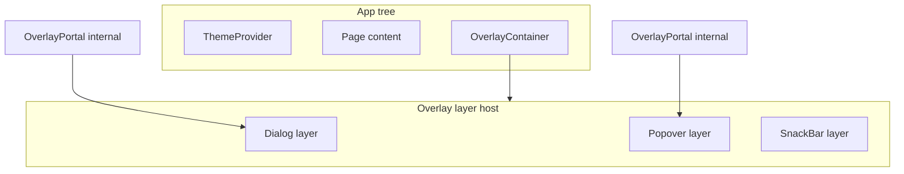

# v1.7 Overlays — specification sections (for API_DESIGN.md §73–§89)

> **Integrated** into `docs/API_DESIGN.md` §73–§89 (2026-06-02). Edit this file first, then re-sync if sections change.

> **Status:** Specified — architecture review complete. Decisions **OV1–OV15** approved (§43).
> **Scope:** Overlay infrastructure + overlay widgets API design. **No implementation in this document.**

---

## 73. v1.7 Overlays — overview

### 73.1 Purpose

- Flutter-style overlays for Qwik: dialogs, bottom sheets, snack bars, tooltips, popovers, menus.
- Shared **overlay infrastructure** (`OverlayContainer`, internal portal/layer stack) so v2 widgets (DatePicker, ContextMenu) reuse the same host.
- SSR-friendly, resumable open state, semantic HTML + ARIA, minimal runtime (Principles §1–§10).

### 73.2 Architecture



| Layer | Public (exported) | Internal (not exported) |
| ----- | ----------------- | ------------------------ |
| Host | `OverlayContainer` | Layer stack, `useOverlayLayer`, focus coordinator, auto-fallback host (OV13) |
| Portal | — | `OverlayPortal`, DOM portal target, positioner |
| Widgets | `Dialog`, `AlertDialog`, `ModalBottomSheet`, `SnackBar`, `SnackBarHost`, `enqueueSnackBar$`, `Tooltip`, `Popover`, `Menu`, `MenuItem`, `MenuDivider` | Compose via internal portal + dismiss/focus helpers |

### 73.2.1 Public vs internal export policy (approved)

| Symbol | Export from `src/index.ts` |
| ------ | -------------------------- |
| `OverlayContainer` | **Yes** — app root host; explicit placement recommended |
| `OverlayPortal` | **No** — implementation detail (OV1, OV10) |
| `Dialog`, `AlertDialog`, `ModalBottomSheet`, `Tooltip`, `Popover`, `Menu`, … | **Yes** |
| `SnackBarHost`, `enqueueSnackBar$` | **Yes** (OV14) |
| `useOverlayLayer`, focus-trap, internal positioner | **No** |
| Shared animation engine / `OverlayTransition` | **No** (OV15) |

**Rationale:** Flutter developers use `showDialog` / `ScaffoldMessenger.showSnackBar`, not raw portal layers. Keeping `OverlayPortal` internal preserves flexibility for portal DOM strategy, stacking, and positioning without semver surface on low-level primitives.

### 73.3 v1.7 non-goals

Explicitly **out of scope** for v1.7:

#### Widgets / milestones (deferred)

| Item | Status | Target |
| ---- | ------ | ------ |
| `ContextMenu` | Defer | v2+ |
| `DropdownMenu` | Defer | v2+ |
| `DatePicker` | Defer | v2+ |
| `TimePicker` | Defer | v2+ |
| `CommandPalette` | Defer | v2+ |
| `Drawer` | Defer | **v1.8** App Structure |
| `AppBar` | Defer | **v1.8** |
| `BottomNavigationBar` | Defer | **v1.8** |
| `NavigationRail` | Defer | **v1.9** Navigation |
| `Tabs` / `TabBar` / `TabPanel` | Defer | **v1.9** |
| `Link` / `Breadcrumb` | Defer | **v1.9** |

#### Toast vs SnackBar (approved distinction)

| Surface | v1.7 | Notes |
| ------- | ---- | ----- |
| **`SnackBar`** | **Ship** | Material-style transient message + optional action; `SnackBarHost` + `enqueueSnackBar$` (OV14) |
| **`Toast`** | **Defer** | Separate product pattern (often multiple concurrent toasts, different positioning/dismiss rules). Do not alias SnackBar as Toast in v1.7. Revisit v2+ |

#### ModalBottomSheet v2+ mechanics

See **§79.2** — drag, snap, velocity, partial/persistent sheets, sheet controllers.

#### Animation framework (OV15)

| Item | Status | Notes |
| ---- | ------ | ----- |
| Shared overlay animation engine | **Reject v1.7** | No central transition coordinator in `overlay/` |
| **Framer Motion** integration | **Reject** | External dependency; conflicts with Principle #7 |
| **Motion One** / WAAPI wrapper layer | **Reject** | Same |
| Public `OverlayTransition` / `AnimationController` | **Defer v2+** | Revisit if coordinated exit-before-unmount is needed |

Widgets may use **CSS transitions/keyframes** in their own `.module.css` files only. Infrastructure unmounts layers on `open={false}` **without** waiting for animation callbacks in v1.7.

---

## 74. `OverlayContainer` (public)

Root host for overlay layers. Place **once** inside `ThemeProvider` (OV11) near the app root.

```tsx
<ThemeProvider inherit={false} theme={{}}>
  <OverlayContainer>
  <SnackBarHost />
  {children}
  </OverlayContainer>
</ThemeProvider>
```

### 74.1 Responsibilities

| Concern | Owner |
| ------- | ----- |
| Layer stack / z-index | Central counter on container (OV2) |
| Portal DOM host | `<div id="qfu-overlay-root" data-qfu-overlay-host>` in SSR (empty, inert) |
| Focus trap (modal) | Topmost modal layer coordinator (OV3) |
| Focus restore on close | Layer that opened stores `document.activeElement` |
| Escape key | Topmost dismissible layer only |
| Scroll lock | `document.body` `overflow: hidden` when any modal open (OV6) |
| Nested modals | Allowed; monotonic z-index (OV7) |
| SnackBar slot | Renders `SnackBarHost` children or default host region |

### 74.2 Z-index

- CSS variable: `--qfu-overlay-z-base` (e.g. `1000`) on theme / container.
- Each pushed layer increments from base — callers do not pass arbitrary `zIndex` in v1.7.

### 74.3 OV13 — Auto-create fallback

If no `OverlayContainer` exists when an overlay opens or `enqueueSnackBar$` runs:

- **Client:** singleton implicit container appended to `document.body` (`useVisibleTask$` only — **no SSR markup** for fallback).
- **Dev:** one-time console warning recommending explicit container for SSR predictability and theme inheritance.

Explicit container is **required for production SSR**; fallback is DX convenience only.

### 74.4 Props (sketch)

```ts
export interface OverlayContainerProps extends BaseProps {
  /** Base z-index for first layer. Default from theme or 1000. */
  zIndexBase?: number;
}
```

---

## 75. `OverlayPortal` (internal)

**Not exported** from `src/index.ts`. Used only by overlay widgets (`Dialog`, `Popover`, etc.).

### 75.1 Responsibilities

| Concern | Owner |
| ------- | ----- |
| Teleport open content into overlay host | `OverlayPortal` |
| `open` / `defaultOpen` / controlled `onOpenChange$` | Per-widget + portal |
| Anchor / fixed positioning | Internal positioner (OV10 manual flip) |
| z-index assignment | From `OverlayContainer` layer push |

### 75.2 OV1 — Portal DOM target

- **SSR / default:** in-tree host under explicit `OverlayContainer` (hydration anchor).
- **Optional (internal):** client reparent to `document.body` — not a public API.

### 75.3 OV15 — Animation

Portal **unmounts** when `open={false}` immediately in v1.7 — **not** animation-gated. Enter/exit motion is widget CSS only (§73.3).

### 75.4 Open model

- Default `open={false}` for SSR (no overlay in static HTML except inert host `div`).
- Listeners (`keydown`, focus trap) only in `useVisibleTask$` while `open` (Principle #5).

---

## 76. v1.7 shared types review

| Type / enum | Verdict | Reasoning |
| ----------- | ------- | --------- |
| `OverlayPlacement` | **Ship** | `top` \| `bottom` \| `start` \| `end` \| `center` — Popover, Tooltip (§1.32) |
| `OverlayStrategy` | **Defer** | Implementation detail (fixed vs anchored) |
| `OverlayTrigger` | **Ship** | `manual` \| `click` \| `hover` \| `focus` (§1.33) |
| `OverlayDismissReason` | **Ship** | `escape` \| `backdrop` \| `outsidePointer` \| `programmatic` (§1.34) |
| `OverlayRole` | **Reject** | Widget-specific ARIA, not a public enum |
| `SnackBarDuration` | **Defer** | Use `number` ms; optional `short` / `long` presets in widget props only |

New types in `src/lib/_shared/types.ts` (sketch):

```ts
export type OverlayDismissReason =
  (typeof OverlayDismissReason)[keyof typeof OverlayDismissReason];

export interface OverlayOpenChangeDetail {
  open: boolean;
  reason?: OverlayDismissReason;
}
```

---

## 77. `Dialog`

Flutter: [`showDialog`](https://api.flutter.dev/flutter/material/showDialog.html) / [`Dialog`](https://api.flutter.dev/flutter/material/Dialog-class.html).

### 77.1 v1.7 API

**Declarative only** (OV4). Defer imperative `showDialog$(component$)` to **v1.8**.

```ts
export interface DialogProps extends BaseProps {
  open?: boolean;
  defaultOpen?: boolean;
  onOpenChange$?: QRL<(open: boolean, reason?: OverlayDismissReason) => void>;
  modal?: boolean; // default true
  dismissOnEscape?: boolean; // default true when modal
  dismissOnBackdropClick?: boolean; // default true
  restoreFocus?: boolean; // default true
  labelledBy?: string; // optional; auto from title id
}
```

### 77.2 Markup & ARIA

- `role="dialog"`; `aria-modal="true"` when `modal={true}`.
- Backdrop: sibling or pseudo-layer; pointer events dismiss when enabled.
- Title: slotted heading with `id` wired to `aria-labelledby`.

### 77.3 Animation (OV15)

Optional fade via `dialog.module.css`. Infrastructure does not coordinate exit timing.

### 77.4 SSR

- `defaultOpen={true}` on modal: **dev warning** on server (OV12).
- Closed dialog: no portal content in SSR HTML.

---

## 78. `AlertDialog`

Built on `Dialog`. Always modal.

### 78.1 Subcomponents (recommended)

- `AlertDialog` — root
- `AlertDialogTitle` — `id` for `aria-labelledby`
- `AlertDialogContent`
- `AlertDialogActions` — action buttons row

### 78.2 `role`

- Destructive / blocking confirm: `role="alertdialog"` when appropriate.
- Informational: `role="dialog"` acceptable.

---

## 79. `ModalBottomSheet`

Flutter: [`showModalBottomSheet`](https://api.flutter.dev/flutter/material/showModalBottomSheet.html).

### 79.1 v1.7 scope (ship)

| Topic | v1.7 |
| ----- | ---- |
| Panel | Bottom-anchored; backdrop; escape/backdrop dismiss; focus trap |
| API | Declarative `<ModalBottomSheet>`; document `showModalBottomSheet$` name for parity — implement with Dialog imperative in v1.8 |
| Responsive | Mobile: full-width; desktop: centered max-width (e.g. 560px) — not side drawer |

```ts
export interface ModalBottomSheetProps extends BaseProps {
  open?: boolean;
  defaultOpen?: boolean;
  onOpenChange$?: QRL<(open: boolean, reason?: OverlayDismissReason) => void>;
  dismissOnEscape?: boolean;
  dismissOnBackdropClick?: boolean;
}
```

### 79.2 v2+ scope lock (do not ship in v1.7)

| Deferred feature | Notes |
| ---------------- | ----- |
| Drag gestures | Pointer-driven vertical drag on handle |
| Snap points | Half-height / full-height positions |
| Velocity tracking | Fling-to-dismiss / snap physics |
| Partial sheet states | Peek heights (e.g. 40% open) |
| Persistent sheets | `DraggableScrollableSheet` class |
| Sheet controllers | Imperative `SheetController` API |

v1.7: **static** open/closed only — no `onDrag$`, `snapPoints`, `initialChildSize`.

### 79.3 Animation (OV15)

Optional slide-up via widget CSS; unmount on close without exit callback.

---

## 80. `SnackBar` (OV14 hybrid)

Flutter: [`ScaffoldMessenger.showSnackBar`](https://api.flutter.dev/flutter/material/ScaffoldMessenger/showSnackBar.html).

### 80.1 Architecture (approved)

| Option | Verdict |
| ------ | ------- |
| (A) Imperative only | Reject — poor SSR |
| (B) Declarative widget only | Acceptable; weak Flutter parity |
| **(C) Hybrid** | **`SnackBarHost` + `enqueueSnackBar$`** |

```tsx
<OverlayContainer>
  <SnackBarHost />
  …
</OverlayContainer>
```

```ts
export interface SnackBarOptions {
  message: string;
  actionLabel?: string;
  onAction$?: QRL<() => void>;
  duration?: number; // ms; default ~4000
}

export const enqueueSnackBar$: QRL<(options: SnackBarOptions) => void>;
```

### 80.2 Queue behavior

- Default: **one visible** snack at a time (queue or replace — document in implementation).
- Position: bottom-center or bottom-start (theme).
- `role="status"` default; `role="alert"` when `assertive` option added later.

### 80.3 Declarative `SnackBar`

Optional controlled `<SnackBar open message …>` for SSR demos; primary DX is `enqueueSnackBar$`.

### 80.4 Animation (OV15)

Slide/fade via `snack-bar.module.css`. Queue **duration** is widget timing, not infra transitions.

---

## 81. `Tooltip`

Flutter: [`Tooltip`](https://api.flutter.dev/flutter/material/Tooltip-class.html).

### 81.1 v1.7 (minimal)

| Ship | Defer (v1.8+) |
| ---- | ------------- |
| Child wrapper + `content` | Touch long-press |
| Hover + focus show (default) | Multi-monitor collision engine |
| `delayDuration` default ~700ms | Follow-cursor |
| Controlled `open` optional | Tap-to-toggle on touch |

- `aria-describedby` links trigger to tooltip id.
- Built on internal `OverlayPortal` + anchor placement (OV10).

---

## 82. `Popover`

Non-modal by default. `aria-expanded` on trigger.

### 82.1 vs `Dialog`

| | `Dialog` | `Popover` |
| - | -------- | --------- |
| Modal | Yes (default) | No (default) |
| Focus trap | Yes | No |
| Backdrop | Yes | Optional scrim defer |
| Dismiss | Escape + backdrop | Outside pointer; escape optional |

### 82.2 Positioning

- `placement?: OverlayPlacement` (§1.32).
- Manual flip math v1.7; Floating UI **defer**.

---

## 83. `Menu` / `MenuItem` / `MenuDivider`

`Menu` = `Popover` + list semantics.

### 83.1 Components

```ts
export interface MenuProps extends BaseProps {
  open?: boolean;
  defaultOpen?: boolean;
  onOpenChange$?: QRL<(open: boolean, reason?: OverlayDismissReason) => void>;
  trigger: JSX.Element; // or slot pattern per §0.1
}

export interface MenuItemProps extends BaseProps {
  disabled?: boolean;
  onSelect$?: QRL<() => void>;
}

export interface MenuDividerProps extends BaseProps {}
```

### 83.2 Keyboard

- Roving `tabIndex` or `aria-activedescendant` on menu list.
- Arrow keys, Home/End, typeahead defer v2.
- `MenuDivider`: `role="separator"`.

### 83.3 `PopupMenuButton`

**Not shipped** as separate widget. Document pattern:

```tsx
<Button onClick$={() => (menuOpen.value = true)}>Open</Button>
<Menu open={menuOpen.value} … />
```

---

## 84. v1.7 accessibility review

| Widget | Focus trap | Escape | Roles |
| ------ | ---------- | ------ | ----- |
| `Dialog` | Yes (modal) | Yes | `dialog`, `aria-modal` |
| `AlertDialog` | Yes | Yes | `alertdialog` when appropriate |
| `ModalBottomSheet` | Yes | Yes | `dialog` |
| `Popover` | No | Optional | `aria-expanded` on trigger |
| `Menu` | Focus inside menu while open | Yes closes | `menu` / `menuitem` |
| `Tooltip` | No | N/A | `aria-describedby` |
| `SnackBar` | No | Optional action | `status` / `alert` |

- **Focus restore:** returning focus to trigger on close when `restoreFocus` (default true for modals).
- **Nested modals (OV7):** only topmost receives escape; focus trap on topmost.
- **`prefers-reduced-motion`:** per-widget CSS (OV15).

---

## 85. v1.7 SSR and resumability

| Content | SSR | Client |
| ------- | --- | ------ |
| `OverlayContainer` host `div` | Empty inert anchor | Hydrated |
| Closed overlays | No layer markup | — |
| `open` signal | From props / `defaultOpen` | Resumed |
| Focus trap / keydown | Not active | `useVisibleTask$` while open |
| Fallback container (OV13) | Not rendered | Created on first open |
| `enqueueSnackBar$` | No-op or queue until client | Runs after resume |

- No `document` / `window` in render (Principle #4).
- **Related (forms):** playground `Form` may need `preventdefault:submit` on `<form>` — separate from v1.7; optional cross-reference.

---

## 86. v1.7 open questions — resolved (OV1–OV15)

All architecture questions for v1.7 are **closed**.

| ID | Topic | Recommendation |
| -- | ----- | -------------- |
| **OV1** | Portal DOM target | **In-tree host** under `OverlayContainer`; optional internal client reparent to `document.body` |
| **OV2** | Stacking | **Central counter** on `OverlayContainer` |
| **OV3** | Focus trap | **Custom minimal** (no dependency) |
| **OV4** | Dialog API | **Declarative v1.7**; defer `showDialog$` to v1.8 |
| **OV5** | SnackBar model | **Superseded by OV14** |
| **OV6** | Scroll lock | **`document.body` overflow hidden** when any modal open |
| **OV7** | Nested modals | **Allow stack** with monotonic z-index |
| **OV8** | Tooltip touch | **Defer** to v1.8+ |
| **OV9** | Bottom sheet drag/snap | **Defer all** — §79.2 |
| **OV10** | Positioning | **Manual flip v1.7**; CSS anchor positioning defer |
| **OV11** | Theme placement | **`OverlayContainer` child of `ThemeProvider`** |
| **OV12** | SSR `defaultOpen` | **Dev warning** if modal `defaultOpen={true}` on server |
| **OV13** | Required container? | **(B) Auto-create fallback** + dev warning |
| **OV14** | SnackBar | **(C) Hybrid:** `SnackBarHost` + `enqueueSnackBar$` |
| **OV15** | Animations | **(B) Widget-owned** — see below |

### OV13 — OverlayContainer required?

**Recommendation: (B) Auto-create fallback**

- Explicit container: preferred for production SSR + theme.
- Fallback: client-only singleton at `document.body` end when missing.
- Dev warning when fallback used.

### OV14 — SnackBar architecture

**Recommendation: (C) Hybrid** — `SnackBarHost` under `OverlayContainer` + `enqueueSnackBar$` for Flutter `showSnackBar` parity while keeping host in SSR tree.

### OV15 — Shared animation primitives?

**Recommendation: (B) Widget-owned animations**

| Infrastructure owns | Widgets own |
| ------------------- | ----------- |
| Stacking / z-index | Enter animations |
| Focus trap + restore | Exit animations |
| Escape + backdrop routing | Duration / easing |
| Anchor positioning | `prefers-reduced-motion` |

Defer shared `OverlayTransition` to v2+.

---

## 87. v1.7 Flutter parity — intentional differences

| Flutter | qwik-flutter-ui v1.7 |
| ------- | -------------------- |
| `showDialog(builder)` imperative | Declarative `<Dialog>`; imperative v1.8 |
| `Navigator` overlay route | No router integration — app-owned `open` state |
| `ScaffoldMessenger` | `SnackBarHost` + `enqueueSnackBar$` |
| `OverlayPortal` widget | **Internal** — not exported |
| `Material` motion specs | Per-widget CSS; no shared `AnimationController` |
| `PopupMenuButton` | `Button` + `Menu` pattern doc |

---

## 88. v1.7 future roadmap

### v1.7 — Overlays (this milestone)

- `OverlayContainer` (public); `OverlayPortal` internal
- `Dialog`, `AlertDialog`, `ModalBottomSheet`, `SnackBar`, `SnackBarHost`, `enqueueSnackBar$`, `Tooltip`, `Popover`, `Menu`, `MenuItem`, `MenuDivider`
- Enums: `OverlayPlacement`, `OverlayTrigger`, `OverlayDismissReason`

### v1.8 — App Structure

- `AppBar`, `Drawer`, `BottomNavigationBar`, `AppShell`
- `showDialog$` / `showModalBottomSheet$` (optional)

### v1.9 — Navigation

- `Link`, `Tabs`, `TabBar`, `TabPanel`, `Breadcrumb`, `NavigationRail`

### v2+ overlays

- `ContextMenu`, `DropdownMenu`, `DatePicker`, `TimePicker`, `CommandPalette`, `Toast`
- Bottom sheet drag/snap (§79.2)
- Shared `OverlayTransition` (if needed)
- Tooltip touch / collision engine

---

## 89. Final review (v1.7 architecture)

| Check | Status |
| ----- | ------ |
| **OV1–OV15** documented with recommendations | Pass (§86) |
| **`OverlayPortal` internal / `OverlayContainer` public** | Pass (§73.2) |
| **OV13** auto-fallback container | Pass |
| **OV14** SnackBar hybrid | Pass |
| **ModalBottomSheet** v2+ scope locked (§79.2) | Pass |
| **Toast** deferred; **SnackBar** ships | Pass (§73.3) |
| **OV15** widget-owned animations; no shared animation engine | Pass (§73.3, §86) |
| Overlay architecture reusable (DatePicker, ContextMenu v2+) | Pass |
| Accessibility (focus trap, restore, escape, roles) | Pass (§84) |
| SSR (closed overlays, explicit host, fallback client-only) | Pass (§85) |
| Resumability (signals + `useVisibleTask$` boundaries) | Pass |
| **Roadmap** v1.7 / v1.8 / v1.9 structure | Pass (§88) |
| Flutter-first naming | Pass (§87) |
| No new Design Principles violations | Pass |
